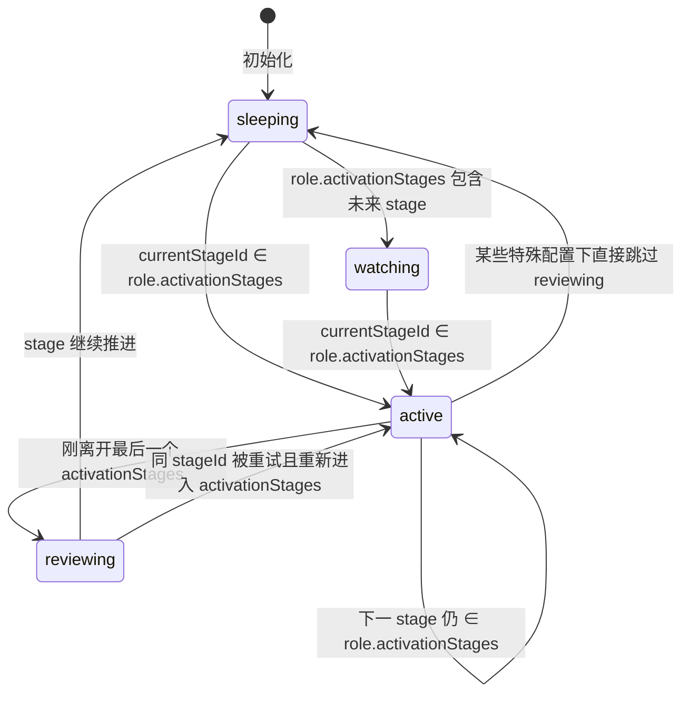
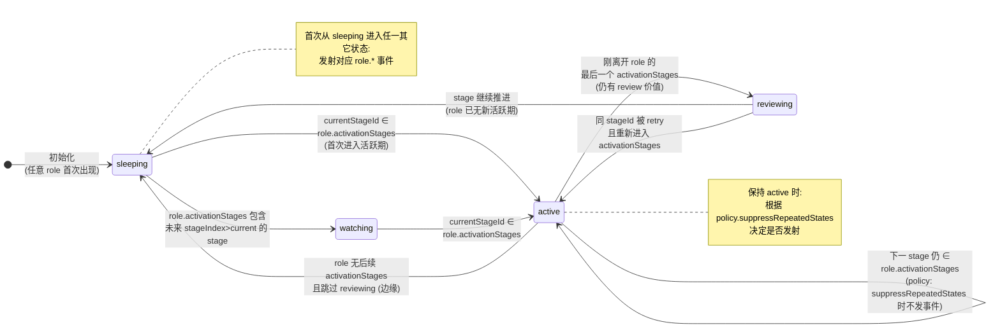
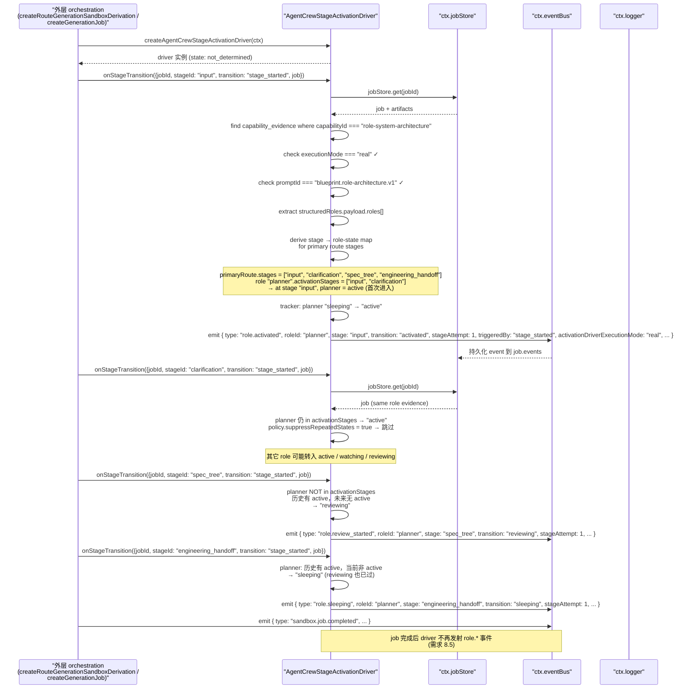
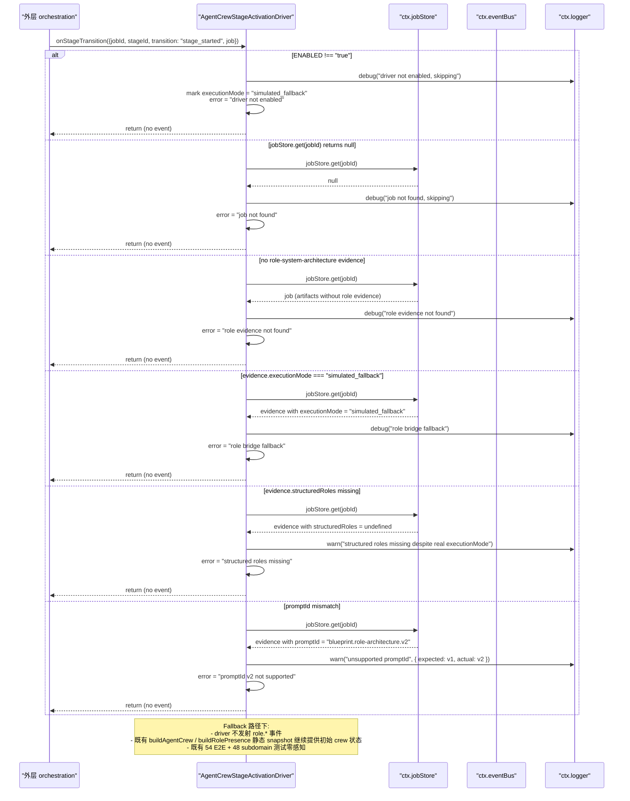
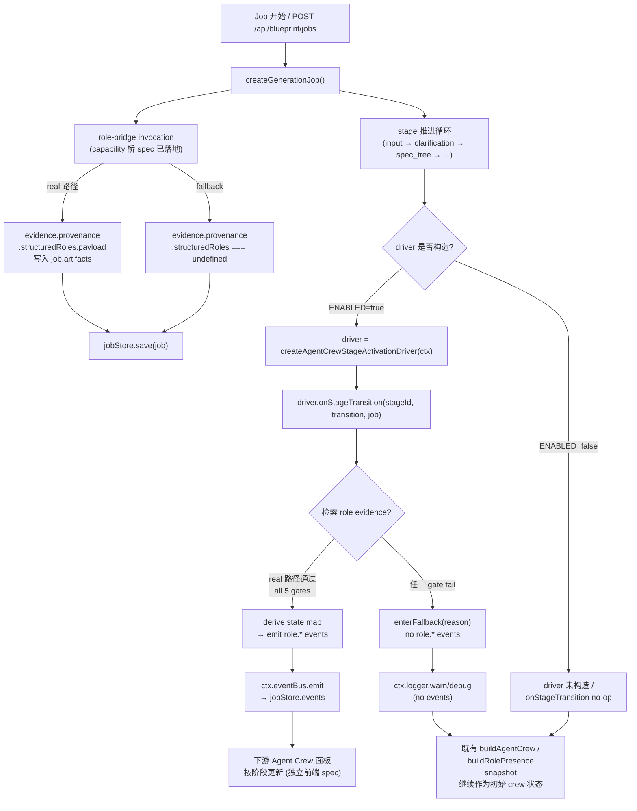

# 设计文档：Autopilot Agent Crew — Stage Activation Driver

## 1. 设计概述

本 spec 把当前 `server/routes/blueprint.ts` 中由 `buildAgentCrew()` / `buildRolePresence()` 在**路由生成时刻一次性落定**的静态 role snapshot，升级为跟随沙箱派生管线（或下游阶段推进管线）**每个 `BlueprintGenerationStage` 实际进入 / 结束**时刻逐阶段计算每个 role 状态并真实发射 `role.*` 事件的 **Stage Activation Driver**。

Driver 消费姊妹 spec `autopilot-capability-bridge-role` 写入 evidence store 的结构化角色 JSON（`evidence.provenance.structuredRoles.payload`），按每个 role 的 `activationStages` 派生出 `BlueprintRolePresenceState`（`active` / `watching` / `reviewing` / `sleeping`），在 `BlueprintServiceContext.eventBus` 上同步发射 `role.activated` / `role.watching` / `role.review_started` / `role.sleeping` 事件。本 spec 与前 4 条 capability 桥 spec（Docker / MCP / aigc-node / role）在同一 scope-boundary 与 Simulated Fallback 原则下工作，但本 spec 是 Wave 2 **第一条非 capability-bridge 的 spec**，与桥 spec 有本质不同：

| 维度 | Tier 1/2 桥 spec | **stage-activation（本 spec）** |
| --- | --- | --- |
| 产出对象 | 单次 invocation / evidence 记录 | **阶段时间线上的事件流**（每 stage × role 一事件） |
| 触发方式 | capability 命中时被调用一次 | **被动触发**：由外层在 stage lifecycle 钩子上主动调用 Driver |
| LLM 调用 | 有（每桥一次） | **无**（纯数据转换 + 事件发射） |
| Fallback 语义 | 模板化 invocation | **不发射 `role.*` 事件** + 保留既有静态 snapshot |
| 事件名可能新增 | 不新增 | **必须新增** `BlueprintEventName.RoleSleeping`（D4） |
| 检索依赖 | 自产 | **硬依赖** role-bridge 的 `evidence.provenance.structuredRoles.payload` |
| Schema 版本检查 | 无 | **必须显式校验** `promptId === "blueprint.role-architecture.v1"` |

### 1.1 最低可接受交付

当 role-bridge 处于 `executionMode === "real"` 且可被 `jobId` / `routeSetId` / `primaryRouteId` 三元组稳定检索时：

- 每当外层调用 `driver.onStageTransition(stageId, transition, job)`，driver 以**同步调用栈**形式按稳定 (role-first, transition-second) 顺序向 `ctx.eventBus` 发射一组 `role.*` 事件
- 事件 `type` 严格来自 `BlueprintEventName`（含本 spec 新增的 `RoleSleeping`）
- 事件 payload 携带 `jobId` / `stageId` / `roleId` / `roleLabel` / `transition` / `timestamp` / `triggeredBy` / 可选 `stageAttempt`
- 同一输入两次运行产出**字节级等价**的事件序列（`timestamp` 除外）
- 同一 `(roleId, stageId, stageAttempt)` 三元组**不会**发射重复事件

当 role-bridge 走 `simulated_fallback`、evidence 检索失败、`roles.length === 0`、或 `promptId !== "blueprint.role-architecture.v1"` 时：

- Driver **静默回退**：对 `onStageTransition` 调用不发射任何 `role.*` 事件
- 沿用今天 `buildAgentCrew()` / `buildRolePresence()` 的静态 snapshot 作为初始 crew 状态
- 在 driver 自身 provenance（详见 §4.6）中标注 `activationDriverExecutionMode === "simulated_fallback"` + `error` 原因
- 既有 54 E2E（45 基线 + Docker+2 + MCP+3 + aigc+2 + role+2）+ 48 子域单测 + 9 SDK smoke 行为零感知

### 1.2 与 role-bridge 的公共契约引用

本 spec **严格消费** `.kiro/specs/autopilot-capability-bridge-role/design.md` §7 "Downstream Contract for Wave 2" 定义的契约：

- 检索路径：`jobStore.get(jobId)` → `job.artifacts.filter(a => a.type === "capability_evidence")` → `.filter(e => e.capabilityId === "role-system-architecture")`
- 检索键三元组：`{ jobId, routeSetId, primaryRouteId }`
- 真相源字段：`evidence.provenance.structuredRoles.payload: RoleArchitectureResponse`
- Schema 版本守卫：`evidence.provenance.promptId === "blueprint.role-architecture.v1"`
- Fallback 信号：`evidence.provenance.structuredRoles === undefined` 或 `executionMode !== "real"`

**本 spec 不重复定义这套契约**；任何与 role-bridge §7 描述不一致的行为都应视为本 spec 的 bug。

### 1.3 环境变量门禁

- `BLUEPRINT_AGENT_CREW_STAGE_ACTIVATION_ENABLED=true` 开启本 driver
- 未设或设为其它值时，即使 role-bridge evidence 已落地，driver 也**不发射任何 `role.*` 事件**，既有行为零感知
- 与 role-bridge 的 `BLUEPRINT_ROLE_CAPABILITY_BRIDGE_ENABLED` 相互独立：role-bridge 开启但本 driver 不开启是合法配置（evidence 已落地但未驱动 role 事件流）

### 1.4 严格限定范围

本 spec 严格限定在以下范围：

- 新增 `createAgentCrewStageActivationDriver(ctx)` 工厂，落地到 `server/routes/blueprint/agent-crew-stage-activation/` 目录
- 在 `shared/blueprint/events.ts` 追加 `BlueprintEventName.RoleSleeping: "role.sleeping"`（D4）
- 在 `BlueprintServiceContext` 追加 2 个可选字段：`agentCrewStageActivationPolicy?` + `agentCrewStageActivationDriver?`
- 在外层（`createRouteGenerationSandboxDerivation` 或 `createGenerationJob`）的 stage 推进时刻调用 `driver.onStageTransition(...)`
- **不修改** `buildAgentCrew()` / `buildRolePresence()` / `BlueprintAgentRole` / `BlueprintRolePresence` 任一既有定义
- **不修改** role-bridge 或其它 3 条桥的任一 invocation / evidence 产出路径
- **不新增** `/api/*` 路由；HTTP 契约完全不变
- **不实现** Agent Crew 前端面板 UI 订阅逻辑（属独立前端 spec）
- **不引入** PBT（需求 9.3 锁定）；本轮新增 +2 E2E + ~20 条 co-located 单测
- 既有 54 E2E + 48 子域单测 + 9 SDK smoke 全部继续通过，不重写既有断言

---

## 2. 架构决策（Key Decisions）

### D1：工厂模式 `createAgentCrewStageActivationDriver(ctx)`

```ts
export function createAgentCrewStageActivationDriver(
  ctx: BlueprintServiceContext
): AgentCrewStageActivationDriver;

export interface AgentCrewStageActivationDriver {
  /**
   * 外层在 stage lifecycle 钩子处主动调用。Driver 无副作用订阅 event bus。
   * 同步调用栈：返回时所有相关 role.* 事件已 emit 到 ctx.eventBus。
   */
  onStageTransition(input: {
    jobId: string;
    stageId: BlueprintGenerationStage;
    transition: "stage_started" | "stage_completed" | "stage_retry" | "manual_override";
    job: BlueprintGenerationJob;
  }): void;
}
```

Driver 是纯数据转换 + 事件发射器：

- 不持有任何全局状态；每次 `createAgentCrewStageActivationDriver(ctx)` 返回独立实例
- 实例内部维护 `Map<roleId, RoleTracker>` 记录每个 role 的最后状态 / 最后 stage / stageAttempt 计数
- 同一 `(ctx, job)` 下应复用同一 driver 实例（由外层保证）

**硬约束**（code-review 规则）：

- 实现文件 SHALL NOT `import { callLLMJson }` / `import { getAIConfig }`
- 实现文件 SHALL NOT 调用模块级 `fetch()` / `import "node-fetch"`
- 实现文件 SHALL NOT 硬编码任何 role id / stage id 字面量（所有标识从 evidence / `BlueprintGenerationStage` 派生）
- 实现文件 SHALL NOT `import` 模块级 evidence store / event bus 单例
- 所有依赖必须来自 `ctx: BlueprintServiceContext`

### D2：Context 扩展（仅追加 policy + driver 实例 2 个可选字段）

```ts
export interface BlueprintServiceContext {
  // ...既有字段...
  agentCrewStageActivationPolicy?: AgentCrewStageActivationPolicy;
  agentCrewStageActivationDriver?: AgentCrewStageActivationDriver;
}
```

**默认装配策略**：

- 未注入 `agentCrewStageActivationDriver` → `buildBlueprintServiceContext()` **不默认装配**（与桥 spec 不同）
- 原因：driver 生命周期与 job 绑定（内部有 per-job 的 tracker state），外层需在每条 job 起点 `const driver = createAgentCrewStageActivationDriver(ctx)` 自行构造
- Policy 可注入，未注入时使用 `createDefaultAgentCrewStageActivationPolicy()`

**与四条桥 D2 的差异**：桥是无状态纯函数，可在 context 上默认装配；本 spec driver 是 stateful，不宜放在 context 单例位置。

### D3：Stage Lifecycle Hook 方案（选 B — Driver 暴露 `onStageTransition` 方法，外层主动调用）

**两种方案对比**：

| 方案 | 优点 | 缺点 |
| --- | --- | --- |
| A：Driver 内部订阅 `ctx.eventBus` 的现有 `JobStage` 事件 | 零侵入外层代码 | (1) 现有 `JobStage` 事件 payload 不含 `transition`（started/completed）区分；(2) 订阅路径是副作用，难隔离测试；(3) 需要在 driver 销毁时取消订阅，生命周期复杂 |
| **B：Driver 暴露 `onStageTransition(...)` 方法，外层主动调用** | (1) Driver 纯函数式，无订阅副作用；(2) 单测最小化（同步调用 / 同步断言）；(3) 不新增 event bus wiring；(4) 外层 orchestration 已经持有 stage 推进逻辑的显式控制权 | 需要在 `createRouteGenerationSandboxDerivation` / `createGenerationJob` 的 stage 推进点加 1-2 处 hook |

**选 B**。论据：

1. 现有 `BlueprintEventName.JobStage` 的事件 payload 只标注当前 stage，不区分 started/completed；强行让 driver 订阅会要求先扩 event bus payload，侵入面更大
2. Driver 暴露纯方法让测试只需要构造 fake job + fake ctx，调用 `driver.onStageTransition(...)` 并断言 spy eventBus，不需要 mock 订阅 / 取消订阅
3. 外层 `createRouteGenerationSandboxDerivation` 在每个 stage 推进时已经在做 `await ctx.eventBus.emit({ type: BlueprintEventName.JobStage, stage: ... })`；在同一处追加一行 `driver.onStageTransition({ jobId, stageId, transition: "stage_started", job })` 代价极低
4. Driver 无订阅副作用，符合 "Driver 纯数据转换" 口径（§D1）

### D4：R3.3 — 新增 `BlueprintEventName.RoleSleeping`（决策 A）

**决策**：向 `shared/blueprint/events.ts` 追加 `BlueprintEventName.RoleSleeping: "role.sleeping"`，并同步扩展 `BlueprintGenerationEventType` union。

**论据**：

1. **语义清晰性**：`sleeping` 与 `completed` 是两种**根本不同**的生命周期状态：
   - `sleeping` = role 当前不活跃，但 job 还在跑，未来 stage 可能再次被激活
   - `completed` = role 任务已结束，不会再被激活
   将两者共用 `role.completed` 并依赖 payload `transition` 字段区分，会让下游订阅者难以精确分流（绘制"休眠中"UI vs "已完成"UI 需要检查 payload）
2. **下游精度**：Agent Crew 面板（独立前端 spec）可对 `role.sleeping` 与 `role.completed` 分别做不同的可视化（例如 "休眠中 — 等待下一阶段" vs "已完成 — 不再参与"）
3. **映射表一致性**：需求 3.1 定义的 `BlueprintRolePresenceState → BlueprintEventName` 映射表希望**每个状态对应唯一事件名**：
   - `active → RoleActivated`
   - `watching → RoleWatching`
   - `reviewing → RoleReviewStarted`
   - `sleeping → RoleSleeping`（本 spec 新增）
   - `completed →`（job 收尾时的独立路径，复用现有 `RoleCompleted`）
4. **扩展成本低**：`BlueprintEventName` 的扩展机制本身就是为此设计的（见 `shared/blueprint/events.ts` 开头注释："新增事件只允许通过本文件扩展"）

**`shared/blueprint/events.ts` 具体改动范围**：

```ts
// 1. BlueprintGenerationEventType union 追加
export type BlueprintGenerationEventType =
  // ...既有 union 成员...
  | "role.activated"
  | "role.watching"
  | "role.capability_invoked"
  | "role.review_started"
  | "role.review_completed"
  | "role.sleeping"           // ← 本 spec 新增
  | "role.completed"
  // ...其它既有成员不变...

// 2. BlueprintEventName const 追加
export const BlueprintEventName = {
  // ...既有常量...
  RoleActivated: "role.activated",
  RoleWatching: "role.watching",
  RoleCapabilityInvoked: "role.capability_invoked",
  RoleReviewStarted: "role.review_started",
  RoleReviewCompleted: "role.review_completed",
  RoleSleeping: "role.sleeping",  // ← 本 spec 新增
  RoleCompleted: "role.completed",
  // ...其它既有常量...
} as const satisfies Record<string, BlueprintGenerationEventType>;

// 3. resolveBlueprintEventFamily() 无需改动
//    其实现按 "."分割首段，"role.sleeping" → "role"，
//    family "role" 已在 BlueprintGenerationEventFamily union 中，无需新增
```

**与既有 `role` 家族其它成员的一致性**：`role.sleeping` 与 `role.activated` / `role.watching` / `role.review_started` / `role.review_completed` / `role.completed` 统一使用 `"role."` 前缀，`resolveBlueprintEventFamily("role.sleeping") === "role"`，不需要改 family union / mapping 函数。

### D5：Stage → Role State 映射算法

核心数据转换。给定：

- `role.activationStages: string[]`（来自结构化角色 JSON）
- `primaryRoute.stages: BlueprintGenerationStage[]`（来自 job 的 primary route）
- `currentStageId: BlueprintGenerationStage`（外层传入）
- `stageIndex = primaryRoute.stages.indexOf(currentStageId)`

**状态机定义**：

```
状态域: { active, watching, reviewing, sleeping }

对每个 role × 每个 stage 的映射规则（按下列条件依次判定，先命中者生效）:

1. IF currentStageId ∈ role.activationStages:
     → "active"
     （该 role 在此 stage 明确激活）

2. ELSE IF 存在 j ∈ role.activationStages 使得 stageIndex(j) < stageIndex(currentStageId)
        AND 不存在 k ∈ role.activationStages 使得 stageIndex(k) >= stageIndex(currentStageId):
     → "reviewing"
     （该 role 在历史 stage 激活过，且未来 stage 不再激活 — 处于收尾审阅态）
     注：此场景暗示"刚离开活跃期"；驱动在当前 stage 首次进入时发射 role.review_started
     在 stage 序列推进过该 role 的最后一个 activationStages 之后的第一个 stage 时触发

3. ELSE IF 存在 k ∈ role.activationStages 使得 stageIndex(k) > stageIndex(currentStageId):
     → "watching"
     （该 role 未来 stage 会激活 — 当前处于监视态）

4. ELSE:
     → "sleeping"
     （该 role 在当前及之后所有 stage 都不会激活 — 彻底休眠）
```

**边界处理**：

- `role.activationStages` 中出现当前 primary route 不存在的 stage：该项被**忽略**（不计入 stageIndex 判定）
- `role.activationStages.length === 0` 或所有项都在 primary route 中不存在：该 role 对所有 stage 映射为 `sleeping`
- `stageIndex === -1`（currentStageId 不在 primary route.stages 中）：driver 跳过本次 `onStageTransition`，不发射任何事件（记录 `logger.warn("unknown stage")`）

**状态转移图（Mermaid）**：



**首次进入 vs 保持 active 的区别**：

- "首次从非 active 进入 active"：发射 `RoleActivated`
- "连续 stage 都保持 active"（`role.activationStages` 覆盖多个连续 stage）：需求 3.7 允许 driver 选择抑制重复事件
- **本 spec 决策**：抑制同状态连续事件（default behavior），通过 policy `suppressRepeatedStates: true` 控制；测试 / 外层可覆盖

### D6：事件 payload 契约（统一 payload shape）

所有 `role.*` 事件的 payload 统一 shape（继承 `BlueprintGenerationEvent` 既有字段 + driver 特定扩展）：

```ts
{
  id: string,                  // 事件自身 id（由 createId 生成）
  type: "role.activated" | "role.watching" | "role.review_started" | "role.sleeping" | "role.completed",
  family: "role",
  jobId: string,
  projectId?: string,
  crewId?: string,
  stage: BlueprintGenerationStage,
  status: BlueprintGenerationStatus,  // = job.status on emit
  message: string,              // 人可读摘要
  occurredAt: string,           // ISO8601
  roleId: string,
  presenceState: BlueprintRolePresenceState,  // = transition 目标状态
  capabilityId?: string,
  evidenceId?: string,          // 本次决策依据的 role evidence id
  
  // ── Driver 新增字段（可选，向后兼容）──
  activationDriverExecutionMode?: "real" | "simulated_fallback",  // 继承自 role-bridge evidence
  stageAttempt?: number,        // 从 1 起，同 stageId 多次进入时递增
  triggeredBy?: "stage_started" | "stage_completed" | "stage_retry" | "manual_override",
  roleLabel?: string,           // 来自 structuredRoles.payload.roles[i].label
  sourceEvidenceId?: string,    // 本次决策依据的 role evidence id（与 evidenceId 语义相同；字段名保留向后兼容）
}
```

**字段来源**：

| 字段 | 来源 |
| --- | --- |
| `id` | `createId("blueprint-role-event")` |
| `type` | 由 stage-state mapping 算法决定 |
| `family` | 固定 `"role"` |
| `jobId` / `projectId` / `crewId` | 从 `job` / `extractAgentCrew(job)` 提取 |
| `stage` | `input.stageId` |
| `status` | `job.status` |
| `message` | locale-aware 派生，如 `"${roleLabel} entered ${stageId} as active"` |
| `occurredAt` | `ctx.now().toISOString()` |
| `roleId` | 来自 `structuredRoles.payload.roles[i].id` |
| `presenceState` | 目标状态（与 `type` 映射表对齐） |
| `capabilityId` | 从 crew.capabilityMatrix 推导；可缺省 |
| `evidenceId` | role evidence 的 `id` |
| `activationDriverExecutionMode` | `"real"` 或 `"simulated_fallback"` |
| `stageAttempt` | driver tracker 维护 |
| `triggeredBy` | `input.transition` |
| `roleLabel` | 来自 `structuredRoles.payload.roles[i].label` |

### D7：确定性与幂等（需求 8.1 / 8.2）

**Driver 内部 tracker 数据结构**：

```ts
interface RoleTracker {
  roleId: string;
  lastEmittedState: BlueprintRolePresenceState | null;
  lastStageId: BlueprintGenerationStage | null;
  stageAttemptByStage: Map<BlueprintGenerationStage, number>;  // stageId → attempt count (starts at 1)
}

// driver 实例内部:
const trackersByRole: Map<string, RoleTracker>;
const trackersByStage: Map<BlueprintGenerationStage, Map<string, BlueprintRolePresenceState>>;
// trackersByStage[stageId] → Map<roleId, emitted-state>  用于 (roleId, stageId, stageAttempt) 幂等判重
```

**核心幂等规则**：

1. 每次 `onStageTransition({ stageId, transition: "stage_started", ... })` 时：
   - `stageAttempt = (tracker.stageAttemptByStage.get(stageId) ?? 0) + 1`
   - `tracker.stageAttemptByStage.set(stageId, stageAttempt)`
2. 对同一 `(roleId, stageId, stageAttempt)` 三元组，driver **不允许**发射两条相同 `type` 的事件
3. 状态抑制（D5）：若 `tracker.lastEmittedState === newState` 且 `policy.suppressRepeatedStates === true`（默认），跳过本次发射

**确定性保证**：

- 事件 emit 顺序按 `structuredRoles.payload.roles[]` 原始顺序（数组下标升序），同一 role 不会发射多条事件
- `occurredAt` 字段取 `ctx.now()`，测试通过 `buildBlueprintServiceContext({ now: () => fixedDate })` 固定
- 所有其它字段（`roleId` / `type` / `presenceState` / `stageAttempt` / `triggeredBy` / `message` 等）对同一输入产出字节相同

### D8：Fallback 降级语义（需求 5）

**决策**：走 Simulated Fallback 时 **driver 静默回退**，**不发射任何 `role.*` 事件**。

**5 个触发条件**（任一成立进入 fallback）：

| 条件 | Provenance.error 记录值 | logger 级别 |
| --- | --- | --- |
| `BLUEPRINT_AGENT_CREW_STAGE_ACTIVATION_ENABLED !== "true"` | `"driver not enabled"` | `debug` |
| `jobStore.get(jobId)` 返回 `null` / 无对应 evidence | `"role evidence not found"` | `debug` |
| `evidence.provenance.executionMode !== "real"` | `"role bridge fallback"` | `debug` |
| `evidence.provenance.structuredRoles === undefined` / `structuredRoles.payload === undefined` | `"structured roles missing"` | `warn` |
| `evidence.provenance.promptId !== "blueprint.role-architecture.v1"` | `"promptId v${N} not supported"` | `warn` |

**Fallback 路径下**：

- Driver 的 `onStageTransition` 是 no-op（不发射任何事件）
- Driver 内部 tracker 仍然维护（以便 state 后续恢复为 real 时保持 idempotence；**本 spec 不强制要求恢复，但保留扩展点**）
- 外层沿用既有 `buildAgentCrew()` / `buildRolePresence()` 静态 snapshot 作为初始 crew 状态（与今天行为等价）
- Driver 暴露只读属性 `driver.executionMode: "real" | "simulated_fallback" | "not_determined"`，供外层观测

**为什么选"静默回退"而非"每 stage 一条 `CrewContextUpdated`"**：

1. 既有 54 E2E + 48 子域单测在默认装配（env 不开 / 无 role evidence）下已经期望"不发额外事件"；静默回退是零感知路径
2. `CrewContextUpdated` 事件在 `BlueprintEventName` 中是 crew 跨角色上下文更新事件，语义是"crew 级别有变更"，每 stage 一条会语义模糊
3. 下游 Agent Crew 面板可按"无真实 role 事件"降级处理（沿用既有静态 snapshot 订阅路径），代价最低

### D9：Schema 版本检查（需求 3.6 / role-bridge design §7.5）

Driver 在每次尝试读取 role evidence 时**显式校验**：

```ts
if (evidence.provenance.promptId !== "blueprint.role-architecture.v1") {
  ctx.logger.warn("stage-activation driver: unsupported role evidence promptId", {
    jobId,
    promptId: evidence.provenance.promptId,
    expected: "blueprint.role-architecture.v1",
  });
  return enterFallback("promptId mismatch");
}
```

**future-proof 考量**：

- 若未来 role-bridge bump 到 `v2`，本 spec **必须**同步评估 schema 变更：
  - 若 v2 向后兼容（仅新增可选字段） → 本 spec 可扩展支持列表 `["blueprint.role-architecture.v1", "blueprint.role-architecture.v2"]`
  - 若 v2 破坏性变更 → 本 spec 需同步 bump driver 版本
- 当前版本只支持 `v1`；`v2+` 一律 fallback + 告警

### D10：脱敏独立实现 `applyAgentCrewRedaction`

与四条桥对齐，本 spec 实现独立的 `applyAgentCrewRedaction(text, policy)` 纯函数（覆盖 API key / GitHub PAT / email / Authorization 等敏感 marker）。

**脱敏点**：

| 字段 | 脱敏规则 |
| --- | --- |
| event.payload.message | 脱敏（人可读摘要可能含用户输入） |
| event.payload.roleLabel | **不脱敏**（来自 role-bridge 已校验的 `structuredRoles.payload.roles[i].label`，上游保证合法） |
| event.payload.roleId | **不脱敏**（schema 约束 `[a-z][a-z0-9-]{0,63}`，不会含敏感内容） |
| event.payload.stageId | **不脱敏**（枚举值） |
| driver.provenance.error | 脱敏 + 截断 400 字符 |

### D11：无 callback dispatcher / 无 LLM 调用

Driver 是纯数据转换 + 事件发射，不调 `ctx.llm.callJson` / 不调 HTTP / 不监听 `/api/executor/events`。本 spec 与 HTTP / executor 中继链完全解耦。

### D12：测试默认装配 ≡ 生产行为

- 默认测试装配下：`BLUEPRINT_AGENT_CREW_STAGE_ACTIVATION_ENABLED` 未设置 → driver 即使被构造也走 fallback 路径（no-op）
- 既有 54 E2E + 48 子域单测 + 9 SDK smoke **无需任何 mock**，零感知
- 本 spec 新增 2 条 E2E：(a) real-path + multi-stage 序列；(b) fallback 路径。基线从 54 → 56

---

## 3. High-Level Design（HLD）

### 3.1 Stage → Role State 状态机（Mermaid）



### 3.2 Happy path 时序图（real LLM evidence + 多 stage 序列）



### 3.3 Fallback 时序图



### 3.4 数据流总图



---

## 4. Low-Level Design（LLD）

### 4.1 文件布局

```
server/routes/blueprint/agent-crew-stage-activation/
  ├── driver.ts                           # 新增：createAgentCrewStageActivationDriver(ctx) 工厂 + 主算法
  ├── driver.test.ts                      # 新增：R9.2 四条硬需求 + 2 条幂等专测 + 补充覆盖
  ├── policy.ts                           # 新增：AgentCrewStageActivationPolicy + createDefault + applyAgentCrewRedaction
  ├── policy.test.ts                      # 新增：policy 与 redaction 纯函数测试
  ├── state-machine.ts                    # 新增：deriveStageRoleStateMap + 纯函数状态机逻辑
  ├── state-machine.test.ts               # 新增：状态机纯函数测试 (~8 条，覆盖 4 态转移)
  ├── evidence-lookup.ts                  # 新增：findRoleArchitectureEvidence 纯 helper + promptId 校验
  └── evidence-lookup.test.ts             # 新增：检索 helper 纯函数测试

server/routes/blueprint/context.ts        # 修改：
                                           #   - BlueprintServiceContext 追加:
                                           #       agentCrewStageActivationPolicy?: AgentCrewStageActivationPolicy
                                           #       agentCrewStageActivationDriver?: AgentCrewStageActivationDriver
                                           #   - BlueprintServiceContextDeps 追加同样字段
                                           #   - buildBlueprintServiceContext 不默认装配 driver (per-job 生命周期)
                                           #     但默认装配 policy (若未注入)

server/routes/blueprint.ts                # 修改 (最小侵入):
                                           #   - createRouteGenerationSandboxDerivation / createGenerationJob
                                           #     在每个 stage 推进点 (含 JobStage emit 处) 追加:
                                           #       ctx.agentCrewStageActivationDriver?.onStageTransition({
                                           #         jobId, stageId, transition: "stage_started" | "stage_completed", job
                                           #       })
                                           #   - 若 ctx.agentCrewStageActivationDriver 未注入, 跳过 (等价于 no-op)
                                           #   - 在 job 起点构造一次 driver 实例:
                                           #       ctx.agentCrewStageActivationDriver ??=
                                           #         createAgentCrewStageActivationDriver(ctx)
                                           #     (若 ENABLED !== "true", 构造后首次 onStageTransition 走 fallback)
                                           #   - buildAgentCrew() / buildRolePresence() 完全保留 (需求 7.2)

shared/blueprint/events.ts                # 修改 (仅追加):
                                           #   - BlueprintGenerationEventType union 追加 "role.sleeping"
                                           #   - BlueprintEventName 追加 RoleSleeping: "role.sleeping"
                                           #   - resolveBlueprintEventFamily 无需改动
                                           #   - BlueprintGenerationEventFamily 无需改动 (family "role" 已存在)

server/tests/blueprint-routes.test.ts     # 修改 (只追加, 不改写):
                                           #   + 2 条新 E2E 用例:
                                           #     (a) Real role evidence + multi-stage 序列
                                           #         → 断言 role.* 事件顺序 / count / transitions
                                           #     (b) Role-bridge fallback → driver 不发 role.* 事件
```

### 4.2 核心类型定义（`driver.ts`）

```ts
import type { BlueprintServiceContext } from "../context.js";
import type {
  BlueprintGenerationJob,
  BlueprintGenerationStage,
  BlueprintRolePresenceState,
} from "../../../../shared/blueprint/index.js";
import type { AgentCrewStageActivationPolicy } from "./policy.js";

export type AgentCrewStageActivationTransition =
  | "stage_started"
  | "stage_completed"
  | "stage_retry"
  | "manual_override";

export interface AgentCrewStageActivationInput {
  jobId: string;
  stageId: BlueprintGenerationStage;
  transition: AgentCrewStageActivationTransition;
  job: BlueprintGenerationJob;
}

export type AgentCrewStageActivationExecutionMode =
  | "real"
  | "simulated_fallback"
  | "not_determined";

export interface AgentCrewStageActivationDriver {
  /**
   * 外层在 stage lifecycle 钩子处主动调用。
   * 同步调用栈：返回时所有相关 role.* 事件已 emit 到 ctx.eventBus。
   * 如进入 fallback，返回时未发射任何 role.* 事件。
   */
  onStageTransition(input: AgentCrewStageActivationInput): void;

  /**
   * 当前 driver 的执行模式；外层可查询以决定是否继续使用 buildRolePresence snapshot 兜底。
   * - "not_determined": driver 已构造但未收到任何 stage lifecycle 信号
   * - "real": 至少一次 onStageTransition 已成功读取到 real-path role evidence
   * - "simulated_fallback": 至少一次 onStageTransition 因任一 fallback 条件进入降级
   */
  readonly executionMode: AgentCrewStageActivationExecutionMode;

  /**
   * 最近一次 fallback 原因（若当前 executionMode === "simulated_fallback"）。
   */
  readonly lastFallbackReason?: string;
}

export function createAgentCrewStageActivationDriver(
  ctx: BlueprintServiceContext
): AgentCrewStageActivationDriver;
```

### 4.3 Policy 类型（`policy.ts`）

```ts
export interface AgentCrewStageActivationPolicy {
  /** 连续 stage 保持同状态时是否抑制重复事件（默认 true） */
  suppressRepeatedStates: boolean;
  /** 同一 (roleId, stageId, stageAttempt) 幂等性开关（默认 true，禁止关闭） */
  enforceTripletIdempotence: true;
  /** locale-aware message 派生语言（默认 "en-US"） */
  defaultLocale: "zh-CN" | "en-US";
  /** 支持的 role evidence schema 版本（白名单） */
  supportedPromptIds: readonly string[];
  /** 脱敏：email 正则 */
  redactedEmailPattern: RegExp;
  /** 脱敏：API key 正则 */
  redactedApiKeyPattern: RegExp;
  /** 脱敏：GitHub PAT 正则 */
  redactedGithubPatPattern: RegExp;
  /** 脱敏关键词 */
  redactionKeywords: readonly string[];
  /** error 字符串最大字节数 */
  maxErrorBytes: number;
}

export function createDefaultAgentCrewStageActivationPolicy(): AgentCrewStageActivationPolicy {
  return {
    suppressRepeatedStates: true,
    enforceTripletIdempotence: true,
    defaultLocale: "en-US",
    supportedPromptIds: ["blueprint.role-architecture.v1"] as const,
    redactedEmailPattern: /[\w.+-]+@[\w.-]+/g,
    redactedApiKeyPattern: /\b(sk-[A-Za-z0-9]{20,}|clp_[A-Za-z0-9]{20,})\b/g,
    redactedGithubPatPattern:
      /\b(gh[pousr]_[A-Za-z0-9]{36,255}|github_pat_[A-Za-z0-9_]{22,255})\b/g,
    redactionKeywords: [
      "authorization",
      "token",
      "api_key",
      "apikey",
      "secret",
      "password",
      "bearer",
      "access_token",
    ],
    maxErrorBytes: 400,
  };
}

export function applyAgentCrewRedaction(
  value: string,
  policy: AgentCrewStageActivationPolicy
): string;
```

### 4.4 Evidence 检索 helper（`evidence-lookup.ts`）

```ts
import type {
  BlueprintCapabilityEvidence,
  BlueprintGenerationJob,
  RoleArchitectureResponse,
} from "../../../../shared/blueprint/index.js";
import type { AgentCrewStageActivationPolicy } from "./policy.js";

export type EvidenceLookupResult =
  | {
      status: "real";
      evidence: BlueprintCapabilityEvidence;
      payload: RoleArchitectureResponse;
    }
  | {
      status: "fallback";
      reason:
        | "job not found"
        | "role evidence not found"
        | "role bridge fallback"
        | "structured roles missing"
        | `promptId ${string} not supported`;
    };

/**
 * 检索 job 中 role-system-architecture capability 的 real-path evidence。
 * 
 * 按 role-bridge design §7.3 契约：
 *   1. job.artifacts.filter(a => a.type === "capability_evidence")
 *   2. 筛 capabilityId === "role-system-architecture"
 *   3. 筛 provenance.executionMode === "real"
 *   4. 匹配 jobId / routeSetId / primaryRouteId 三元组（若指定）
 *   5. 校验 provenance.structuredRoles.payload 存在
 *   6. 校验 provenance.promptId ∈ policy.supportedPromptIds
 */
export function findRoleArchitectureEvidence(input: {
  job: BlueprintGenerationJob | null;
  routeSetId?: string;
  primaryRouteId?: string;
  policy: AgentCrewStageActivationPolicy;
}): EvidenceLookupResult;
```

**实现伪代码**：

```ts
export function findRoleArchitectureEvidence(input): EvidenceLookupResult {
  const { job, routeSetId, primaryRouteId, policy } = input;

  if (!job) {
    return { status: "fallback", reason: "job not found" };
  }

  const candidates = job.artifacts
    .filter((a) => a.type === "capability_evidence")
    .map((a) => a.payload as BlueprintCapabilityEvidence)
    .filter((e) => e.capabilityId === "role-system-architecture");

  const realCandidate = candidates.find((e) => {
    if (e.provenance.executionMode !== "real") return false;
    if (routeSetId && e.provenance.routeSetId !== routeSetId) return false;
    if (primaryRouteId && e.provenance.primaryRouteId !== primaryRouteId)
      return false;
    return true;
  });

  if (!realCandidate) {
    const hasFallback = candidates.some(
      (e) => e.provenance.executionMode === "simulated_fallback"
    );
    return {
      status: "fallback",
      reason: hasFallback ? "role bridge fallback" : "role evidence not found",
    };
  }

  const structuredRoles = realCandidate.provenance.structuredRoles;
  if (!structuredRoles || !structuredRoles.payload) {
    return { status: "fallback", reason: "structured roles missing" };
  }

  const promptId = realCandidate.provenance.promptId;
  if (!promptId || !policy.supportedPromptIds.includes(promptId)) {
    return {
      status: "fallback",
      reason: `promptId ${promptId ?? "missing"} not supported`,
    };
  }

  return {
    status: "real",
    evidence: realCandidate,
    payload: structuredRoles.payload,
  };
}
```

### 4.5 状态机纯函数（`state-machine.ts`）

```ts
import type {
  BlueprintGenerationStage,
  BlueprintRolePresenceState,
  RoleArchitectureResponse,
} from "../../../../shared/blueprint/index.js";

export interface StageRoleStateEntry {
  roleId: string;
  stage: BlueprintGenerationStage;
  state: BlueprintRolePresenceState;
}

/**
 * 给定 role 数组 + primary route stages + 当前 stage，派生每个 role 的当前状态。
 * 纯函数：无副作用，可多次调用产出相同结果。
 */
export function deriveStageRoleStateMap(input: {
  roles: RoleArchitectureResponse["roles"];
  primaryRouteStages: BlueprintGenerationStage[];
  currentStageId: BlueprintGenerationStage;
}): Map<string, BlueprintRolePresenceState> {
  const { roles, primaryRouteStages, currentStageId } = input;
  const currentIndex = primaryRouteStages.indexOf(currentStageId);
  const result = new Map<string, BlueprintRolePresenceState>();

  if (currentIndex < 0) {
    // currentStageId 不在 primary route.stages 中；全 role 映射为 sleeping
    for (const role of roles) {
      result.set(role.id, "sleeping");
    }
    return result;
  }

  for (const role of roles) {
    // 过滤掉 activationStages 中不存在于 primary route 的项
    const validStages = role.activationStages.filter(
      (s) => primaryRouteStages.indexOf(s as BlueprintGenerationStage) >= 0
    );
    const stageIndices = validStages
      .map((s) => primaryRouteStages.indexOf(s as BlueprintGenerationStage))
      .sort((a, b) => a - b);

    // Rule 1: current ∈ activationStages → active
    if (stageIndices.includes(currentIndex)) {
      result.set(role.id, "active");
      continue;
    }

    const pastActivations = stageIndices.filter((i) => i < currentIndex);
    const futureActivations = stageIndices.filter((i) => i > currentIndex);

    // Rule 2: 历史有 active + 未来无 active → reviewing (仅在刚离开最后一个 active 后的第一个 stage)
    if (pastActivations.length > 0 && futureActivations.length === 0) {
      const lastActivation = pastActivations[pastActivations.length - 1];
      if (currentIndex === lastActivation + 1) {
        result.set(role.id, "reviewing");
      } else {
        result.set(role.id, "sleeping");
      }
      continue;
    }

    // Rule 3: 未来有 active → watching
    if (futureActivations.length > 0) {
      result.set(role.id, "watching");
      continue;
    }

    // Rule 4: 其它 → sleeping
    result.set(role.id, "sleeping");
  }

  return result;
}
```

### 4.6 Driver 主算法（伪代码）

```ts
import { BlueprintEventName } from "../../../../shared/blueprint/events.js";
import type {
  BlueprintGenerationEvent,
  BlueprintGenerationEventType,
  BlueprintRolePresenceState,
} from "../../../../shared/blueprint/index.js";
import { createId } from "../../../core/id.js";
import { findRoleArchitectureEvidence } from "./evidence-lookup.js";
import { deriveStageRoleStateMap } from "./state-machine.js";
import {
  applyAgentCrewRedaction,
  createDefaultAgentCrewStageActivationPolicy,
} from "./policy.js";

interface RoleTracker {
  lastEmittedState: BlueprintRolePresenceState | null;
  lastStageId: BlueprintGenerationStage | null;
  stageAttemptByStage: Map<BlueprintGenerationStage, number>;
  /** 记录已发射的 (stageId, stageAttempt, state) 三元组，用于幂等 */
  emittedTriplets: Set<string>; // `${stageId}:${stageAttempt}:${state}:${roleId}`
}

const STATE_TO_EVENT_NAME: Record<
  BlueprintRolePresenceState,
  BlueprintGenerationEventType
> = {
  active: BlueprintEventName.RoleActivated,
  watching: BlueprintEventName.RoleWatching,
  reviewing: BlueprintEventName.RoleReviewStarted,
  sleeping: BlueprintEventName.RoleSleeping, // ← 本 spec 新增
};

export function createAgentCrewStageActivationDriver(
  ctx: BlueprintServiceContext
): AgentCrewStageActivationDriver {
  const policy =
    ctx.agentCrewStageActivationPolicy ??
    createDefaultAgentCrewStageActivationPolicy();

  const trackers = new Map<string, RoleTracker>();
  let executionMode: AgentCrewStageActivationExecutionMode = "not_determined";
  let lastFallbackReason: string | undefined;
  let jobCompleted = false;

  function enterFallback(reason: string): void {
    executionMode = "simulated_fallback";
    lastFallbackReason = applyAgentCrewRedaction(
      reason.slice(0, policy.maxErrorBytes),
      policy
    );
    // logger 级别：debug 对 bridge 未启用 / evidence 未找到 / fallback 常见情况
    //             warn 对 structured missing / promptId mismatch 异常情况
    const isAnomaly =
      reason.includes("structured roles missing") ||
      reason.includes("not supported");
    const level = isAnomaly ? "warn" : "debug";
    ctx.logger[level]("agent-crew stage-activation driver: fallback", {
      reason: lastFallbackReason,
    });
  }

  function getTracker(roleId: string): RoleTracker {
    let tracker = trackers.get(roleId);
    if (!tracker) {
      tracker = {
        lastEmittedState: null,
        lastStageId: null,
        stageAttemptByStage: new Map(),
        emittedTriplets: new Set(),
      };
      trackers.set(roleId, tracker);
    }
    return tracker;
  }

  return {
    get executionMode() {
      return executionMode;
    },
    get lastFallbackReason() {
      return lastFallbackReason;
    },
    onStageTransition(input) {
      // 1. 环境变量 gate
      if (process.env.BLUEPRINT_AGENT_CREW_STAGE_ACTIVATION_ENABLED !== "true") {
        enterFallback("driver not enabled");
        return;
      }

      // 2. job 终态 gate (R8.5)
      if (jobCompleted) {
        ctx.logger.debug("driver: onStageTransition after job completed, skipping");
        return;
      }
      if (
        input.job.status === "completed" ||
        input.job.status === "failed"
      ) {
        jobCompleted = true;
        ctx.logger.debug("driver: job completed/failed, skipping");
        return;
      }

      // 3. 只处理 stage_started（R8.4 起点；stage_completed / retry / manual_override 在未来扩展点）
      //    本 spec 当前版本只在 stage_started 时计算新 state 并发射事件
      if (input.transition !== "stage_started") {
        ctx.logger.debug(
          "driver: non-start transition not handled in current version",
          { transition: input.transition }
        );
        return;
      }

      // 4. 检索 role evidence (5 档 gate)
      const routeSetId = input.job.request?.routeSetId ?? undefined;
      const primaryRouteId =
        input.job.stageState?.nextAction?.routeId ?? undefined;
      const lookup = findRoleArchitectureEvidence({
        job: input.job,
        routeSetId,
        primaryRouteId,
        policy,
      });

      if (lookup.status === "fallback") {
        enterFallback(lookup.reason);
        return;
      }

      executionMode = "real";
      const { evidence, payload } = lookup;

      // 5. 确定 primary route stages
      const primaryRoute = input.job.routeSet?.routes.find(
        (r) => r.id === primaryRouteId
      ) ?? input.job.routeSet?.routes[0];
      if (!primaryRoute) {
        enterFallback("primary route not resolvable");
        return;
      }
      const primaryRouteStages = primaryRoute.stages ?? [];
      if (primaryRouteStages.length === 0) {
        enterFallback("primary route has no stages");
        return;
      }

      // 6. 派生 stage-role state map
      const stateMap = deriveStageRoleStateMap({
        roles: payload.roles,
        primaryRouteStages,
        currentStageId: input.stageId,
      });

      // 7. 对每个 role，计算是否发射事件
      //    按 payload.roles[] 原始顺序（稳定 outer: role-first 顺序 R3.6）
      for (const role of payload.roles) {
        const tracker = getTracker(role.id);
        const newState = stateMap.get(role.id) ?? "sleeping";

        // 7a. 计算 stageAttempt（仅在当前 stage 尚未记录时递增；R8.2）
        const stageKey = input.stageId;
        let stageAttempt = tracker.stageAttemptByStage.get(stageKey);
        if (stageAttempt === undefined) {
          stageAttempt = 1;
          tracker.stageAttemptByStage.set(stageKey, 1);
        }
        // 注：若外层希望 stage_retry 语义触发 stageAttempt++，
        //     需要在外层显式再调 onStageTransition({transition: "stage_retry"})
        //     本 spec 当前只处理 stage_started 默认递增规则

        // 7b. 幂等三元组检查
        const tripletKey = `${stageKey}:${stageAttempt}:${newState}:${role.id}`;
        if (tracker.emittedTriplets.has(tripletKey)) {
          continue; // 已发射，跳过 (R8.2)
        }

        // 7c. 状态抑制（D5 / R3.7）
        if (
          policy.suppressRepeatedStates &&
          tracker.lastEmittedState === newState &&
          tracker.lastStageId !== stageKey
        ) {
          // 同状态跨 stage（例如连续两个 stage 都 active） → 抑制
          // 但更新 tracker 以保持 lastStageId 最新
          tracker.lastStageId = stageKey;
          continue;
        }

        // 7d. 构造并发射事件
        const eventType = STATE_TO_EVENT_NAME[newState];
        const event: BlueprintGenerationEvent = {
          id: createId("blueprint-role-event"),
          type: eventType,
          family: "role",
          jobId: input.jobId,
          projectId: input.job.projectId,
          stage: input.stageId,
          status: input.job.status,
          message: applyAgentCrewRedaction(
            `${role.label} transitioned to ${newState} at ${input.stageId}`,
            policy
          ),
          occurredAt: ctx.now().toISOString(),
          roleId: role.id,
          presenceState: newState,
          evidenceId: evidence.id,
          // Driver 新增可选字段
          activationDriverExecutionMode: "real",
          stageAttempt,
          triggeredBy: input.transition,
          roleLabel: role.label,
          sourceEvidenceId: evidence.id,
        } as BlueprintGenerationEvent;

        ctx.eventBus.emit(event);

        // 7e. 更新 tracker
        tracker.emittedTriplets.add(tripletKey);
        tracker.lastEmittedState = newState;
        tracker.lastStageId = stageKey;
      }
    },
  };
}
```

### 4.7 外层 orchestration hook 点（`server/routes/blueprint.ts` 改动最小化）

```ts
// 在 createRouteGenerationSandboxDerivation 开头 / createGenerationJob 开头追加：
if (!ctx.agentCrewStageActivationDriver) {
  ctx.agentCrewStageActivationDriver = createAgentCrewStageActivationDriver(ctx);
}

// 在每个 stage 推进点（当前已经在 emit BlueprintEventName.JobStage 的位置）追加一行：
ctx.agentCrewStageActivationDriver.onStageTransition({
  jobId,
  stageId: currentStage,
  transition: "stage_started",
  job,
});
```

**关键约束**：

- 在 `BLUEPRINT_AGENT_CREW_STAGE_ACTIVATION_ENABLED !== "true"` 时，`onStageTransition` 内部立即走 fallback no-op（不发事件 / 不改 job.events）
- 既有 54 E2E + 48 子域测试在默认装配下**没有**设置此环境变量，因此路径零感知

---

## 5. Error Handling（5 档）

本 spec 采用与 4 条桥 spec 完全对齐的 **fail-open 到 fallback** 原则。任何 driver 层异常都不会冒泡到 HTTP handler / 外层 orchestration。

| 触发源 | 具体条件 | driver 行为 | logger 级别 | `driver.executionMode` | `driver.lastFallbackReason` |
| --- | --- | --- | --- | --- | --- |
| 档位 1 | `BLUEPRINT_AGENT_CREW_STAGE_ACTIVATION_ENABLED !== "true"` | no-op（不发事件） | `debug` | `"simulated_fallback"` | `"driver not enabled"` |
| 档位 2 | `jobStore.get(jobId)` 返回 `null` / job 无 `role-system-architecture` evidence | no-op | `debug` | `"simulated_fallback"` | `"role evidence not found"` or `"job not found"` |
| 档位 3 | evidence 存在但 `executionMode === "simulated_fallback"` | no-op | `debug` | `"simulated_fallback"` | `"role bridge fallback"` |
| 档位 4 | evidence 存在但 `structuredRoles === undefined` / `payload === undefined`（role-bridge 契约违反） | no-op | `warn` | `"simulated_fallback"` | `"structured roles missing"` |
| 档位 5 | evidence 存在但 `promptId` 不在 `policy.supportedPromptIds` 白名单 | no-op | `warn` | `"simulated_fallback"` | `"promptId <v> not supported"` |

**额外边界**：

| 触发源 | 行为 |
| --- | --- |
| `primaryRoute` 无法解析（`routeSetId` 未填充 / `routes[]` 为空） | 档位 6（`"primary route not resolvable"`），`warn` |
| `primaryRoute.stages` 为空数组 | 档位 7（`"primary route has no stages"`），`warn` |
| `currentStageId` 不在 `primaryRoute.stages` 中 | `state-machine.deriveStageRoleStateMap` 返回所有 role = `sleeping`；driver 发射 `role.sleeping` 事件（若未抑制），不进入 fallback |
| `role.activationStages` 全部不在 primary route 中 | 该 role 映射为 `sleeping`（边界情况，不进入 fallback） |
| tracker inconsistency（极罕见，内部 map 状态异常） | `warn` + 重新初始化 tracker；不中断 driver，但事件顺序可能抖动一次 |
| `ctx.eventBus.emit` 抛错 | 让错误冒泡到外层 orchestration；driver 不 catch（event bus 的异常本身代表严重错误，应该暴露） |

**日志与 observability**：

- 档位 1 / 2 / 3 使用 `debug`（默认静默 logger 不输出，避免 CI 日志刷屏）
- 档位 4 / 5 / 6 / 7 使用 `warn`（真实异常 / schema 漂移 / 契约违反）
- driver 不 emit 独立错误事件；`driver.executionMode === "simulated_fallback"` + `driver.lastFallbackReason` 已足够观测

---

## 6. Testing Strategy

本 spec 采用 **unit + E2E 双层测试**，**不引入 PBT**（需求 9.3 明确锁定）。

### 6.1 为什么不做 PBT

与 4 条桥 spec 同理：

- 本 spec 核心逻辑是纯数据转换（state machine）+ 事件发射序列；输入空间虽然组合爆炸（role 数 × stage 数 × activation 模式），但 PBT 带来的边际价值低于精心设计的 example test
- 需求 9.3 明确禁止 PBT
- 状态机的 4 态转移边界用穷举 example 覆盖（每条转移路径一测，共 ~10 条）比 PBT 更清晰

### 6.2 Server E2E 新增用例（`server/tests/blueprint-routes.test.ts`，+2）

既有 54 条用例原封不动（基线 45 + Docker 桥 +2 + MCP 桥 +3 + aigc 桥 +2 + role 桥 +2）。本 spec 追加 2 条 → 56。

#### 6.2.1 用例 1：role-bridge real + 多 stage 序列

**输入装配**：
- 通过 `buildBlueprintServiceContext({ llm: { callJson: fakeCallJson, ... } })` 注入让 role-bridge 产出合法 3 角色 JSON 的 fake
- `BLUEPRINT_ROLE_CAPABILITY_BRIDGE_ENABLED=true` + `BLUEPRINT_AGENT_CREW_STAGE_ACTIVATION_ENABLED=true`
- 构造 primary route 的 stages = `["input", "clarification", "spec_tree", "engineering_handoff"]`
- 结构化角色 JSON：
  - `planner.activationStages = ["input", "clarification"]`
  - `architect.activationStages = ["spec_tree"]`
  - `reviewer.activationStages = ["engineering_handoff"]`

**执行序列**：依次触发 4 个 stage 的 `stage_started`。

**断言**：
1. `job.events` 中 `role.*` 事件按稳定顺序出现（按 role-first 即 payload.roles 顺序）：
   - stage=input: `role.activated`(planner), `role.watching`(architect), `role.watching`(reviewer)
   - stage=clarification: `role.activated`(planner)（若 policy.suppressRepeatedStates，planner 被抑制），`role.watching`(architect) 抑制，`role.watching`(reviewer) 抑制
   - stage=spec_tree: `role.review_started`(planner), `role.activated`(architect), `role.watching`(reviewer)
   - stage=engineering_handoff: `role.sleeping`(planner), `role.review_started`(architect), `role.activated`(reviewer)
2. 每条事件 payload 含 `activationDriverExecutionMode === "real"` + `stageAttempt === 1` + `triggeredBy === "stage_started"` + `roleLabel` + `sourceEvidenceId`
3. 事件 `type` 严格来自 `BlueprintEventName` 常量（grep 断言）
4. 连续两次运行，事件序列除 `occurredAt` / `id` 外字节级相同（R8.1）

#### 6.2.2 用例 2：role-bridge fallback → driver 不发 role.* 事件

**输入装配**：
- `BLUEPRINT_ROLE_CAPABILITY_BRIDGE_ENABLED=true` + `BLUEPRINT_AGENT_CREW_STAGE_ACTIVATION_ENABLED=true`
- 但 role-bridge 的 fake `callJson` 返回 `undefined`（触发 role-bridge 内部 fallback）
- 执行沙箱派生，然后触发多个 stage transition

**断言**：
1. `job.events` 中**不存在**任何 `role.*` 事件来自 driver（可能有少量 role 事件来自既有 `buildRolePresence` snapshot 的 `createRolePresenceEvents`，但这些不是本 spec 产出）
2. `driver.executionMode === "simulated_fallback"`
3. `driver.lastFallbackReason === "role bridge fallback"`
4. 既有 E2E 期望的 snapshot 级 crew 字段保持今天的静态 shape（与 role-bridge E2E 2 条用例 b 的断言一致）

### 6.3 Co-located 单元测试（R9.2 四条硬需求 + 2 条幂等专测）

#### 6.3.1 R9.2 (a) Initial activation — stage → role-state 映射正确性

给定合法结构化角色 JSON（`planner.activationStages = ["input","clarification"]`, `architect.activationStages = ["spec_tree"]`, `reviewer.activationStages = ["engineering_handoff"]`），断言 `deriveStageRoleStateMap(...)` 对每个 (stage, role) 组合返回期望的 4 态之一：

| Stage \ Role | planner | architect | reviewer |
| --- | --- | --- | --- |
| input | active | watching | watching |
| clarification | active | watching | watching |
| spec_tree | reviewing | active | watching |
| engineering_handoff | sleeping | reviewing | active |

#### 6.3.2 R9.2 (b) Mid-stage watching — 未来激活的 role 处于 watching

构造：primaryRoute.stages = `["input", "clarification", "spec_tree"]`；某 role `activationStages = ["spec_tree"]`；当前 stageId = `"input"`。断言 `deriveStageRoleStateMap(...).get(roleId) === "watching"`。

#### 6.3.3 R9.2 (c) Final sleeping — 历史激活后彻底退出

构造：某 role `activationStages = ["input"]`；primaryRoute.stages = `["input", "clarification", "spec_tree"]`。断言：
- 在 `input` stage：active
- 在 `clarification` stage：reviewing（刚离开）
- 在 `spec_tree` stage：sleeping（彻底退出）

#### 6.3.4 R9.2 (d) role-bridge fallback silent — driver 静默回退

注入 ctx + job（无 role-system-architecture evidence），调用 `driver.onStageTransition(...)`。断言：
- `ctx.eventBus.emit` spy 未被调用
- `driver.executionMode === "simulated_fallback"`
- `driver.lastFallbackReason` 包含 `"role evidence not found"` 或 `"role bridge fallback"`
- `ctx.logger.debug` 被调用（不 `warn`）

#### 6.3.5 R8.1 幂等性专测 — 同输入两次运行字节相同

调用 `driver.onStageTransition(...)` 对相同 (roleEvidence, stageSequence) 两次（通过重置 `ctx.now` 固定时间）。断言两次 `eventBus.emit` 的捕获序列在除 `id` / `occurredAt` 外完全相同。

#### 6.3.6 R8.2 幂等性专测 — 同 (roleId, stageId, stageAttempt) 不重复发射

调用 `driver.onStageTransition({ stageId: "input", transition: "stage_started", ... })` 两次（同一 stage 重复进入）。断言：
- 第一次：events emitted
- 第二次：**events 被幂等跳过**（tracker.emittedTriplets 命中）
- 若业务场景需要 stage_retry：通过显式调 `driver.onStageTransition({ transition: "stage_retry", ... })` 递增 `stageAttempt` → 1 → 2，允许重新发射

### 6.4 其它 co-located 单测（补充覆盖）

#### 6.4.1 Driver 补充（`driver.test.ts`）

- **Not enabled 档位 1**：不设环境变量 → no-op + `lastFallbackReason === "driver not enabled"`
- **PromptId v2 mismatch 档位 5**：注入 evidence with `promptId: "blueprint.role-architecture.v2"` → no-op + `warn` + `lastFallbackReason` 包含 `"not supported"`
- **structuredRoles missing 档位 4**：注入 evidence with `provenance.executionMode === "real"` 但 `structuredRoles === undefined` → no-op + `warn`
- **Event after job completed**：调用 `onStageTransition` 后将 job.status 改为 "completed"，再次调用 → no-op（R8.5）
- **Event before any transition**：构造 driver 但不调用 `onStageTransition` → spy eventBus 未收到任何 role.* 事件（R8.4）
- **suppressRepeatedStates**：连续两个 stage 都 active → 第二个 stage 不发事件；policy 覆盖 `suppressRepeatedStates: false` 时允许两次发射

#### 6.4.2 State Machine（`state-machine.test.ts`，~8 条）

- 4 态转移的穷举：从每种初始状态到每种可能下一状态的 input → state 配对
- 边界：`currentStageId` 不在 primary route.stages 中 → 全 sleeping
- 边界：`role.activationStages = []` → 全 sleeping
- 边界：`role.activationStages` 全部不在 primary route → 全 sleeping

#### 6.4.3 Evidence Lookup（`evidence-lookup.test.ts`）

- 合法 real path + 三元组匹配 → `status === "real"`
- job === null → `status === "fallback"`, reason === `"job not found"`
- 无 role-system-architecture capability evidence → `"role evidence not found"`
- evidence 存在但 `executionMode === "simulated_fallback"` → `"role bridge fallback"`
- evidence 存在但 `structuredRoles === undefined` → `"structured roles missing"`
- evidence 存在但 `promptId === "v2"` → `"promptId blueprint.role-architecture.v2 not supported"`
- 三元组部分匹配（routeSetId 对但 primaryRouteId 错） → 找不到 → fallback

#### 6.4.4 Policy & Redaction（`policy.test.ts`）

- `applyAgentCrewRedaction` 替换 `sk-...` / `ghp_...` / email / `Authorization: Bearer ...`
- `createDefaultAgentCrewStageActivationPolicy()` 返回合法默认值
- `maxErrorBytes` 截断验证

### 6.5 测试清单汇总

| 测试层级 | 文件 | 新增用例数 | 改写既有？ |
| --- | --- | --- | --- |
| E2E | `server/tests/blueprint-routes.test.ts` | +2 | 否 |
| Co-located driver（R9.2 硬需求） | `driver.test.ts` | 4（R9.2 abcd） | 否 |
| Co-located driver（幂等专测） | `driver.test.ts` | 2（R8.1 + R8.2） | 否 |
| Co-located driver（补充） | `driver.test.ts` | ~6（not enabled / v2 mismatch / structured missing / after job completed / before any transition / suppress） | 否 |
| Co-located state-machine | `state-machine.test.ts` | ~8 | 否 |
| Co-located evidence-lookup | `evidence-lookup.test.ts` | ~7 | 否 |
| Co-located policy & redaction | `policy.test.ts` | ~5 | 否 |

**总计**：**+2 E2E + ~32 co-located** 新增用例；**0** 重写既有用例；**无 PBT**。E2E 基线从 54 → 56。

### 6.6 既有 E2E + 子域单测为什么继续通过

- 默认装配下 `BLUEPRINT_AGENT_CREW_STAGE_ACTIVATION_ENABLED` 未设置 → driver 所有 `onStageTransition` 调用走档位 1 fallback no-op
- 既有 `buildAgentCrew()` / `buildRolePresence()` / `createRolePresenceEvents()` 代码路径完全保留（需求 7.2），产出字段与今天字节级等价
- `shared/blueprint/events.ts` 追加的 `BlueprintEventName.RoleSleeping` 是新增常量，既有 union 成员不变；既有消费者的类型不受影响
- 外层 orchestration 的 hook 点是 `ctx.agentCrewStageActivationDriver?.onStageTransition(...)` 可选链调用；未注入 driver 时等价于空语句

---


## 7. Upstream Contract Consumption

本章节对应 role-bridge design §7 "Downstream Contract for Wave 2"。本 spec 是 role-bridge 声明的公共契约的**唯一 Wave 2 消费者**。

### 7.1 消费契约主张

本 spec 严格依赖 role-bridge design §7 承诺的下列行为：

1. **Evidence 可检索**：当 role-bridge 以 real 路径完成一次调用时，本 driver 可以通过 `jobId` / `routeSetId` / `primaryRouteId` 三元组从 `job.artifacts[]` 稳定检索到 `capabilityId === "role-system-architecture"` 的 evidence
2. **结构化 payload 完整**：`evidence.provenance.structuredRoles.payload` 必然是完整的 `RoleArchitectureResponse` 对象（不是仅 digest）
3. **Schema 版本标识稳定**：`evidence.provenance.promptId === "blueprint.role-architecture.v1"` 作为 schema 版本守卫；任何 v2+ 本 spec 当前版本一律 fallback
4. **Fallback 信号稳定**：`evidence.provenance.structuredRoles === undefined` 或 `executionMode !== "real"` 始终等价于 "role-bridge 未以 real 路径成功落地"，本 driver 据此静默回退

### 7.2 检索路径（与 role-bridge §7.3 一致）

```ts
// Driver 内部检索逻辑（简化）
const candidates = job.artifacts
  .filter(a => a.type === "capability_evidence")
  .map(a => a.payload as BlueprintCapabilityEvidence)
  .filter(e => e.capabilityId === "role-system-architecture");

const realEvidence = candidates.find(e =>
  e.provenance.executionMode === "real" &&
  e.provenance.routeSetId === targetRouteSetId &&
  e.provenance.primaryRouteId === targetPrimaryRouteId
);

// ... 校验 structuredRoles / promptId（见 §4.4）
```

**三元组来源**：

| 检索键 | 运行时来源 |
| --- | --- |
| `jobId` | `onStageTransition(input.jobId)` |
| `routeSetId` | `input.job.request?.routeSetId` |
| `primaryRouteId` | `input.job.stageState?.nextAction?.routeId` 或 `job.routeSet?.routes[0].id` |

### 7.3 字段依赖清单

本 driver 消费的 role-bridge evidence 字段：

| 字段 | 用途 |
| --- | --- |
| `evidence.id` | 写入 driver 发射事件的 `evidenceId` / `sourceEvidenceId` |
| `evidence.capabilityId === "role-system-architecture"` | 候选筛选 |
| `evidence.provenance.executionMode === "real"` | fallback 判断 |
| `evidence.provenance.routeSetId` / `primaryRouteId` | 三元组匹配 |
| `evidence.provenance.promptId === "blueprint.role-architecture.v1"` | schema 版本守卫 |
| `evidence.provenance.structuredRoles.payload.roles[]` | **真相源**：每个 role 的 `id` / `label` / `activationStages` 用于派生 stage-role state map |

### 7.4 未来版本演进协议

当 role-bridge 向 `v2` 演进时：

- 若 v2 向后兼容（仅新增可选字段） → 本 spec 通过扩展 `policy.supportedPromptIds = ["v1", "v2"]` 即可支持，代码改动最小
- 若 v2 破坏性变更 → 本 spec 同步升级，`policy.supportedPromptIds` 替换为 `["v2"]`，`deriveStageRoleStateMap` 可能需要按新 schema 字段调整；**必须** bump 本 spec 自身版本

### 7.5 Evidence 写入失败 / driver 构造失败的边界

- role-bridge evidence 写入失败：`jobStore.save()` 抛错由外层 `createGenerationJob` catch；本 driver 永远不会观察到 "bridge 返回 real invocation 但 jobStore 没持久化" 的中间态（与 role-bridge design §7.6 一致）
- driver 构造失败（`ctx.agentCrewStageActivationPolicy` 非法）：不发生 — `createDefaultAgentCrewStageActivationPolicy()` 是纯常量工厂
- driver 发射失败（`ctx.eventBus.emit` 抛错）：异常冒泡到外层；driver 不 catch。event bus 异常代表 infra 级错误，不应被静默

---

## 8. Correctness Properties（10 条）

*A property is a characteristic or behavior that should hold true across all valid executions of a system—essentially, a formal statement about what the system should do. Properties serve as the bridge between human-readable specifications and machine-verifiable correctness guarantees.*

本 spec 的 10 条 correctness properties 由 example-based test 等价覆盖；不引入 PBT（R9.3）。

### Property 1: Evidence 检索稳定性

*For any* `job` that contains an `role-system-architecture` capability evidence artifact with `provenance.executionMode === "real"`, `provenance.routeSetId === R`, `provenance.primaryRouteId === P`, and `provenance.structuredRoles.payload` defined, the driver's internal `findRoleArchitectureEvidence({ job, routeSetId: R, primaryRouteId: P, policy })` SHALL return `{ status: "real", payload: evidence.provenance.structuredRoles.payload }`.

**Validates: Requirements 2.1, 2.6**

### Property 2: Fallback trigger closure

*For any* input meeting any of the 5 fallback conditions (driver not enabled / job not found / role evidence not found / role bridge fallback / structured roles missing / promptId mismatch), the driver's `onStageTransition(...)` call SHALL emit **zero** `role.*` events to `ctx.eventBus` and set `driver.executionMode === "simulated_fallback"` with a matching `lastFallbackReason`.

**Validates: Requirements 2.2, 5.1, 5.2**

### Property 3: Stage → Role State map is a pure function

*For any* tuple `(roles, primaryRouteStages, currentStageId)` passed to `deriveStageRoleStateMap(...)`, the resulting `Map<roleId, BlueprintRolePresenceState>` SHALL be deterministic (same input → identical map) and SHALL assign every role exactly one state from `{ "active", "watching", "reviewing", "sleeping" }` per the D5 state machine rules.

**Validates: Requirements 2.3, 2.4, 2.5**

### Property 4: State → Event name mapping

*For any* role transitioning into state `S ∈ { "active", "watching", "reviewing", "sleeping" }`, the event emitted by the driver SHALL have `event.type === BlueprintEventName[K]` where `K` is `{ active: "RoleActivated", watching: "RoleWatching", reviewing: "RoleReviewStarted", sleeping: "RoleSleeping" }[S]`.

**Validates: Requirements 3.1, 3.3 (decision A)**

### Property 5: Transition emission on state change

*For any* two consecutive `onStageTransition` calls where the driver's internal state map assigns role `R` to state `S1` at stage `X1` and state `S2 ≠ S1` at stage `X2`, the driver SHALL emit exactly one `role.*` event whose `type` matches `STATE_TO_EVENT_NAME[S2]` and whose `stage === X2`.

**Validates: Requirements 3.2, 3.7**

### Property 6: Event payload integrity

*For any* `role.*` event emitted by the driver, `event.payload` SHALL contain all of: `jobId: string`, `stage: BlueprintGenerationStage`, `roleId: string`, `roleLabel: string`, `presenceState: BlueprintRolePresenceState`, `occurredAt: ISO8601 string`, `triggeredBy ∈ { "stage_started", "stage_completed", "stage_retry", "manual_override" }`, `stageAttempt: number ≥ 1`, `activationDriverExecutionMode: "real"`, and `event.type` SHALL be a value from the `BlueprintEventName` constant namespace.

**Validates: Requirements 3.4, 4.2, 4.5**

### Property 7: Synchronous emit and stable ordering

*For any* single `onStageTransition` call, by the time the function returns, all `role.*` events for that call SHALL have been emitted to `ctx.eventBus` synchronously (no `setTimeout` / `queueMicrotask`). The events SHALL be emitted in the order determined by `structuredRoles.payload.roles[]` array index (outer: role-first; inner: a single role produces at most one event per `onStageTransition` call).

**Validates: Requirements 3.5, 3.6, 4.4**

### Property 8: Event persistence through jobStore

*For any* `role.*` event emitted by the driver via `ctx.eventBus.emit(event)`, the event SHALL subsequently appear in `ctx.jobStore.get(event.jobId)?.events` (via the event bus's `jobStore.save()` integration established in role-bridge spec and prior work).

**Validates: Requirements 4.1, 4.3**

### Property 9: Determinism and triplet idempotence

*For any* two runs of `onStageTransition(...)` with identical input `(jobId, stageId, transition, job)` and an identical internal tracker state, the driver SHALL either:
(a) emit an identical event sequence (byte-equal modulo `occurredAt` / `id` fields) — if the `(roleId, stageId, stageAttempt)` triplet has not been emitted before; or
(b) emit **no** events — if the `(roleId, stageId, stageAttempt)` triplet is already recorded in `tracker.emittedTriplets`.

**Validates: Requirements 8.1, 8.2, 8.3**

### Property 10: Emission window bounds

*For any* driver instance created via `createAgentCrewStageActivationDriver(ctx)`:
(a) before any `onStageTransition` is called, the driver SHALL have emitted zero `role.*` events; and
(b) after the driver observes `input.job.status ∈ { "completed", "failed" }` on an `onStageTransition` call, all subsequent `onStageTransition` calls SHALL be no-ops (emit zero additional `role.*` events).

**Validates: Requirements 8.4, 8.5**

---

## 9. 已确认决策与 tasks trace 项

### 9.1 已确认决策（D1-D12 summary）

| 决策 | 摘要 | 需求锚点 |
| --- | --- | --- |
| D1 | 工厂 `createAgentCrewStageActivationDriver(ctx)`；实例 stateful；driver 纯数据转换 | 需求 6.1, 6.5 |
| D2 | Context 追加 `agentCrewStageActivationPolicy?` + `agentCrewStageActivationDriver?` 2 个可选字段；driver 不默认装配（per-job 生命周期） | 需求 6.1, 6.6 |
| D3 | Stage lifecycle hook 选方案 B（Driver 暴露 `onStageTransition` 方法，外层主动调用） | 需求 4.1, 6.3 |
| D4 | 新增 `BlueprintEventName.RoleSleeping: "role.sleeping"`（决策 A）；同步扩展 `BlueprintGenerationEventType` union | **需求 3.3**（显式决策点）|
| D5 | Stage → Role State 状态机：4 条规则 + 状态转移图；首次激活 vs 保持 active 通过 `suppressRepeatedStates` policy 区分 | 需求 2.3, 2.5, 3.7 |
| D6 | 事件 payload shape 统一；新增可选字段 `activationDriverExecutionMode` / `stageAttempt` / `triggeredBy` / `roleLabel` / `sourceEvidenceId` | 需求 3.4, 4.5 |
| D7 | 确定性与幂等：tracker 数据结构 + `(roleId, stageId, stageAttempt)` 三元组幂等 | 需求 8.1, 8.2, 8.3 |
| D8 | Fallback 语义：5 档触发 + 静默回退（不发任何 `role.*` 事件）；沿用 `buildAgentCrew` snapshot 作初始状态 | 需求 5.1, 5.2, 5.3, 5.4 |
| D9 | Schema 版本检查：`supportedPromptIds = ["blueprint.role-architecture.v1"]`；v2+ 一律 fallback + warn | 需求 3.6 + role-bridge §7.5 |
| D10 | 独立 `applyAgentCrewRedaction` 纯函数；仅脱敏 `message` / `lastFallbackReason`，不脱敏 role.label / role.id | 需求 3.4, 4.7（role-bridge 已确保 payload 合法） |
| D11 | 无 callback dispatcher / 无 LLM 调用 | 需求 1.9, 6.5 |
| D12 | 默认测试装配（env 不开）≡ 今天生产行为；既有 54 E2E + 48 子域测试零感知 | 需求 7.3, 7.4, 9.4 |

### 9.2 tasks.md trace 项（非本轮交付，供后续 tasks 阶段使用）

- 新增 `BlueprintEventName.RoleSleeping` 常量 + union 扩展（shared/blueprint/events.ts）
- 新增 `shared/blueprint/events.test.ts` 中 `role.sleeping` 的 family 映射测试
- 实现 `createDefaultAgentCrewStageActivationPolicy()` + `applyAgentCrewRedaction`
- 实现 `findRoleArchitectureEvidence` helper
- 实现 `deriveStageRoleStateMap` 纯函数
- 实现 `createAgentCrewStageActivationDriver(ctx)` 主工厂
- 在 `BlueprintServiceContext` / `BlueprintServiceContextDeps` 追加 2 个可选字段
- 在 `createRouteGenerationSandboxDerivation` / `createGenerationJob` 的 stage 推进点追加 `driver.onStageTransition(...)` 调用
- 补 R9.2 四条硬需求单测 + R8.1 / R8.2 幂等专测
- 补 2 条 E2E 用例
- 回归跑 `node --run check` + 既有全量测试

---

## 10. 实现大纲 + 最终检查清单

### 10.1 实现大纲（非规范性，指导 tasks.md 拆分）

**阶段 A：事件命名空间扩展（低风险，先做）**
1. 修改 `shared/blueprint/events.ts`：
   - `BlueprintGenerationEventType` union 追加 `"role.sleeping"`
   - `BlueprintEventName` 追加 `RoleSleeping: "role.sleeping"`
2. 修改 `shared/blueprint/events.test.ts`：
   - 追加 `RoleSleeping` 常量断言
   - 追加 `resolveBlueprintEventFamily("role.sleeping") === "role"` 断言
3. `node --run check` 确认类型扩展未引入新 TS 错误

**阶段 B：Policy + 纯函数模块（无依赖，可并行）**
4. 新建 `server/routes/blueprint/agent-crew-stage-activation/policy.ts`：`AgentCrewStageActivationPolicy` + `createDefaultAgentCrewStageActivationPolicy` + `applyAgentCrewRedaction`
5. 新建 `server/routes/blueprint/agent-crew-stage-activation/policy.test.ts`：~5 条单测
6. 新建 `server/routes/blueprint/agent-crew-stage-activation/state-machine.ts`：`deriveStageRoleStateMap` 纯函数
7. 新建 `server/routes/blueprint/agent-crew-stage-activation/state-machine.test.ts`：~8 条单测
8. 新建 `server/routes/blueprint/agent-crew-stage-activation/evidence-lookup.ts`：`findRoleArchitectureEvidence`
9. 新建 `server/routes/blueprint/agent-crew-stage-activation/evidence-lookup.test.ts`：~7 条单测

**阶段 C：Driver 主体（依赖 B）**
10. 新建 `server/routes/blueprint/agent-crew-stage-activation/driver.ts`：`createAgentCrewStageActivationDriver` + tracker 数据结构 + 主算法
11. 新建 `server/routes/blueprint/agent-crew-stage-activation/driver.test.ts`：
    - R9.2 (a) initial activation
    - R9.2 (b) mid-stage watching
    - R9.2 (c) final sleeping
    - R9.2 (d) role-bridge fallback silent
    - R8.1 determinism
    - R8.2 triplet idempotence
    - 补充：not enabled / v2 mismatch / structured missing / after job completed / before any transition / suppress

**阶段 D：Context 扩展（依赖 C）**
12. 修改 `server/routes/blueprint/context.ts`：
    - `BlueprintServiceContext` + `BlueprintServiceContextDeps` 追加 2 个可选字段
    - `buildBlueprintServiceContext` 默认装配 `agentCrewStageActivationPolicy`（未注入时），不默认装配 driver

**阶段 E：外层 hook 点（依赖 D，最小侵入）**
13. 修改 `server/routes/blueprint.ts`：
    - 在 `createGenerationJob` / `createRouteGenerationSandboxDerivation` 作业起点 lazy 构造 driver
    - 在每个 stage 推进点追加 `driver?.onStageTransition(...)` 调用
    - 不动 `buildAgentCrew` / `buildRolePresence` 一行

**阶段 F：E2E + 回归（依赖 E）**
14. 修改 `server/tests/blueprint-routes.test.ts`：
    - 追加 E2E 用例 1（real + 多 stage 序列）
    - 追加 E2E 用例 2（fallback）
15. 运行既有 54 E2E + 48 子域测试 + 9 SDK smoke，确认零回归
16. 运行 `node --run check`，确认类型债不扩大

### 10.2 最终检查清单

- [ ] `shared/blueprint/events.ts` 已追加 `RoleSleeping`；`events.test.ts` 已验证 family 映射
- [ ] `policy.ts` / `state-machine.ts` / `evidence-lookup.ts` / `driver.ts` 四个文件均落地并通过各自子域单测
- [ ] `BlueprintServiceContext` 追加 2 个可选字段；`buildBlueprintServiceContext` 保持向后兼容
- [ ] 外层 `blueprint.ts` 追加的 hook 点 ≤ 5 处，均为可选链调用；不删除一行既有代码
- [ ] 单测清单：R9.2 四条硬需求 + R8.1 / R8.2 两条幂等专测 + ~25 条补充覆盖，总计 ~32 条 co-located
- [ ] E2E 追加 2 条（real + fallback），基线 54 → 56
- [ ] 禁止：`import { callLLMJson }` / 模块级 `fetch` / 硬编码 role id / stage id 字面量
- [ ] `driver.ts` 文件不 `import` 模块级 eventBus / jobStore 单例
- [ ] Fallback 路径下 `ctx.eventBus.emit` **未**被调用过（可通过 spy 断言）
- [ ] 既有 54 E2E + 48 子域 + 9 SDK smoke 在 env 不开的默认装配下继续通过，不改写任何既有断言
- [ ] `BLUEPRINT_AGENT_CREW_STAGE_ACTIVATION_ENABLED=true` 作为独立开关，与 role-bridge ENABLED 相互独立
- [ ] `promptId === "blueprint.role-architecture.v1"` 作为 schema 版本守卫，v2+ 一律 fallback
- [ ] Driver 实例只通过外层在每条 job 起点构造，不在 context 默认装配（per-job 生命周期）
- [ ] `node --run check` 未引入新增 TypeScript 错误

---

**本 design 到此结束。tasks.md 将在 spec workflow 推进到 tasks 阶段时另行产出。**
