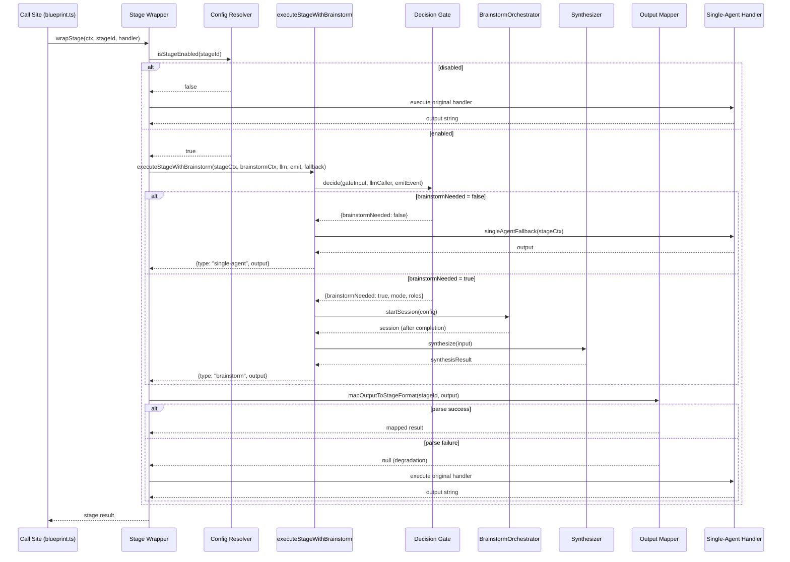

# Design Document: Brainstorm Pipeline Hookup

## Overview

本设计将已实现的 `autopilot-multi-agent-brainstorm` 子系统（Decision Gate、BrainstormOrchestrator、Synthesizer、Memory Store）接入真实 autopilot blueprint 管线的 6 个阶段。核心思路是在每个 pipeline stage handler 外层引入一个 **Stage Wrapper** 函数，该函数：

1. 读取 per-stage 环境变量配置，决定是否启用 brainstorm decision gating
2. 如果启用，调用 `executeStageWithBrainstorm()` 进行 Decision Gate 评估
3. 根据结果路由到 brainstorm 多 Agent 路径或 single-agent 直连路径
4. 对 brainstorm 输出进行 stage-specific 格式映射
5. 任何异常均 graceful degrade 回 single-agent

设计遵循 **additive wrapping** 原则：不修改现有 stage handler 的签名、返回值或内部逻辑，仅在调用点外层包裹决策逻辑。当 brainstorm 关闭时，执行路径与当前代码完全一致（零额外 LLM 调用、零额外事件、零额外延迟）。

### Key Design Decisions

| 决策 | 选择 | 理由 |
|------|------|------|
| 拦截位置 | stage handler 调用点外层 | 不修改 handler 签名，保证向后兼容 |
| 配置模型 | master switch + per-stage env vars | 渐进式 rollout，运维可逐 stage 开启 |
| 适配器模式 | 桥接 adapter (LLM + EventEmitter) | brainstorm 子系统设计为可注入，不直接依赖 ctx |
| 输出映射 | per-stage parser + degrade-on-failure | 结构化阶段需要 JSON 解析，文本阶段直通 |
| 错误策略 | top-level try/catch → single-agent | brainstorm 永不阻塞主管线 |

## Architecture

```mermaid
graph TB
    subgraph "Pipeline Stage Entry"
        A[Stage Handler Call Site] --> B{stageConfigResolver}
        B -->|disabled| C[Single-Agent Path<br/>existing handler]
        B -->|enabled| D[Stage Wrapper]
    end

    subgraph "Stage Wrapper"
        D --> E[Build StageContext]
        E --> F[executeStageWithBrainstorm]
        F --> G{Decision Gate}
        G -->|single-agent| H[Single-Agent Fallback]
        G -->|brainstorm| I[BrainstormOrchestrator]
        I --> J[Synthesizer]
        J --> K[Stage Output Mapper]
        K -->|parse success| L[Return brainstorm output]
        K -->|parse failure| M[Degrade → Single-Agent]
    end

    subgraph "Adapter Bridges"
        N[LLM Caller Adapter] -->|delegates| O[ctx.llm.callJson]
        P[Event Emitter Adapter] -->|constructs event| Q[ctx.eventBus.emit]
    end

    subgraph "BlueprintServiceContext"
        R[brainstormContext: BrainstormServiceContext | null]
        R --> I
        R --> J
    end

    F --> N
    F --> P
```

### Sequence Diagram: Stage Execution with Brainstorm



## Components and Interfaces

### 1. `stageConfigResolver` — Per-Stage Configuration Resolver

```typescript
// server/routes/blueprint/brainstorm/stage-config.ts

export interface BrainstormStageConfig {
  masterEnabled: boolean;
  perStage: Record<BrainstormEligibleStage, boolean>;
}

export type BrainstormEligibleStage =
  | "route_generation"
  | "spec_tree"
  | "spec_docs"
  | "effect_preview"
  | "prompt_packaging"
  | "engineering_handoff";

/**
 * Resolves brainstorm configuration from environment variables.
 * Pure synchronous function — no LLM calls, no network I/O.
 */
export function resolveStageConfig(): BrainstormStageConfig;

/**
 * Checks whether brainstorm is enabled for a specific stage.
 * Returns true only when BOTH master AND per-stage are enabled.
 */
export function isStageEnabled(stageId: BrainstormEligibleStage): boolean;
```

Environment variable mapping:
| Stage | Env Var |
|-------|---------|
| route_generation | `BRAINSTORM_STAGE_ROUTE_GENERATION_ENABLED` |
| spec_tree | `BRAINSTORM_STAGE_SPEC_TREE_ENABLED` |
| spec_docs | `BRAINSTORM_STAGE_SPEC_DOCS_ENABLED` |
| effect_preview | `BRAINSTORM_STAGE_EFFECT_PREVIEW_ENABLED` |
| prompt_packaging | `BRAINSTORM_STAGE_PROMPT_PACKAGING_ENABLED` |
| engineering_handoff | `BRAINSTORM_STAGE_ENGINEERING_HANDOFF_ENABLED` |

### 2. `createLlmCallerAdapter` — LLM Caller Adapter Bridge

```typescript
// server/routes/blueprint/brainstorm/llm-adapter.ts

import type { BlueprintLlmDependencies } from "../context.js";
import type { LLMCallerFn } from "./decision-gate.js";

/**
 * Creates an LLMCallerFn adapter that bridges the brainstorm subsystem's
 * (prompt, options) => Promise<string> signature to ctx.llm.callJson.
 *
 * - Formats prompt + optional systemPrompt into messages array
 * - Uses ctx.llm.getConfig() for model/temperature
 * - Returns LLM response content as plain string
 * - Propagates errors unmodified (brainstorm has its own retry logic)
 */
export function createLlmCallerAdapter(
  llm: BlueprintLlmDependencies,
): LLMCallerFn;
```

### 3. `createEventEmitterAdapter` — Event Emitter Adapter Bridge

```typescript
// server/routes/blueprint/brainstorm/event-emitter-adapter.ts

import type { BlueprintEventBus, BlueprintLogger } from "../context.js";
import type { EventEmitterFn } from "./decision-gate.js";
import type { BlueprintGenerationStage } from "../../../../shared/blueprint/index.js";

export interface EventEmitterAdapterContext {
  eventBus: BlueprintEventBus;
  logger: BlueprintLogger;
  jobId: string;
  stage: BlueprintGenerationStage;
  projectId?: string;
}

/**
 * Creates an EventEmitterFn adapter that bridges brainstorm's
 * (type, payload) => void to ctx.eventBus.emit(BlueprintGenerationEvent).
 *
 * - Constructs BlueprintGenerationEvent with randomUUID() id
 * - Sets family to "brainstorm"
 * - Populates jobId, stage, status, occurredAt from execution context
 * - Swallows eventBus.emit errors (logs at warn level)
 */
export function createEventEmitterAdapter(
  adapterCtx: EventEmitterAdapterContext,
): EventEmitterFn;
```

### 4. `wrapStageWithBrainstorm` — Stage Wrapper

```typescript
// server/routes/blueprint/brainstorm/stage-wrapper.ts

import type { BlueprintServiceContext } from "../context.js";
import type { StageResult, StageContext } from "./pipeline-integration.js";
import type { BrainstormEligibleStage } from "./stage-config.js";

export interface StageWrapperOptions {
  ctx: BlueprintServiceContext;
  jobId: string;
  stageId: BrainstormEligibleStage;
  stageDescription: string;
  previousStageOutputs?: string[];
  /** The original single-agent handler that produces stage output */
  singleAgentFn: () => Promise<string>;
}

/**
 * Wraps a pipeline stage with brainstorm decision gating.
 *
 * Algorithm:
 * 1. Check isStageEnabled(stageId) — if false, run singleAgentFn directly
 * 2. Check ctx.brainstormContext — if null, run singleAgentFn directly
 * 3. Build StageContext, LLM adapter, Event adapter
 * 4. Call executeStageWithBrainstorm()
 * 5. Map output to stage format via stageOutputMapper
 * 6. On any exception: log warn, run singleAgentFn
 *
 * Returns: stage output string (identical format to singleAgentFn return)
 */
export async function wrapStageWithBrainstorm(
  options: StageWrapperOptions,
): Promise<string>;
```

### 5. `stageOutputMapper` — Brainstorm Output to Stage Format Mapper

```typescript
// server/routes/blueprint/brainstorm/stage-output-mapper.ts

import type { BrainstormEligibleStage } from "./stage-config.js";

export interface StageOutputMapResult {
  success: boolean;
  /** Mapped output string, or null on parse failure */
  output: string | null;
  /** Error message on parse failure */
  error?: string;
}

/**
 * Maps brainstorm synthesis output to the expected format of a pipeline stage.
 *
 * - route_generation: parse as JSON RouteSet → re-serialize for downstream
 * - spec_tree: parse as JSON node array → re-serialize for downstream
 * - spec_docs: parse as markdown/JSON document content → validate structure
 * - effect_preview / prompt_packaging / engineering_handoff: pass-through (text)
 *
 * On parse failure: returns { success: false, output: null, error }
 */
export function mapStageOutput(
  stageId: BrainstormEligibleStage,
  rawOutput: string,
): StageOutputMapResult;
```

### 6. `BlueprintServiceContext` Extension

```typescript
// Addition to server/routes/blueprint/context.ts

import type { BrainstormServiceContext } from "./brainstorm/pipeline-integration.js";

// Added to BlueprintServiceContext interface:
export interface BlueprintServiceContext {
  // ... existing fields ...

  /**
   * Optional brainstorm subsystem context.
   * Non-null when BLUEPRINT_BRAINSTORM_ENABLED=true AND BUILD_TARGET!=test.
   * Assembled by buildBlueprintServiceContext using LLM/EventBus adapters.
   */
  brainstormContext?: BrainstormServiceContext | null;
}
```

### 7. Diagnostics Extension

```typescript
// Addition to diagnostics endpoint response

export interface BrainstormDiagnosticsEntry {
  enabled: boolean;
  activeSessionsCount: number;
  totalSessionsCompleted: number;
  degradationCount: number;
  perStageConfig: Record<BrainstormEligibleStage, boolean>;
}
```

## Data Models

### StageContext (passed to executeStageWithBrainstorm)

```typescript
interface StageContext {
  jobId: string;                      // Current job ID
  stageId: string;                    // BlueprintGenerationStage value
  stageDescription: string;           // Human-readable: "Generate route set from intake"
  degradedBridges: string[];          // List of currently degraded capability bridges
  previousStageOutputs?: string[];    // Summaries from completed prior stages
}
```

### BrainstormServiceContext (assembled into BlueprintServiceContext)

```typescript
interface BrainstormServiceContext {
  orchestrator: BrainstormOrchestrator;
  synthesizer: BrainstormSynthesizer;
  memoryStore: BrainstormMemoryStore;
  enabled: boolean;
}
```

### BlueprintGenerationEvent (brainstorm events)

All brainstorm events follow the existing `BlueprintGenerationEvent` structure:

```typescript
{
  id: string;           // randomUUID()
  jobId: string;        // from execution context
  type: string;         // e.g. "brainstorm.session.started"
  family: "brainstorm"; // always "brainstorm"
  stage: string;        // current BlueprintGenerationStage
  status: string;       // current job status
  message: string;      // human-readable description
  occurredAt: string;   // ISO timestamp
  // ... additional payload fields via spread
}
```

### Per-Stage Config Resolution Flow

```
BLUEPRINT_BRAINSTORM_ENABLED === "true"?
  └─ No  → all stages disabled (short-circuit)
  └─ Yes → check per-stage:
             BRAINSTORM_STAGE_{STAGE}_ENABLED === "true"?
               └─ No  → this stage disabled
               └─ Yes → this stage enabled

BUILD_TARGET === "test"?
  └─ Yes → brainstormContext = null (overrides everything)
```

## Correctness Properties

*A property is a characteristic or behavior that should hold true across all valid executions of a system — essentially, a formal statement about what the system should do. Properties serve as the bridge between human-readable specifications and machine-verifiable correctness guarantees.*

### Property 1: Context Assembly Correctness

*For any* combination of `BLUEPRINT_BRAINSTORM_ENABLED` and `BUILD_TARGET` environment variable values, `brainstormContext` SHALL be non-null if and only if `BLUEPRINT_BRAINSTORM_ENABLED === "true"` AND `BUILD_TARGET !== "test"`. In all other cases, `brainstormContext` SHALL be `null`, and assembly errors SHALL never propagate.

**Validates: Requirements 1.2, 1.3, 1.6, 8.1**

### Property 2: Per-Stage Configuration Resolution

*For any* stage ID and combination of master/per-stage environment variable values, `isStageEnabled(stageId)` SHALL return `true` if and only if BOTH `BLUEPRINT_BRAINSTORM_ENABLED === "true"` AND the corresponding `BRAINSTORM_STAGE_{STAGE}_ENABLED === "true"`. The resolution SHALL complete synchronously without any LLM call or network operation.

**Validates: Requirements 3.2, 3.3, 3.4, 3.5**

### Property 3: Graceful Degradation Invariant

*For any* exception thrown by any component of the brainstorm subsystem (Decision Gate, Orchestrator, Synthesizer, output mapper), the Stage Wrapper SHALL catch the exception, execute the single-agent fallback, and produce output identical to what the original stage handler would have returned. The brainstorm subsystem SHALL never cause a pipeline stage to fail.

**Validates: Requirements 4.1, 4.2, 4.3, 4.4, 4.6**

### Property 4: Event Adapter Structural Invariant

*For any* `(type, payload)` pair emitted through the Event Emitter Adapter, the constructed `BlueprintGenerationEvent` SHALL have: (a) `family === "brainstorm"`, (b) a non-empty `jobId` derived from execution context, (c) a valid `stage` field, (d) a unique `id` generated via `randomUUID()`, and (e) a valid ISO `occurredAt` timestamp. Furthermore, if `ctx.eventBus.emit` throws, the error SHALL be swallowed and logged at warn level.

**Validates: Requirements 5.5, 5.6, 7.1, 7.2, 7.4, 7.5**

### Property 5: LLM Adapter Delegation Transparency

*For any* `(prompt, options)` input to the LLM Caller Adapter, the adapter SHALL invoke `ctx.llm.callJson` with equivalent message content and return the response as a plain string. If `ctx.llm.callJson` throws an error, the adapter SHALL propagate that exact error to the caller without wrapping or modification.

**Validates: Requirements 6.1, 6.3, 6.4**

### Property 6: Stage Output Parse-or-Degrade

*For any* brainstorm synthesis output and target stage, the output mapper SHALL either (a) successfully parse the output into the stage's expected format and return it, or (b) if parsing fails, signal failure so the Stage Wrapper can degrade to single-agent execution. For text-only stages (effect_preview, prompt_packaging, engineering_handoff), the output SHALL always pass through successfully.

**Validates: Requirements 10.1, 10.2, 10.3, 10.4, 10.5**

### Property 7: Backward Compatibility

*For any* pipeline stage execution where brainstorm is disabled (either via master switch, per-stage switch, or BUILD_TARGET=test), the stage SHALL produce output identical to calling the original handler directly, with zero additional LLM calls, zero additional events emitted, and zero additional latency. The Stage Wrapper SHALL not modify existing stage artifacts, events, or job state.

**Validates: Requirements 8.2, 8.3, 8.4, 8.5**

### Property 8: Stage Wrapper Output Equivalence

*For any* `StageResult` returned by `executeStageWithBrainstorm()`, regardless of whether `type === "brainstorm"` or `type === "single-agent"`, the Stage Wrapper SHALL use the `output` field as the stage's LLM generation result (after applying stage-specific output mapping for brainstorm results).

**Validates: Requirements 2.4, 2.5**

## Error Handling

### Error Hierarchy

```
Stage Wrapper (top-level try/catch)
├── Config Resolution Error → impossible (pure synchronous env reads)
├── LLM Adapter Error → propagated TO brainstorm subsystem (not caught here)
│   └── Brainstorm internal retry logic handles it
├── Event Adapter Error → swallowed internally (logged at warn)
├── executeStageWithBrainstorm Error → caught → single-agent fallback
│   ├── Decision Gate timeout/failure → internal fallback to single-agent
│   ├── Orchestrator session failure → internal degradation
│   └── Unhandled exception → caught by Stage Wrapper
├── Stage Output Mapper Error → caught → single-agent fallback
└── Single-Agent Fallback Error → NOT caught (propagates as current behavior)
```

### Degradation Events

When degradation occurs, the following event is emitted:

```typescript
{
  type: "brainstorm.degraded",
  family: "brainstorm",
  jobId, stage, status,
  message: `Brainstorm degraded at ${stageId}: ${reason}`,
  // payload fields:
  reason: string,
  affectedComponent: "decision-gate" | "orchestrator" | "synthesizer" | "output-mapper",
  fallbackAction: "single-agent",
}
```

### Logging Strategy

| Level | Scenario |
|-------|----------|
| `debug` | Brainstorm disabled for stage (expected path) |
| `info` | Brainstorm session started/completed |
| `warn` | Graceful degradation triggered; event emit error swallowed |
| `error` | Never — brainstorm failures are warnings, not errors |

## Testing Strategy

### Property-Based Testing (PBT)

This feature is well-suited for property-based testing because:
- The config resolver is a pure function with clear input/output
- The adapter bridges have universal delegation properties
- The graceful degradation guarantee is a universal invariant
- The output mapper has clear parse-or-fail behavior

**Library:** `fast-check` (already used in the project)
**Minimum iterations:** 100 per property test

Each property test SHALL reference its design property via tag format:
**Feature: brainstorm-pipeline-hookup, Property {N}: {title}**

### Test Structure

| Test Category | Focus | Count |
|---------------|-------|-------|
| Property tests | Properties 1-8 | 8 property tests, 100+ iterations each |
| Unit tests (example) | Adapter wiring, diagnostics shape, stage coverage | ~10 tests |
| Integration tests | End-to-end stage wrapper with mock LLM | ~6 tests (one per stage) |

### Unit Tests (Example-Based)

- Config resolver returns correct per-stage values for explicit env scenarios
- LLM adapter formats messages correctly for ctx.llm.callJson
- Event adapter constructs valid BlueprintGenerationEvent shape
- Diagnostics endpoint includes brainstorm entry
- All 6 stages have wrapper applied
- Stage output mapper handles each stage's expected format
- BUILD_TARGET=test produces null brainstormContext

### Property Tests

1. **Context assembly:** Generate random env value strings → verify brainstormContext null/non-null invariant
2. **Config resolution:** Generate random (masterEnabled, perStageValues) → verify isStageEnabled logical AND
3. **Graceful degradation:** Generate random errors (throw, reject, invalid output) → verify single-agent fallback always produces output
4. **Event adapter structure:** Generate random (type, payload) pairs → verify all BlueprintGenerationEvent fields present and valid
5. **LLM adapter delegation:** Generate random prompts → verify callJson called and result returned as string
6. **Output mapper parse-or-degrade:** Generate random strings → verify structured stages parse valid JSON or return failure
7. **Backward compatibility:** Generate random inputs with brainstorm disabled → verify output matches direct handler call
8. **Stage result routing:** Generate random StageResult objects → verify output field is always used

### Integration Tests

- Full Stage Wrapper flow with mock LLM that returns brainstorm-needed decision
- Full Stage Wrapper flow with mock LLM that returns single-agent decision
- Stage Wrapper degradation path when orchestrator throws
- Stage Wrapper with invalid synthesis output triggers fallback
- Diagnostics endpoint with brainstorm enabled returns live counters
- Diagnostics endpoint with brainstorm disabled returns zeroed entry
