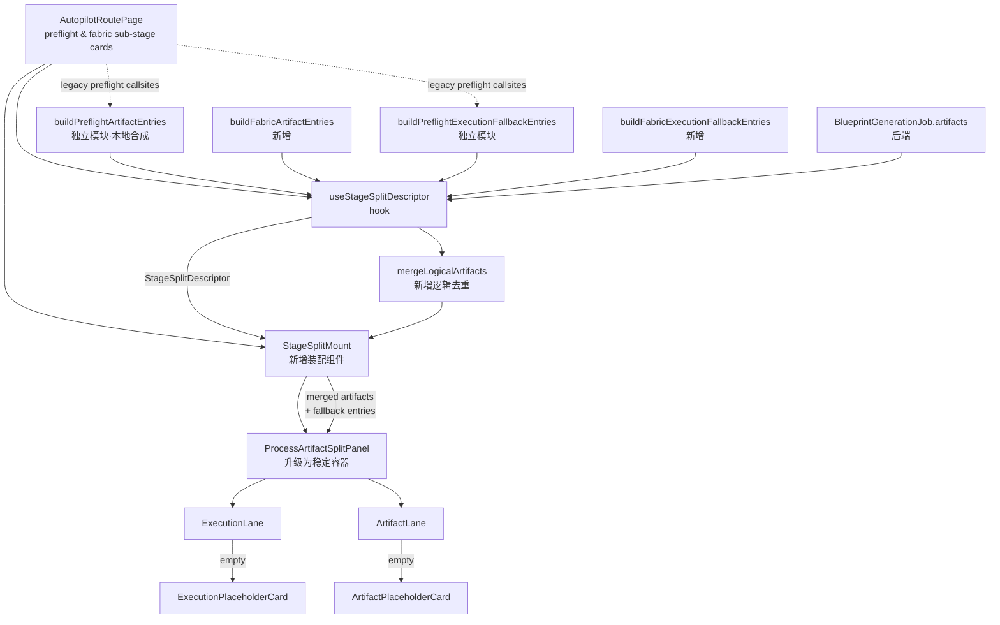
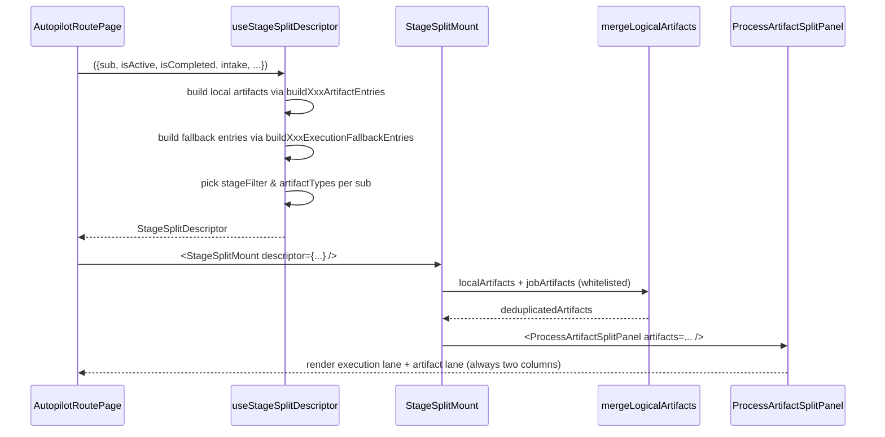
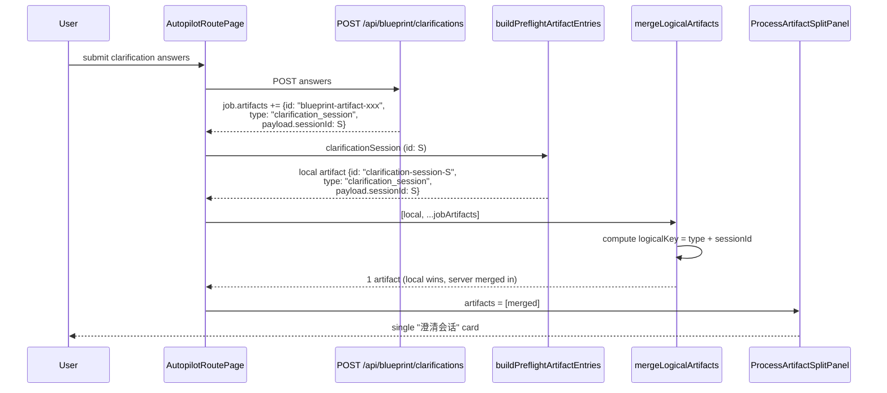
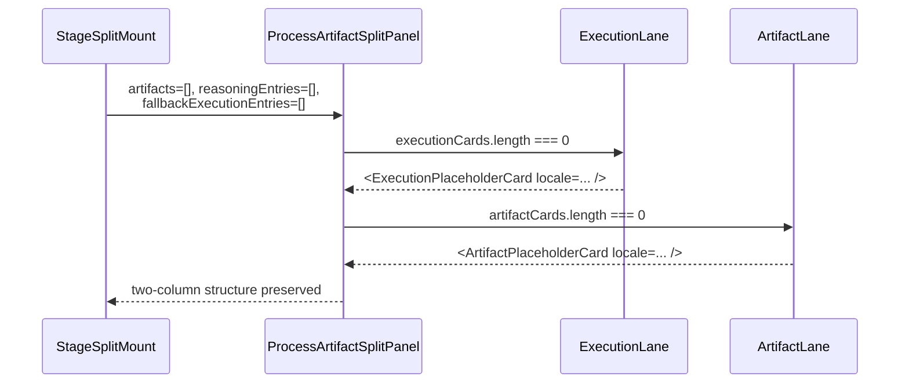

# Design Document: spec-first-stage-process-artifact-split-uniform

## Overview

SPEC-FIRST 蓝图驾驶舱页面 (`AutopilotRoutePage`) 当前在不同 sub-stage 下手工
装配 `<ProcessArtifactSplitPanel>`，导致三类不一致：(1) 部分 sub-stage（如
`target_input` 活跃态，以及 fabric 阶段下的 `agent_crew_fabric / spec_tree /
effect_preview / prompt_package / runtime_capability / engineering_handoff /
artifact_memory` 共 7 个 sub-stage）根本没挂载双栏；(2) `clarification` 阶段
提交后右栏出现两张同一逻辑会话的产物卡片，因为去重只比较 `artifact.id` 字面
值；(3) 当任一栏为空时整块退化为单行 `EmptyLane`，与"已有产物"的视觉密度差
距过大，让用户误判为"挂载失败"或"产物消失"。

本设计把"执行流 / 产物流"双栏从"按 sub-stage 分散装配"重构为**统一描述符 +
单一渲染入口**：每个 sub-stage 只声明自己的 `StageSplitDescriptor`（执行流过滤
器、产物类型白名单、本地合成 artifact、fallback 文案），由一个新增的
`useStageSplitDescriptor` hook 集中输出，再由所有挂载点（preflight 4 个
sub-stage 与 fabric 7 个 sub-stage 的 active / completed 卡片，共 11 个
sub-stage）共享同一份装配逻辑。同时把 `<ProcessArtifactSplitPanel>` 升级为
"双栏始终保留结构 + 空态降级为占位卡片"的稳定容器，并在产物侧引入
`logicalArtifactKey` 维度的去重以消除澄清会话双卡片问题。

设计严格遵守现有兼容边界：保留 `BlueprintGenerationArtifact` 字段语义、不引入
第二套 mission/runtime 真相源、不改变 GitHub Pages 静态预览数据流、不影响
`WorkbenchExecutionPanel` 中独立挂载的双栏外观。

## Architecture



边界声明（与 steering 一致）：
- `useStageSplitDescriptor` 是**派生层**，不写回任何 store；它只读
  `useBlueprintRealtimeStore` 与父组件传入的 `intake / clarificationSession /
  routeSet / selection / specTree / latestJob` props，不引入新的 mission /
  workflow / runtime 真相源。
- `mergeLogicalArtifacts` 只在 UI 渲染前合并，不修改 `latestJob.artifacts` 自身。
- `buildPreflightArtifactEntries` / `buildPreflightExecutionFallbackEntries`
  必须先从 `AutopilotRoutePage.tsx` 抽出为独立模块（见 Component 0），由
  `useStageSplitDescriptor` 与现有 preflight 装配点共同 import，避免
  `right-rail/` 反向依赖 `AutopilotRoutePage.tsx` 形成循环。
- `useStageSplitDescriptor` 在结构上应实现为对纯函数
  `deriveStageSplitDescriptor(input)` 的 `useMemo` 薄包裹（见 Performance
  Considerations 中的 Rules of Hooks 风险声明），从而让调用方既可在顶层一次
  性、按 `AnyStageSub` 分支调用 hook，也可在单一 `useMemo` 中遍历 11 个 sub
  调用纯函数，避免在条件 / 映射分支内调用 hook 触发 Rules of Hooks 违例。

## Sequence Diagrams

### Sequence 1：active sub-stage 装配双栏



### Sequence 2：澄清提交后逻辑去重



### Sequence 3：empty lane 占位卡片



## Components and Interfaces

### Component 0: 抽出 `buildPreflightArtifactEntries` / `buildPreflightExecutionFallbackEntries`（前置迁移步骤）

**Purpose**: 当前 `buildPreflightArtifactEntries` 与
`buildPreflightExecutionFallbackEntries` 内联实现于
`client/src/pages/autopilot/AutopilotRoutePage.tsx`（约第 594 行与第 676 行
开始）。`useStageSplitDescriptor` 必须能从 `right-rail/` 子树消费这两个函数；
若直接 `import` `AutopilotRoutePage.tsx`，会形成
`right-rail/` → `AutopilotRoutePage.tsx` → `right-rail/StageSplitMount` →
`right-rail/useStageSplitDescriptor` → `AutopilotRoutePage.tsx` 的循环依赖，
阻塞编译。

**Migration**: 把这两个函数（以及它们使用到的局部辅助 / 常量，例如
`PREFLIGHT_ARTIFACT_TYPES` 中与之耦合的部分）原样搬迁到一个新模块：

```
client/src/pages/autopilot/right-rail/stage-split-descriptor/
  ├── build-preflight-artifact-entries.ts
  └── build-preflight-execution-fallback-entries.ts
```

**Constraints**:
- 抽出后的模块不引入对 `AutopilotRoutePage.tsx` 的 `import`。
- `AutopilotRoutePage.tsx` 现有的 6 处
  `artifacts={buildPreflightArtifactEntries(...)}` 与 6 处
  `fallbackExecutionEntries={buildPreflightExecutionFallbackEntries(...)}`
  callsite 改为从新模块 `import`；行为字节对等。
- `useStageSplitDescriptor` 与 `<StageSplitMount>` 也只从新模块 `import`，
  不再回链 `AutopilotRoutePage.tsx`。
- 抽出动作必须在 `useStageSplitDescriptor` 实现前合入，否则后续 hook 改造
  无法在不破坏现有 6+6 处 callsite 的情况下绿。

**Interface**:

```typescript
// build-preflight-artifact-entries.ts
export function buildPreflightArtifactEntries(args: {
  sub: "target_input" | "intake_created" | "clarification" | "route";
  intake: BlueprintIntake | null;
  projectContext: BlueprintProjectDomainContext | null;
  clarificationSession: BlueprintClarificationSession | null;
  routeSet: BlueprintRouteSet | null;
  selection: BlueprintRouteSelection | null;
  specTree: BlueprintSpecTree | null;
  // 视抽出实测保留的依赖原样保留
}): BlueprintGenerationArtifact[];

// build-preflight-execution-fallback-entries.ts
export function buildPreflightExecutionFallbackEntries(args: {
  sub: "target_input" | "intake_created" | "clarification" | "route";
  locale: AppLocale;
  // 视抽出实测保留的依赖原样保留
}): ProcessArtifactFallbackExecutionEntry[];
```

**Responsibilities**:
- 仅做物理位置迁移与 import 路径更新；不调整内部实现、不调整签名以外的参数顺序。
- 保留这两个函数当前在 `StoreObservabilityHud.test.tsx` 第 225 行附近被
  `source.match(/artifacts=\{buildPreflightArtifactEntries\(/g)` 字面正则
  匹配的可读形态（迁移后该正则改为匹配 `<StageSplitMount` 即可，不需要保留
  callsite 的字面 token，但函数名必须保留为同名导出）。

### Component 1: `useStageSplitDescriptor` (新增 hook)

**Purpose**: 把每个 sub-stage（preflight 三段 + fabric 四段）所需要的双栏参数
集中输出，是所有挂载点的唯一描述符来源。

**Interface**:

```typescript
type AnyStageSub =
  | "target_input"          // preflight - 输入活跃前
  | "intake_created"        // preflight - 输入记录已创建
  | "clarification"         // preflight - 澄清
  | "route"                 // preflight - 路线生成 / 选择 / spec_tree 派生
  | "agent_crew_fabric"     // fabric - Agent 编队
  | "spec_tree"             // fabric - SPEC 树
  | "effect_preview"        // fabric - 效果预览
  | "prompt_package"        // fabric - Prompt 套件
  | "runtime_capability"    // fabric - 运行期能力
  | "engineering_handoff"   // fabric - 工程交接
  | "artifact_memory";      // fabric - 产物记忆 / 回放

interface StageSplitDescriptorInput {
  sub: AnyStageSub;
  locale: AppLocale;
  isActive: boolean;
  isCompleted: boolean;
  // preflight 真相源
  intake: BlueprintIntake | null;
  projectContext: BlueprintProjectDomainContext | null;
  clarificationSession: BlueprintClarificationSession | null;
  readiness: BlueprintClarificationReadiness | undefined;
  routeSet: BlueprintRouteSet | null;
  selection: BlueprintRouteSelection | null;
  specTree: BlueprintSpecTree | null;
  // fabric 真相源
  job: BlueprintGenerationJob | null;
}

interface StageSplitDescriptor {
  sub: AnyStageSub;
  /** 该阶段允许出现在右栏的 artifact.type 白名单 */
  artifactTypes: readonly BlueprintGenerationArtifactType[];
  /** 该阶段在左栏 reasoning 流上的 stageId 过滤集合 */
  stageFilter: string | readonly string[];
  /** 本地合成 + 后端 job.artifacts 经逻辑去重后得到的最终右栏数据 */
  artifacts: readonly BlueprintGenerationArtifact[];
  /** reasoning 为空时落到左栏的 fallback 文案 */
  fallbackExecutionEntries: readonly ProcessArtifactFallbackExecutionEntry[];
  /** 是否应该挂载双栏：active 永远 true；completed 时按既有规则保留 */
  shouldMount: boolean;
}

function useStageSplitDescriptor(
  input: StageSplitDescriptorInput
): StageSplitDescriptor;
```

**Responsibilities**:
- 根据 `sub` 路由到对应的 `buildXxxArtifactEntries` / `buildXxxExecutionFallbackEntries`。
- 调用 `mergeLogicalArtifacts(local, job.artifacts.filter(allowed))` 合并去重。
- 在 `target_input` 等无真相源的活跃态下也返回 `shouldMount: true`，确保
  双栏占位始终可见（满足 1.1 / 2.1）。

### Component 2: `StageSplitMount` (新增装配组件)

**Purpose**: 唯一渲染入口，消费 `StageSplitDescriptor` 与 `latestJob`，渲染
`<ProcessArtifactSplitPanel>`；保留 `data-testid` 与现有 `className` 容器，便于
回归。

**Interface**:

```typescript
interface StageSplitMountProps {
  descriptor: StageSplitDescriptor;
  job: BlueprintGenerationJob | null;
  locale: AppLocale;
  /** 当前 sub-stage 卡片是 active 还是 completed，用于 testid 区分 */
  variant: "active" | "completed";
}

const StageSplitMount: FC<StageSplitMountProps>;
```

**Responsibilities**:
- 当 `descriptor.shouldMount === false` 时返回 `null`（preserve 历史不挂载分支）。
- 把 `descriptor.artifacts / stageFilter / artifactTypes / fallbackExecutionEntries`
  逐一透传给 `<ProcessArtifactSplitPanel>`。
- 不引入新的网络请求或状态。

### Component 3: `ProcessArtifactSplitPanel` (升级现有组件)

**Purpose**: 从"任一栏为空时退化为单行文本"升级为"双栏始终保留结构，空态使用
占位卡片"。

**Interface (新增 props)**:

```typescript
interface ProcessArtifactSplitPanelProps {
  // 现有 props 保持不变
  locale: AppLocale;
  job?: BlueprintGenerationJob | null;
  artifacts?: readonly BlueprintGenerationArtifact[];
  stageFilter?: string | readonly string[];
  artifactTypes?: readonly string[];
  reasoningEntries?: readonly AgentReasoningEntry[];
  fallbackExecutionEntries?: readonly ProcessArtifactFallbackExecutionEntry[];
  executionTitle?: string;
  artifactTitle?: string;
  /** NEW：当任一栏为空时是否渲染稳定占位（默认 true） */
  showEmptyPlaceholder?: boolean;
  /** NEW：自定义占位文案（覆盖 locale 默认） */
  emptyExecutionLabel?: string;
  emptyArtifactLabel?: string;
}
```

**Responsibilities**:
- 计算 `executionCards` / `artifactCards`（与现有行为一致）。
- 当 `showEmptyPlaceholder !== false` 且 `executionCards.length === 0`，渲染
  `<ExecutionPlaceholderCard>`；同理 `<ArtifactPlaceholderCard>`。
- 占位卡片使用与正式卡片接近的视觉密度（圆角 + 边框 + padding），但用骨架色调
  (`bg-slate-50`) 和 `text-slate-400` 区分；附 `aria-busy="true"` 以利可达性。
- `WorkbenchExecutionPanel` 的非回归口径取**接受新基线**：本特性**不**给
  `<WorkbenchExecutionPanel>` 的公共 props 表面新增 `showEmptyPlaceholder`
  透传开关；非空数据下渲染结构与历史完全等价（不回归），空态下允许新增
  `<ExecutionPlaceholderCard>` / `<ArtifactPlaceholderCard>` 节点作为新的视觉
  基线；回归测试以新基线为准对比，而不是重新对比历史空白基线。

### Component 4: `mergeLogicalArtifacts` (新增工具函数)

**Purpose**: 在 `artifact.id` 字面去重之上引入"逻辑产物"维度的去重，解决澄清
会话双卡片问题，并对未来其他 stage（如 `route_set`、`spec_tree`）保持一致语义。

**Interface**:

```typescript
function mergeLogicalArtifacts(
  artifacts: readonly BlueprintGenerationArtifact[]
): BlueprintGenerationArtifact[];

/**
 * 计算逻辑键。命中下表则按逻辑键合并；否则退回 artifact.id。
 *
 * | type                 | logicalKey                              |
 * |----------------------|-----------------------------------------|
 * | clarification_session| `clar:${payload.sessionId ?? id}`       |
 * | route_set            | `route_set:${payload.routeSetId ?? id}` |
 * | route_selection      | `route_sel:${payload.selectionId ?? id}`|
 * | spec_tree            | `spec_tree:${payload.treeId ?? id}`     |
 * | intake               | `intake:${payload.intakeId ?? id}`      |
 * | github_source        | `gh:${payload.normalizedUrl ?? id}`     |
 * | project_context      | `pctx:${payload.projectId ?? id}`       |
 * | <other>              | `id:${id}`                              |
 */
function computeLogicalArtifactKey(
  artifact: BlueprintGenerationArtifact
): string;
```

**Responsibilities**:
- 同 logicalKey 下保留**最早的本地合成 artifact** 作为 representative（保证
  `id` 仍为可读形式如 `clarification-session-${sessionId}`）；`id`、`title`、
  `summary`、`type` 字段在合并过程中**不被覆盖**，始终采用 representative 的
  原值。
- 字段级合并精度（合并 `prev`（先到的本地 representative）与 `a`（同 key 后
  到的、通常来自后端 `job.artifacts` 的 artifact）时）：
  - `staleSince`：`a.staleSince` 非空时取 `a` 的值，否则保留 `prev` 的值；
  - `invalidatedBy`：`a.invalidatedBy` 非空时取 `a` 的值，否则保留 `prev` 的
    值；
  - `createdAt`：取较早的一个（`pickEarlier(prev.createdAt, a.createdAt)`），
    避免占位先于真实产物消失；
  - `payload`：浅合并，**本地 representative 在键冲突时获胜**——后端 sparse
    payload 仅用来补齐 representative 中缺失的键，绝不覆盖已有键，从而保证
    UI 已渲染出来的丰富字段（如澄清问题列表 / 答案）不会因为后端推送的 sparse
    payload 在去重时被擦除。

## Data Models

### Model 1: `StageSplitDescriptor`

```typescript
interface StageSplitDescriptor {
  sub: AnyStageSub;
  artifactTypes: readonly BlueprintGenerationArtifactType[];
  stageFilter: string | readonly string[];
  artifacts: readonly BlueprintGenerationArtifact[];
  fallbackExecutionEntries: readonly ProcessArtifactFallbackExecutionEntry[];
  shouldMount: boolean;
}
```

**Validation Rules**:
- `artifactTypes.length >= 0`，可以为空（如 `target_input`）。
- `stageFilter` 至少存在一个 stageId 字符串；空字符串视为 invalid。
- `artifacts` 中每个元素的 `type` 必须 ∈ `artifactTypes`（即 hook 内部已经
  完成白名单过滤，下游不再二次过滤）。
- `shouldMount === true` 是 `isActive === true` 的必要条件（active 必挂）。

### Model 2: `STAGE_ARTIFACT_TYPES`

把现有 `PREFLIGHT_ARTIFACT_TYPES` 扩展为 `STAGE_ARTIFACT_TYPES`，覆盖全部 11
个 sub-stage（4 个 preflight + 7 个 fabric），且只使用
`BlueprintGenerationArtifactType` 联合中真实存在的字面量：

```typescript
const STAGE_ARTIFACT_TYPES: Record<
  AnyStageSub,
  readonly BlueprintGenerationArtifactType[]
> = {
  // preflight (unchanged)
  target_input: [],                                          // 无产物，仅占位
  intake_created: ["intake", "github_source", "project_context", "sandbox_derivation_job"],
  clarification: ["clarification_session"],
  route: ["route_set", "route_selection", "spec_tree"],
  // fabric (7 real sub-stages, only legal artifact types)
  agent_crew_fabric: ["agent_crew", "role_timeline", "capability_registry"],
  spec_tree: ["spec_tree", "spec_tree_version", "spec_document_version", "requirements", "design", "tasks"],
  effect_preview: ["preview", "effect_preview"],
  prompt_package: ["prompt_pack"],
  runtime_capability: ["capability_invocation", "capability_evidence"],
  engineering_handoff: ["engineering_plan", "engineering_run"],
  artifact_memory: ["replay", "feedback"],
};
```

**Validation Rules**:
- 所有出现在表中的字面量必须属于 `shared/blueprint/contracts.ts` 当前导出的
  `BlueprintGenerationArtifactType` 联合（`intake | github_source |
  clarification_session | project_context | route_set | route_selection |
  spec_tree | spec_tree_version | requirements | design | tasks |
  spec_document_version | preview | effect_preview | prompt_pack |
  capability_registry | agent_crew | role_timeline | capability_invocation |
  capability_evidence | sandbox_derivation_job | engineering_plan |
  engineering_run | replay | feedback`）；CI 通过编译保障。
- fabric 阶段的类型集合需要与现有 `PAGE_TWO_ARTIFACT_TYPES` 取并集兼容，避免
  漏过任一已有产物。

### Model 2.5: `STAGE_FILTER_BY_SUB`

把 sub-stage 与左栏 reasoning 流的 `stageId` 显式映射开。**实测发现**：服务端
emit 的 reasoning 事件 `stageId` 与 fabric 子阶段名并不总是一致（最关键的
错配是 `prompt_package` ↔ `prompt_packaging`），同时 `route` 需要合并三段
stageId。把这层映射沉淀为独立表，避免在 hook / mount 内反复写 `sub === "route"
? [...] : sub`：

```typescript
const STAGE_FILTER_BY_SUB: Record<AnyStageSub, string | readonly string[]> = {
  // preflight
  target_input: "target_input",
  intake_created: "intake_created",
  clarification: "clarification",
  route: ["route_generation", "route_selection", "spec_tree"],
  // fabric (注意 prompt_package 与服务端 stageId 不一致)
  agent_crew_fabric: "agent_crew_fabric",
  spec_tree: "spec_tree",
  effect_preview: "effect_preview",
  prompt_package: "prompt_packaging",   // ← 服务端 stageId
  runtime_capability: "runtime_capability",
  engineering_handoff: "engineering_handoff",
  artifact_memory: "artifact_memory",
};
```

**Validation Rules**:
- 每个 `AnyStageSub` 都必须有非空映射；空字符串视为 invalid。
- 字符串值必须出现在服务端 `BlueprintGenerationStage` 联合内（编译期通过对
  服务端 stage 字面集合的 `satisfies` 校验，运行期通过单测断言）。
- `prompt_package` 必须映射到 `"prompt_packaging"`（不是 `"prompt_package"`），
  与 `server/routes/blueprint/staleness/dependency-graph.ts` 中的
  `prompt_pack → prompt_packaging` 映射保持一致。

### Model 3: `LogicalArtifactKey`

```typescript
type LogicalArtifactKey = string; // 形如 "clar:S-123" | "id:blueprint-artifact-xxx"
```

**Validation Rules**:
- 不允许空字符串；computeLogicalArtifactKey 必返回非空。
- 同一 `(type, logical-id)` 对应同一 key，跨多次渲染保持稳定（不依赖
  `Date.now()` 等不稳定值）。

## Algorithmic Pseudocode

### Algorithm: `useStageSplitDescriptor`

```typescript
function useStageSplitDescriptor(input: StageSplitDescriptorInput): StageSplitDescriptor {
  ASSERT input.sub is one of AnyStageSub
  ASSERT input.locale ∈ {"zh-CN", "en-US"}

  // Step 1: 决定是否挂载
  const shouldMount =
    input.isActive ||
    input.isCompleted ||
    /* 历史路线卡片仍要挂载 */ input.sub === "route";

  // Step 2: 路由到本地合成器
  let localArtifacts: BlueprintGenerationArtifact[];
  const PREFLIGHT_SUBS = new Set([
    "target_input", "intake_created", "clarification", "route",
  ]);
  const FABRIC_SUBS = new Set([
    "agent_crew_fabric", "spec_tree", "effect_preview", "prompt_package",
    "runtime_capability", "engineering_handoff", "artifact_memory",
  ]);
  if (PREFLIGHT_SUBS.has(input.sub)) {
    localArtifacts = buildPreflightArtifactEntries({ ...preflight inputs, sub });
  } else {
    ASSERT FABRIC_SUBS.has(input.sub)
    localArtifacts = buildFabricArtifactEntries({ sub: input.sub, job: input.job });
  }

  // Step 3: 取后端 artifacts，按白名单过滤
  const allowedTypes = new Set(STAGE_ARTIFACT_TYPES[input.sub]);
  const jobArtifacts = (input.job?.artifacts ?? [])
    .filter(a => allowedTypes.has(a.type));

  // Step 4: 合并 + 逻辑去重
  const mergedArtifacts = mergeLogicalArtifacts([...localArtifacts, ...jobArtifacts]);

  // Step 5: 计算 fallback execution entries
  let fallbackEntries: ProcessArtifactFallbackExecutionEntry[];
  if (PREFLIGHT_SUBS.has(input.sub)) {
    fallbackEntries = buildPreflightExecutionFallbackEntries({ ...preflight inputs, sub, locale });
  } else {
    fallbackEntries = buildFabricExecutionFallbackEntries({ sub: input.sub, locale, job: input.job });
  }

  // Step 6: 计算 stageFilter（route 是合并的三段）
  const stageFilter =
    input.sub === "route"
      ? ["route_generation", "route_selection", "spec_tree"] as const
      : input.sub;

  ASSERT mergedArtifacts.every(a => allowedTypes.has(a.type))
  ASSERT fallbackEntries.length >= 0

  RETURN {
    sub: input.sub,
    artifactTypes: STAGE_ARTIFACT_TYPES[input.sub],
    stageFilter,
    artifacts: mergedArtifacts,
    fallbackExecutionEntries: fallbackEntries,
    shouldMount,
  };
}
```

**Preconditions:**
- `input.sub` 是 `AnyStageSub` 联合中的合法成员。
- `input.locale` 已归一化为 `"zh-CN" | "en-US"`。
- 各真相源 props 要么是合法对象要么是 `null`/`undefined`，函数内部用 nullish 守卫。

**Postconditions:**
- 返回值的 `artifacts` 不含同 `logicalKey` 的重复条目。
- 所有返回的 `artifacts[i].type` 都在该 sub 的白名单内。
- `shouldMount === true` 时调用方可以安全把 `<StageSplitMount>` 挂到 DOM。

**Loop Invariants:** N/A（无显式循环；过滤与去重各自一次线性扫描）。

### Algorithm: `mergeLogicalArtifacts`

```typescript
function mergeLogicalArtifacts(
  artifacts: readonly BlueprintGenerationArtifact[]
): BlueprintGenerationArtifact[] {
  ASSERT artifacts is iterable

  const byKey = new Map<LogicalArtifactKey, BlueprintGenerationArtifact>();
  const order: LogicalArtifactKey[] = [];

  FOR each a IN artifacts DO
    ASSERT order matches insertion sequence so far
    const key = computeLogicalArtifactKey(a);

    IF NOT byKey.has(key) THEN
      byKey.set(key, a);
      order.push(key);
    ELSE
      const prev = byKey.get(key)!;
      // representative 是 prev（本地优先）；id / title / summary / type 不动
      const merged: BlueprintGenerationArtifact = {
        ...prev,
        staleSince: a.staleSince ?? prev.staleSince,
        invalidatedBy: a.invalidatedBy ?? prev.invalidatedBy,
        // 关键：本地 representative 在键冲突时获胜。
        // 把后端 a.payload 放在前面、本地 prev.payload 放在后面，
        // 这样 prev 的键值会覆盖 a 中同名键，仅当 prev 缺该键时才用 a 的。
        payload: { ...(a.payload ?? {}), ...(prev.payload ?? {}) },
        // createdAt: 选最早一个，避免占位先于真实产物消失
        createdAt: pickEarlier(prev.createdAt, a.createdAt),
      };
      byKey.set(key, merged);
    END IF
  END FOR

  RETURN order.map(k => byKey.get(k)!);
}
```

**Preconditions:**
- 输入数组中每个 artifact 有合法 `id` 与 `type`。
- `computeLogicalArtifactKey` 是纯函数（同输入恒等输出）。

**Postconditions:**
- 输出数组长度 ≤ 输入数组长度。
- 任意 `i ≠ j`，`computeLogicalArtifactKey(out[i]) ≠ computeLogicalArtifactKey(out[j])`。
- 输出顺序为同一 `logicalKey` 在输入中**首次出现**的相对顺序（稳定）。
- `out` 中每个 artifact 的字段是输入中同 key 集合在合并规则下的确定结果
  （referential transparency）。

**Loop Invariants:**
- 在循环每一步 `byKey.size === order.length`。
- 在循环每一步 `byKey` 中所有 representative 的 `type` 来自原输入中同 key 的
  第一条记录。

### Algorithm: `ProcessArtifactSplitPanel`（升级版）

```pascal
PROCEDURE ProcessArtifactSplitPanel(props)
INPUT: props (locale, job, artifacts, stageFilter, artifactTypes,
       reasoningEntries, fallbackExecutionEntries,
       showEmptyPlaceholder = true, emptyExecutionLabel?, emptyArtifactLabel?)
OUTPUT: rendered React tree

BEGIN
  artifactCards ← deriveArtifactEntries(artifacts ?? job.artifacts, artifactTypes)
  reasoningCards ← deriveReasoningCards(reasoningEntries ?? store entries, stageFilter)

  IF reasoningCards is empty THEN
    fallbackCards ← deriveFallbackReasoningCards(
      fallbackExecutionEntries
        IF non-empty
        ELSE deriveArtifactFallbackExecutionEntries(artifactCards, locale)
    )
    executionCards ← fallbackCards
  ELSE
    executionCards ← reasoningCards
  END IF

  RETURN
    <section data-testid="autopilot-process-artifact-split-panel"
             className="grid two-column">
      <div data-testid="autopilot-process-execution-lane">
        <LaneTitle>{executionTitle ?? default}</LaneTitle>
        IF executionCards is non-empty THEN
          render each as <ReasoningCard>
        ELSE IF showEmptyPlaceholder THEN
          render <ExecutionPlaceholderCard
                   label={emptyExecutionLabel ?? defaultByLocale} />
        ELSE
          render <EmptyLane />          // 旧行为，保留兼容
        END IF
      </div>
      <div data-testid="autopilot-process-artifact-lane">
        <LaneTitle>{artifactTitle ?? default}</LaneTitle>
        IF artifactCards is non-empty THEN
          render each as <ArtifactCreatedCard> with <StaleBadge>
        ELSE IF showEmptyPlaceholder THEN
          render <ArtifactPlaceholderCard
                   label={emptyArtifactLabel ?? defaultByLocale} />
        ELSE
          render <EmptyLane />
        END IF
      </div>
    </section>
END PROCEDURE
```

**Preconditions:**
- `props.locale ∈ {"zh-CN", "en-US"}`。
- `props.artifacts` 中每个元素类型在 `props.artifactTypes` 内（如未传，则不过滤）。

**Postconditions:**
- 总是返回包含两个 lane 容器（`autopilot-process-execution-lane` 与
  `autopilot-process-artifact-lane`）的 `<section>`，无论数据是否为空（满足
  2.5 / 2.6）。
- 当 `showEmptyPlaceholder === true` 时，空 lane 渲染稳定占位卡片，绝不返回
  `null`。
- `artifactCards` / `executionCards` 的渲染顺序与计算结果一致。

**Loop Invariants:** N/A。

### Key Functions with Formal Specifications

```typescript
function buildFabricArtifactEntries(args: {
  sub:
    | "agent_crew_fabric"
    | "spec_tree"
    | "effect_preview"
    | "prompt_package"
    | "runtime_capability"
    | "engineering_handoff"
    | "artifact_memory";
  job: BlueprintGenerationJob | null;
  // 视需要扩展
}): BlueprintGenerationArtifact[];
```

**Preconditions:**
- `args.sub` 是 fabric 7 个 sub 之一。
- 不依赖 preflight 真相源（intake / clarificationSession 等）。

**Postconditions:**
- 返回的每个 artifact 的 `type` ∈ `STAGE_ARTIFACT_TYPES[args.sub]`。
- 返回数组可能为空（fabric 阶段早期的 active 态），此时上游会落到占位卡片。
- 不抛异常；任何 `null` 真相源都按 "no local artifacts" 处理。

```typescript
function buildFabricExecutionFallbackEntries(args: {
  sub:
    | "agent_crew_fabric"
    | "spec_tree"
    | "effect_preview"
    | "prompt_package"
    | "runtime_capability"
    | "engineering_handoff"
    | "artifact_memory";
  locale: AppLocale;
  job: BlueprintGenerationJob | null;
}): ProcessArtifactFallbackExecutionEntry[];
```

**Preconditions:**
- `args.locale ∈ {"zh-CN", "en-US"}`。

**Postconditions:**
- 每个 entry 的 `text` 是非空字符串。
- 每个 entry 的 `stageId` 与该 sub 在 `STAGE_FILTER_BY_SUB` 表中的 stageId 一致。
- 不抛异常；当 `job` 缺失时返回空数组（让占位卡片接管）。

## Example Usage

### Example 1：preflight active 态统一挂载

```typescript
// 在 AutopilotRoutePage.tsx 内，sub-stage 卡片渲染处
const descriptor = useStageSplitDescriptor({
  sub,                       // "target_input" | "intake_created" | "clarification" | "route"
  locale,
  isActive,
  isCompleted,
  intake,
  projectContext,
  clarificationSession,
  readiness,
  routeSet,
  selection,
  specTree,
  job: latestJob,
});

return (
  <SubStageCard ...>
    {/* 现有 active / completed UI 保持不变 */}
    {isActive && sub === "target_input" && <TargetInputForm ... />}
    {isActive && sub === "intake_created" && <IntakeSummary ... />}
    {/* … */}

    {/* 唯一新增：所有 sub 都通过同一入口装配双栏 */}
    <StageSplitMount
      descriptor={descriptor}
      job={latestJob}
      locale={locale}
      variant={isActive ? "active" : "completed"}
    />
  </SubStageCard>
);
```

### Example 2：澄清会话去重

```typescript
const local: BlueprintGenerationArtifact = {
  id: "clarification-session-S-123",
  type: "clarification_session",
  title: "澄清会话",
  createdAt: "2026-05-22T10:00:00Z",
  payload: { sessionId: "S-123", questions: [...], answers: [...] },
};
const fromServer: BlueprintGenerationArtifact = {
  id: "blueprint-artifact-9f2c",   // 后端 createId(...) 生成
  type: "clarification_session",
  title: "Clarification session",
  createdAt: "2026-05-22T10:00:01Z",
  payload: { sessionId: "S-123" },
};

mergeLogicalArtifacts([local, fromServer]);
// → [{ id: "clarification-session-S-123", type: "clarification_session",
//      payload: { sessionId: "S-123", questions, answers },
//      createdAt: "2026-05-22T10:00:00Z" }]
// 一张卡片，与 clarificationSession.id 一致
```

### Example 3：fabric `spec_tree` active 态稳定占位

```typescript
const descriptor = useStageSplitDescriptor({
  sub: "spec_tree",
  locale: "zh-CN",
  isActive: true,
  isCompleted: false,
  intake: null, projectContext: null,
  clarificationSession: null, readiness: undefined,
  routeSet: null, selection: null, specTree: null,
  job: { id: "j1", stage: "spec_tree", artifacts: [] /* 尚未生成 */ } as any,
});
// descriptor.artifacts === []
// descriptor.fallbackExecutionEntries === [{ stageId: "spec_tree",
//   text: "正在派生 SPEC 资产树…", phase: "thinking", tone: "info" }]
// descriptor.shouldMount === true

<StageSplitMount descriptor={descriptor} job={job} locale="zh-CN" variant="active" />
// 渲染：左栏 reasoning 流（如有）或单条 fallback；右栏占位卡片"产物生成中…"
```

## Correctness Properties

设计遵循以下属性，作为属性测试 (PBT) 与回归断言的来源。

### Property 1: Lane 结构稳定性

**Validates: Requirements 2.5, 2.6**

```typescript
∀ props: ProcessArtifactSplitPanelProps,
  let rendered = renderToStaticMarkup(<ProcessArtifactSplitPanel {...props} />) in
  rendered contains data-testid="autopilot-process-execution-lane"
  ∧ rendered contains data-testid="autopilot-process-artifact-lane"
```

无论 `artifacts / reasoningEntries / fallbackExecutionEntries` 的组合如何，
渲染结果都保留两个 lane 容器，永远不返回 `null`、永远不退化为单栏。

### Property 2: 空态占位幂等

**Validates: Requirements 2.1, 2.2, 2.5, 2.6**

```typescript
∀ props with artifacts === [] ∧ reasoningEntries === [] ∧ fallbackExecutionEntries === []
  ∧ showEmptyPlaceholder === true,
  rendered contains <ExecutionPlaceholderCard ... />
  ∧ rendered contains <ArtifactPlaceholderCard ... />
```

当 `showEmptyPlaceholder === true` 且任一栏数据全空时，对应的占位卡片必出现；
不会退回到 `<EmptyLane>` 单行文案。

### Property 3: 逻辑去重幂等性

**Validates: Requirements 4.1**

```typescript
∀ artifacts: BlueprintGenerationArtifact[],
  mergeLogicalArtifacts(mergeLogicalArtifacts(artifacts))
    deepEquals
  mergeLogicalArtifacts(artifacts)
```

合并函数对自身的输出再次合并不改变结果，保证 React 重渲染时不抖动。

### Property 4: 逻辑去重对同 logicalKey 单调收敛

**Validates: Requirements 2.3, 4.2**

```typescript
∀ a, b: BlueprintGenerationArtifact
  where computeLogicalArtifactKey(a) === computeLogicalArtifactKey(b),
  mergeLogicalArtifacts([a, b]).length === 1
```

任意两个 logicalKey 相同的 artifact 必合并为一条，对应澄清会话双卡片消除。

### Property 5: 逻辑去重保持非合并条目

**Validates: Requirements 3.1, 3.3**

```typescript
∀ artifacts where ∀ i ≠ j, computeLogicalArtifactKey(arts[i]) ≠ computeLogicalArtifactKey(arts[j]),
  mergeLogicalArtifacts(artifacts).length === artifacts.length
  ∧ orderOf(mergeLogicalArtifacts(artifacts)) === orderOf(artifacts)
```

logicalKey 互异时不合并、不重排，保留原始展示顺序。

### Property 6: 白名单过滤约束

**Validates: Requirements 1.4, 1.5, 2.4, 4.5**

```typescript
∀ input: StageSplitDescriptorInput,
  let d = useStageSplitDescriptor(input) in
  ∀ a ∈ d.artifacts, a.type ∈ STAGE_ARTIFACT_TYPES[input.sub]
```

descriptor 输出的每个 artifact 都属于该 sub-stage 的 artifact-type 白名单，
跨 sub-stage 不串台。

### Property 7: active 必挂双栏

**Validates: Requirements 1.1, 1.6, 2.1, 2.2**

```typescript
∀ input where input.isActive === true,
  useStageSplitDescriptor(input).shouldMount === true
```

任一 sub-stage 处于 active 时，描述符必返回 `shouldMount: true`，从而保证
`<StageSplitMount>` 实际渲染（满足 1.1 / 2.1 / 2.2 / 2.4 / 2.5 / 2.6）。

### Property 8: clarification 提交后单卡片

**Validates: Requirements 2.3**

```typescript
∀ session: BlueprintClarificationSession,
∀ jobArt: BlueprintGenerationArtifact
  where jobArt.type === "clarification_session"
    ∧ jobArt.payload.sessionId === session.id,
  let d = useStageSplitDescriptor({
    sub: "clarification",
    clarificationSession: session,
    job: { artifacts: [jobArt] } as BlueprintGenerationJob,
    ...other inputs nullish,
  }) in
  d.artifacts.filter(a => a.type === "clarification_session").length === 1
  ∧ d.artifacts[0].id === `clarification-session-${session.id}`
```

后端推送同 session 的 artifact 时，与本地合成 artifact 合并为单一卡片，且
representative 的 id 是可读的本地形式。

### Property 9: workbench 行为不回归（接受新基线）

**Validates: Requirements 3.4, 3.5**

```typescript
∀ inputs to WorkbenchExecutionPanel,
  // 非空数据：渲染结构与历史完全等价
  hasNonEmptyData(inputs) ⟹
    newRender(WorkbenchExecutionPanel, inputs)
      structurally equals oldRender(WorkbenchExecutionPanel, inputs)
  // 空态：可能新增占位节点作为新基线
  ∧ ¬hasNonEmptyData(inputs) ⟹
    newRender(WorkbenchExecutionPanel, inputs)
      structurally equals
      newBaselineWithPlaceholders(oldRender(WorkbenchExecutionPanel, inputs))
```

非空数据下，独立挂载的 workbench 双栏外观与生命周期与历史完全一致（不回归）；
空数据下允许新增 `<ExecutionPlaceholderCard>` / `<ArtifactPlaceholderCard>`
节点，作为本特性接受的新视觉基线。本特性**不**给
`<WorkbenchExecutionPanel>` 的公共 props 表面新增 `showEmptyPlaceholder`
透传开关；属性测试与回归测试以新基线为准对比，而不是再次对比历史空白基线。

## Error Handling

### Error Scenario 1：`job.artifacts` 包含未声明的 `type`

**Condition**: 后端在某 sub-stage 推送了一个 `type` 不在 `STAGE_ARTIFACT_TYPES[sub]`
内的 artifact（例如新加的实验性 stage）。

**Response**: `useStageSplitDescriptor` 在白名单过滤步骤中静默丢弃；不抛异常，
不写日志（避免在用户首屏出现噪音）。该 artifact 可能在另一个 sub-stage 的
白名单中被采纳，或者完全不展示。

**Recovery**: 出现新 type 时通过扩展 `STAGE_ARTIFACT_TYPES` 表纳管，单元测试
覆盖；不需要运行时回退。

### Error Scenario 2：`payload.sessionId` 缺失

**Condition**: 后端 `clarification_session` artifact 没有 `payload.sessionId`
字段（旧版本数据 / 异常路径）。

**Response**: `computeLogicalArtifactKey` 退回到 `id:${artifact.id}`，等价于
旧 id 字面去重；不会与本地合成 artifact 合并；右栏可能短时出现两张卡片，但
不会崩溃。

**Recovery**: 后端补齐 `payload.sessionId`；前端不需修改即恢复正常去重。

### Error Scenario 3：`reasoningEntries` 与 `fallbackExecutionEntries` 都为空

**Condition**: 极早期 active 态（如 `target_input` 用户尚未输入任何字符）。

**Response**: `<ProcessArtifactSplitPanel>` 在 `showEmptyPlaceholder === true`
时渲染 `<ExecutionPlaceholderCard>`，文案如 "等待执行流…" / "Waiting for
execution…"；不退化到 `<EmptyLane>`。

**Recovery**: 数据到达时占位卡片被替换。

### Error Scenario 4：GitHub Pages 静态预览数据缺失

**Condition**: `IS_GITHUB_PAGES === true` 且 demo 数据没有覆盖某新 sub-stage。

**Response**: `descriptor.artifacts === []` ∧ `fallbackExecutionEntries === []`
时占位卡片接管；现有 `github-pages-blueprint-demo` 保留覆盖既有 sub-stage 的
真实数据，不退化。

**Recovery**: 静态 demo 按需扩充 fixture；不影响生产路径。

### Error Scenario 5：StageSplitMount 接收到 `descriptor.shouldMount === false`

**Condition**: 历史不挂载分支（如 `target_input` completed 视图下的某些极端
场景）。

**Response**: `<StageSplitMount>` 返回 `null`，与现状一致。

**Recovery**: 用户切回 active 时 hook 重新计算，自动恢复挂载。

## Testing Strategy

### Unit Testing Approach

- `useStageSplitDescriptor`：用 mock 输入覆盖 11 个 sub × {active, completed,
  early-empty} 共 33 个组合，断言 `artifactTypes / stageFilter / artifacts /
  shouldMount` 与表格一致。
- `mergeLogicalArtifacts`：覆盖 (a) 仅本地、(b) 仅后端、(c) 同 logicalKey
  双源、(d) 多 logicalKey 不合并、(e) `payload.sessionId` 缺失退化路径，
  以及 (f) payload 键冲突时本地 representative 获胜、后端 sparse payload 不
  覆盖既有键的合并精度断言。
- `ProcessArtifactSplitPanel`：扩展 `__tests__/ProcessArtifactSplitPanel.test.tsx`，
  新增 "空态渲染占位卡片" / "showEmptyPlaceholder=false 时退回 EmptyLane" 两个
  case，并保留既有 4 个测试不变（防回归）。

### Property-Based Testing Approach

**Property Test Library**: `fast-check`（与项目既有 PBT 套件一致）。

候选属性测试列表（对应 P3 / P4 / P5）：

```typescript
import * as fc from "fast-check";

const arbArtifact = fc.record({...}); // 生成合法 BlueprintGenerationArtifact

test.prop([fc.array(arbArtifact)])("idempotence", (xs) => {
  expect(mergeLogicalArtifacts(mergeLogicalArtifacts(xs)))
    .toEqual(mergeLogicalArtifacts(xs));
});

test.prop([fc.array(arbArtifact, { minLength: 2 })])("collapses same logicalKey", (xs) => {
  const fixedKey = "clar:S-fixed";
  const forced = xs.map(a => ({ ...a, type: "clarification_session" as const,
                                payload: { sessionId: "S-fixed" } }));
  expect(mergeLogicalArtifacts(forced).length).toBe(1);
});

test.prop([fc.array(arbArtifact)])("preserves distinct logicalKeys", (xs) => {
  const distinct = xs.map((a, i) => ({ ...a, id: `${a.id}-${i}`,
                                       payload: { ...a.payload, _u: i } }));
  expect(mergeLogicalArtifacts(distinct).length).toBe(distinct.length);
});
```

### Integration Testing Approach

- `AutopilotRoutePage` 的现有 `StoreObservabilityHud.test.tsx` 已经按字面正则
  断言 `<ProcessArtifactSplitPanel>` 在 3 个 preflight sub-stage 下出现 6
  次。本次迁移到 `<StageSplitMount>` 后，更新这些 source-level 正则改为匹配
  `<StageSplitMount`，并新增 fabric 7 sub-stage 的同类断言
  （`agent_crew_fabric / spec_tree / effect_preview / prompt_package /
  runtime_capability / engineering_handoff / artifact_memory`，每个
  active+completed 共 14 处）。
- 新增 `AutopilotRoutePage.uniform-mount.test.tsx` 跑 `renderToStaticMarkup`
  覆盖：(a) `target_input` active 下出现双栏占位、(b) clarification 提交后
  右栏只有 1 张澄清卡片、(c) fabric `spec_tree` active 下出现双栏占位。

## Performance Considerations

- `useStageSplitDescriptor` 内部对每段 build 函数的输入做 `useMemo` 依赖归一，
  避免每次 `latestJob` 引用变更触发整个描述符重算。具体：将
  `latestJob.artifacts` 用 `Object.is` 比较；当后端 SSE patch 但同一引用时
  不重算。
- 结构上推荐把核心计算实现为纯函数 `deriveStageSplitDescriptor(input)`，再让
  `useStageSplitDescriptor` 退化为对它的 `useMemo` 薄包裹。这样 `AutopilotRoutePage.tsx`
  的调用方有两种合规姿态：(a) 在组件顶层一次性按 11 个 sub 平铺调用 11 次
  hook（顺序与数量在每次渲染保持稳定）；(b) 只在顶层调用一次 `useMemo`，
  内部对 11 个 sub 的描述符直接调用纯函数 `deriveStageSplitDescriptor` 计算。
  **Rules of Hooks 风险**：禁止在条件分支、`map` 回调、循环或 `case` 内调用
  `useStageSplitDescriptor`，否则会因 hook 调用顺序在不同渲染间漂移而触发
  React 报错；在需要按 sub 动态选择时，必须走 (b) 的纯函数路径。
- `mergeLogicalArtifacts` 是 O(n) 一次遍历 + Map 哈希，n 通常 ≤ 数十；可
  忽略。
- `<ProcessArtifactSplitPanel>` 的占位卡片是纯 CSS，无新增字体或图片资源，
  不影响首屏。

## Security Considerations

- 双栏只渲染既有 artifact 的 `title / summary / payload` 派生字段；不引入新的
  `dangerouslySetInnerHTML`。
- `payload` 在 `ArtifactCreatedCard` 中已按现有规则脱敏（不渲染敏感原始字段）；
  本次合并不改变此口径。
- `mergeLogicalArtifacts` 的 `payload` 浅合并保留 representative 优先：本地
  合成的 payload 字段不会被后端覆盖（除非后端字段更新且 representative 缺该
  字段），避免 XSS-like 字段注入。

## Dependencies

- 现有：
  - `client/src/pages/autopilot/AutopilotRoutePage.tsx`（迁移 6+ 处装配）
  - `client/src/pages/autopilot/right-rail/ProcessArtifactSplitPanel.tsx`（升级）
  - `client/src/pages/autopilot/right-rail/streaming-doc/workbench/WorkbenchExecutionPanel.tsx`
    （沿用，不修改外观）
  - `shared/blueprint/contracts.ts`（`BlueprintGenerationArtifact` 与
    `BlueprintGenerationArtifactType` 联合）
  - `client/src/lib/blueprint-realtime-store.ts`（消费方不变）
- 新增（同包内）：
  - `client/src/pages/autopilot/right-rail/stage-split-descriptor/build-preflight-artifact-entries.ts`（从 `AutopilotRoutePage.tsx` 抽出，见 Component 0）
  - `client/src/pages/autopilot/right-rail/stage-split-descriptor/build-preflight-execution-fallback-entries.ts`（从 `AutopilotRoutePage.tsx` 抽出，见 Component 0）
  - `client/src/pages/autopilot/right-rail/useStageSplitDescriptor.ts`
  - `client/src/pages/autopilot/right-rail/StageSplitMount.tsx`
  - `client/src/pages/autopilot/right-rail/mergeLogicalArtifacts.ts`
  - `client/src/pages/autopilot/right-rail/__tests__/useStageSplitDescriptor.test.ts`
  - `client/src/pages/autopilot/right-rail/__tests__/mergeLogicalArtifacts.test.ts`
- 测试：
  - 既有 `__tests__/ProcessArtifactSplitPanel.test.tsx` 扩展
  - 既有 `__tests__/StoreObservabilityHud.test.tsx` 正则同步
- 不引入新的运行时依赖；占位卡片样式复用现有 Tailwind tokens
  (`bg-slate-50 / border-slate-200 / text-slate-400`)。

## Out of Scope

- 不在本设计内：
  - 重构 `<AutopilotRightRail>` 的 fabric 分支为基于 `StageSplitDescriptor` 的
    新结构（fabric 阶段的双栏挂载在本设计内**仅是新增**到现有右栏面板下方，
    不替换 `AutopilotRightRail` 现有的 panel 路由）。
  - 改变 `BlueprintGenerationArtifact` 的后端契约（`payload.sessionId` 等
    字段在后端已经存在，本设计只消费而不要求新增字段）。
  - 引入第二套 mission / runtime / sandbox 真相源，与
    `task-runtime-visibility-v1` 边界一致。

## Implementation Cross-References

| Component | File Path |
|-----------|-----------|
| `mergeLogicalArtifacts` / `computeLogicalArtifactKey` | `client/src/pages/autopilot/right-rail/stage-split-descriptor/merge-logical-artifacts.ts` |
| `STAGE_ARTIFACT_TYPES` | `client/src/pages/autopilot/right-rail/stage-split-descriptor/stage-artifact-types.ts` |
| `STAGE_FILTER_BY_SUB` | `client/src/pages/autopilot/right-rail/stage-split-descriptor/stage-filter-by-sub.ts` |
| `deriveStageSplitDescriptor` | `client/src/pages/autopilot/right-rail/stage-split-descriptor/derive-stage-split-descriptor.ts` |
| `useStageSplitDescriptor` | `client/src/pages/autopilot/right-rail/stage-split-descriptor/use-stage-split-descriptor.ts` |
| `StageSplitMount` | `client/src/pages/autopilot/right-rail/StageSplitMount.tsx` |
| `buildPreflightArtifactEntries` | `client/src/pages/autopilot/right-rail/stage-split-descriptor/build-preflight-artifact-entries.ts` |
| `buildPreflightExecutionFallbackEntries` | `client/src/pages/autopilot/right-rail/stage-split-descriptor/build-preflight-execution-fallback-entries.ts` |
| `buildFabricArtifactEntries` | `client/src/pages/autopilot/right-rail/stage-split-descriptor/build-fabric-artifact-entries.ts` |
| `buildFabricExecutionFallbackEntries` | `client/src/pages/autopilot/right-rail/stage-split-descriptor/build-fabric-execution-fallback-entries.ts` |
| Types (`AnyStageSub`, `StageSplitDescriptor`, etc.) | `client/src/pages/autopilot/right-rail/stage-split-descriptor/types.ts` |
