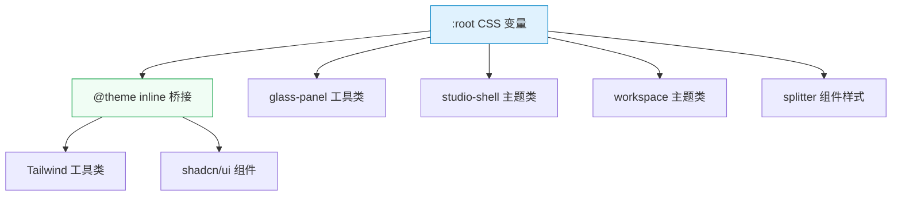

# 设计文档：UI 色板与设计令牌重构

## 概述

本设计文档描述如何将 `client/src/index.css` 中的整套 CSS 变量体系从暖色调毛玻璃拟态（warm-toned glass morphism）迁移到以冷灰 SaaS 色板为核心的专业视觉语言。

**设计目标**：
- 将所有 OKLCH 令牌的 hue 从 60–80（琥珀/米色）迁移到 240–260（冷蓝灰）或 achromatic（无彩色）
- 将 glass-panel、studio-shell、workspace 系列工具类中的 rgba 暖棕色替换为冷灰色
- 保留绿色主强调色（`--primary` hue ≈ 160）和红色状态色（`--destructive`）
- 保留字体栈、`@theme inline` 映射关系和所有 CSS 变量名不变
- 仅修改 `index.css`，不触碰任何 `.tsx` 组件文件

**设计决策**：
1. **选择 achromatic（hue 0, chroma 0）而非 hue 250**：对于背景、卡片、边框等中性色，使用 `chroma: 0` 的纯灰色比带微量蓝色色相的冷灰更安全，避免在不同显示器上出现偏蓝问题。仅在需要微妙冷感的场景（如 `--muted-foreground`）使用极低 chroma + hue 250。
2. **rgba 色值统一使用 slate 色系**：glass-panel、studio、workspace 中的 rgba 暖棕色统一替换为基于 Tailwind slate 色系的冷灰色（如 `rgb(15,23,42)` = slate-900, `rgb(100,116,139)` = slate-400）。
3. **圆角从 0.75rem 调整为 0.625rem**：更精致的圆角符合 SaaS 专业风格。
4. **box-shadow 简化为两层**：一层扩散阴影 + 一层 inset 高光，避免当前多层暖色阴影的复杂度。

## 架构

本次改动仅涉及 CSS 变量层，不涉及组件架构变更。



**变更范围**：仅 `:root` 中的变量值 + `@layer components` 中的工具类样式值。`@theme inline` 中的变量名映射、`@layer base` 中的排版规则、所有 `.tsx` 文件均不修改。

## 组件与接口

### 核心令牌映射表

以下是所有 `:root` 令牌的旧值→新值映射：

#### 背景与前景色

| 变量名 | 旧值 | 新值 | 说明 |
|--------|------|------|------|
| `--background` | `oklch(0.97 0.01 80)` | `oklch(0.98 0 0)` | 接近纯白，achromatic |
| `--foreground` | `oklch(0.25 0.03 60)` | `oklch(0.25 0.02 250)` | 冷灰深色文字 |
| `--card` | `oklch(0.99 0.005 80)` | `oklch(0.99 0 0)` | 纯白卡片 |
| `--card-foreground` | `oklch(0.25 0.03 60)` | `oklch(0.25 0.02 250)` | 冷灰深色文字 |
| `--popover` | `oklch(0.99 0.005 80)` | `oklch(0.99 0 0)` | 纯白弹出层 |
| `--popover-foreground` | `oklch(0.25 0.03 60)` | `oklch(0.25 0.02 250)` | 冷灰深色文字 |

#### 主色与强调色

| 变量名 | 旧值 | 新值 | 说明 |
|--------|------|------|------|
| `--primary` | `oklch(0.45 0.08 160)` | `oklch(0.45 0.08 160)` | **保持不变**，绿色主色 |
| `--primary-foreground` | `oklch(0.98 0 0)` | `oklch(0.98 0 0)` | **保持不变** |
| `--secondary` | `oklch(0.95 0.01 80)` | `oklch(0.95 0.003 250)` | 极浅冷灰 |
| `--secondary-foreground` | `oklch(0.4 0.03 60)` | `oklch(0.4 0.02 250)` | 冷灰中等文字 |
| `--muted` | `oklch(0.94 0.01 80)` | `oklch(0.94 0.003 250)` | 极浅冷灰 |
| `--muted-foreground` | `oklch(0.55 0.02 60)` | `oklch(0.55 0.01 250)` | 冷灰次要文字 |
| `--accent` | `oklch(0.94 0.01 80)` | `oklch(0.94 0.003 250)` | 极浅冷灰 |
| `--accent-foreground` | `oklch(0.2 0.03 60)` | `oklch(0.2 0.02 250)` | 冷灰深色文字 |
| `--destructive` | `oklch(0.58 0.24 27)` | `oklch(0.58 0.24 27)` | **保持不变**，红色 |
| `--destructive-foreground` | `oklch(0.98 0 0)` | `oklch(0.98 0 0)` | **保持不变** |

#### 边框与输入

| 变量名 | 旧值 | 新值 | 说明 |
|--------|------|------|------|
| `--border` | `oklch(0.9 0.01 80)` | `oklch(0.9 0.003 250)` | 冷灰边框 |
| `--input` | `oklch(0.9 0.01 80)` | `oklch(0.9 0.003 250)` | 冷灰输入框边框 |
| `--ring` | `oklch(0.45 0.08 160)` | `oklch(0.45 0.08 160)` | **保持不变**，绿色聚焦环 |

#### Sidebar 系列

| 变量名 | 旧值 | 新值 | 说明 |
|--------|------|------|------|
| `--sidebar` | `oklch(0.98 0.005 80)` | `oklch(0.98 0 0)` | 冷白侧边栏 |
| `--sidebar-foreground` | `oklch(0.25 0.03 60)` | `oklch(0.25 0.02 250)` | 冷灰文字 |
| `--sidebar-primary` | `oklch(0.45 0.08 160)` | `oklch(0.45 0.08 160)` | **保持不变** |
| `--sidebar-primary-foreground` | `oklch(0.98 0 0)` | `oklch(0.98 0 0)` | **保持不变** |
| `--sidebar-accent` | `oklch(0.94 0.01 80)` | `oklch(0.94 0.003 250)` | 冷灰 |
| `--sidebar-accent-foreground` | `oklch(0.2 0.03 60)` | `oklch(0.2 0.02 250)` | 冷灰 |
| `--sidebar-border` | `oklch(0.9 0.01 80)` | `oklch(0.9 0.003 250)` | 冷灰边框 |
| `--sidebar-ring` | `oklch(0.45 0.08 160)` | `oklch(0.45 0.08 160)` | **保持不变** |

#### Chart 系列

| 变量名 | 旧值 | 新值 | 说明 |
|--------|------|------|------|
| `--chart-1` | `oklch(0.7 0.1 60)` | `oklch(0.65 0.15 250)` | 蓝色 |
| `--chart-2` | `oklch(0.6 0.08 160)` | `oklch(0.6 0.08 160)` | 绿色（与 primary 协调） |
| `--chart-3` | `oklch(0.65 0.12 30)` | `oklch(0.65 0.12 30)` | 橙红色（保留对比） |
| `--chart-4` | `oklch(0.55 0.06 80)` | `oklch(0.55 0.08 290)` | 紫色 |
| `--chart-5` | `oklch(0.5 0.1 40)` | `oklch(0.6 0.1 200)` | 青色 |

#### 圆角

| 变量名 | 旧值 | 新值 | 说明 |
|--------|------|------|------|
| `--radius` | `0.75rem` | `0.625rem` | 更精致的 10px 圆角 |

### Glass-Panel 变量映射

| 变量名 | 旧值 | 新值 |
|--------|------|------|
| `--glass-bg` | `rgba(255,255,255,0.85)` | `rgba(248,250,252,0.85)` |
| `--glass-bg-hover` | `rgba(255,255,255,0.9)` | `rgba(248,250,252,0.92)` |
| `--glass-bg-active` | `rgba(255,255,255,0.95)` | `rgba(248,250,252,0.96)` |
| `--glass-border` | `rgba(255,255,255,0.5)` | `rgba(226,232,240,0.5)` |
| `--glass-border-hover` | `rgba(255,255,255,0.6)` | `rgba(226,232,240,0.65)` |

### Studio-Shell 变量映射

| 变量名 | 旧值 | 新值 |
|--------|------|------|
| `--studio-shell-bg` | `linear-gradient(180deg, rgba(255,248,241,0.9), rgba(241,232,220,0.84))` | `linear-gradient(180deg, rgba(248,250,252,0.92), rgba(241,245,249,0.86))` |
| `--studio-shell-border` | `rgba(151,120,90,0.18)` | `rgba(148,163,184,0.18)` |
| `--studio-surface-bg` | `rgba(255,255,255,0.42)` | `rgba(248,250,252,0.42)` |
| `--studio-surface-strong` | `rgba(255,255,255,0.58)` | `rgba(248,250,252,0.58)` |
| `--studio-surface-border` | `rgba(255,255,255,0.48)` | `rgba(226,232,240,0.48)` |
| `--studio-ink` | `#4a3727` | `#1e293b` |
| `--studio-ink-soft` | `#7d6856` | `#64748b` |
| `--studio-accent` | `#c98257` | `#3b82f6` |
| `--studio-accent-strong` | `#b86f45` | `#2563eb` |
| `--studio-sage` | `#5e8b72` | `#5e8b72` |
| `--studio-sage-strong` | `#456b58` | `#456b58` |
| `--studio-plum` | `#836a88` | `#836a88` |
| `--studio-sky` | `#87afc7` | `#87afc7` |

**设计决策**：`--studio-accent` 从暖橙色（`#c98257`）改为蓝色（`#3b82f6`），与冷色板协调且与绿色 `--primary` 形成互补。`--studio-sage` 保留绿色，与 `--primary` 一致。

### Workspace 变量映射

| 变量名 | 旧值 | 新值 |
|--------|------|------|
| `--workspace-page-bg` | 暖色径向渐变 + 暖色线性渐变 | `linear-gradient(180deg, #f8fafc 0%, #f1f5f9 52%, #e2e8f0 100%)` |
| `--workspace-shell-bg` | `linear-gradient(180deg, rgba(255,250,244,0.94), rgba(243,234,222,0.9))` | `linear-gradient(180deg, rgba(248,250,252,0.94), rgba(241,245,249,0.9))` |
| `--workspace-shell-border` | `rgba(156,123,94,0.18)` | `rgba(148,163,184,0.18)` |
| `--workspace-panel-bg` | `linear-gradient(180deg, rgba(255,252,248,0.4), rgba(246,238,229,0.3))` | `linear-gradient(180deg, rgba(248,250,252,0.4), rgba(241,245,249,0.3))` |
| `--workspace-panel-strong-bg` | `linear-gradient(180deg, rgba(255,253,250,0.5), rgba(245,236,226,0.4))` | `linear-gradient(180deg, rgba(248,250,252,0.5), rgba(241,245,249,0.4))` |
| `--workspace-panel-inset-bg` | `rgba(255,255,255,0.52)` | `rgba(248,250,252,0.52)` |
| `--workspace-panel-border` | `rgba(174,146,120,0.22)` | `rgba(148,163,184,0.22)` |
| `--workspace-panel-shadow` | `0 22px 56px rgba(88,61,39,0.12), inset 0 1px 0 rgba(255,255,255,0.48)` | `0 22px 56px rgba(15,23,42,0.08), inset 0 1px 0 rgba(255,255,255,0.48)` |
| `--workspace-panel-shadow-soft` | `0 14px 34px rgba(88,61,39,0.08), inset 0 1px 0 rgba(255,255,255,0.42)` | `0 14px 34px rgba(15,23,42,0.06), inset 0 1px 0 rgba(255,255,255,0.42)` |
| `--workspace-control-bg` | `rgba(255,255,255,0.72)` | `rgba(248,250,252,0.72)` |
| `--workspace-control-bg-hover` | `rgba(255,255,255,0.9)` | `rgba(248,250,252,0.92)` |
| `--workspace-control-border` | `rgba(171,141,111,0.22)` | `rgba(148,163,184,0.22)` |
| `--workspace-control-text` | `#4a3727` | `#1e293b` |
| `--workspace-text-strong` | `#3a2a1a` | `#0f172a` |
| `--workspace-text` | `#4a3727` | `#1e293b` |
| `--workspace-text-muted` | `#7d6856` | `#64748b` |
| `--workspace-text-subtle` | `#a08972` | `#94a3b8` |

#### Workspace 语义色（保留色相，微调以确保 WCAG AA 对比度）

| 变量名 | 旧值 | 新值 | 说明 |
|--------|------|------|------|
| `--workspace-info` | `#5b89a5` | `#0284c7` | 提高对比度 |
| `--workspace-info-soft` | `rgba(91,137,165,0.14)` | `rgba(2,132,199,0.1)` | 与新 info 协调 |
| `--workspace-success` | `#5e8b72` | `#16a34a` | 提高对比度 |
| `--workspace-success-soft` | `rgba(94,139,114,0.14)` | `rgba(22,163,74,0.1)` | 与新 success 协调 |
| `--workspace-warning` | `#c98257` | `#d97706` | 保留暖色语义 |
| `--workspace-warning-soft` | `rgba(201,130,87,0.16)` | `rgba(217,119,6,0.1)` | 与新 warning 协调 |
| `--workspace-danger` | `#b45d4d` | `#dc2626` | 提高对比度 |
| `--workspace-danger-soft` | `rgba(180,93,77,0.14)` | `rgba(220,38,38,0.1)` | 与新 danger 协调 |

### Glass-Panel 工具类变更

#### `.glass-panel`

```css
/* 旧 */
background: linear-gradient(180deg, rgba(255,250,245,0.54), rgba(244,235,224,0.46));
box-shadow: 0 12px 36px rgba(84,59,37,0.12), inset 0 1px 0 rgba(255,255,255,0.42);

/* 新 */
background: linear-gradient(180deg, rgba(248,250,252,0.54), rgba(241,245,249,0.46));
box-shadow: 0 12px 36px rgba(15,23,42,0.08), inset 0 1px 0 rgba(255,255,255,0.42);
```

#### `.glass-panel-strong`

```css
/* 旧 */
background: linear-gradient(180deg, rgba(255,250,244,0.94), rgba(244,236,226,0.88));
box-shadow: 0 18px 48px rgba(84,59,37,0.14), inset 0 1px 0 rgba(255,255,255,0.56);

/* 新 */
background: linear-gradient(180deg, rgba(248,250,252,0.94), rgba(241,245,249,0.88));
box-shadow: 0 18px 48px rgba(15,23,42,0.1), inset 0 1px 0 rgba(255,255,255,0.56);
```

**注意**：`backdrop-filter: blur(…)` 的模糊强度保持不变。

### Splitter 色彩变更

| 选择器 | 属性 | 旧值 | 新值 |
|--------|------|------|------|
| `.office-cockpit-splitter … collapse-bar` | `color` | `#9c6b47` | `#64748b` |
| `.office-cockpit-splitter … collapse-bar` | `box-shadow` | `rgba(201,130,87,0.18)` + `rgba(88,61,39,0.14)` | `rgba(148,163,184,0.18)` + `rgba(15,23,42,0.1)` |
| `.office-cockpit-splitter … collapse-bar:hover` | `background` | `rgba(255,248,241,0.96)` | `rgba(248,250,252,0.96)` |
| `.office-cockpit-splitter … collapse-bar:hover` | `color` | `#5e8b72` | `#5e8b72`（**保留绿色**） |
| `.launch-clarification-splitter … collapse-bar` | `color` | `#9c6b47` | `#64748b` |
| `.launch-clarification-splitter … collapse-bar` | `box-shadow` | `rgba(201,130,87,0.18)` + `rgba(88,61,39,0.14)` | `rgba(148,163,184,0.18)` + `rgba(15,23,42,0.1)` |
| `.launch-clarification-splitter … collapse-bar:hover` | `background` | `rgba(255,248,241,0.98)` | `rgba(248,250,252,0.98)` |
| `.launch-clarification-splitter … collapse-bar:hover` | `color` | `#5e8b72` | `#5e8b72`（**保留绿色**） |

### Studio/Workspace 工具类中的内联色值变更

所有 `.studio-shell`、`.studio-surface`、`.studio-input`、`.workspace-shell`、`.workspace-panel`、`.workspace-control` 等工具类中的 `box-shadow` 和 `border-color` 中的暖棕 rgba 值（如 `rgba(88,61,39,…)`、`rgba(171,141,111,…)`、`rgba(168,139,113,…)`、`rgba(125,104,86,…)`）统一替换为对应的冷灰 rgba 值（如 `rgba(15,23,42,…)`、`rgba(148,163,184,…)`、`rgba(100,116,139,…)`）。

### `.workflow-studio` 覆盖层变更

| 选择器 | 旧值 | 新值 |
|--------|------|------|
| `.workflow-studio .text-white, .text-white/90, .text-white/80` | `color: #4a3727` | `color: #1e293b` |
| `.workflow-studio .text-white/60, …/50, …/40` | `color: #7d6856` | `color: #64748b` |
| `.workflow-studio .border-white/10` | `border-color: rgba(171,141,111,0.16)` | `border-color: rgba(148,163,184,0.16)` |
| `.workflow-studio input` | `border-color: rgba(171,141,111,0.2)` | `border-color: rgba(148,163,184,0.2)` |
| `.workflow-studio input::placeholder` | `color: rgba(125,104,86,0.62)` | `color: rgba(100,116,139,0.62)` |
| `.workflow-studio input:focus` | `border-color: rgba(94,139,114,0.42)` | `border-color: rgba(94,139,114,0.42)`（**保留绿色**） |

## 数据模型

本次改动不涉及数据模型变更。所有变更均为 CSS 变量值和工具类样式值的替换。

### 暗色模式占位

在 `:root` 块之后、`@layer base` 之前，新增 `.dark` 选择器占位声明：

```css
.dark {
  /* 暗色模式令牌占位 — 当前不主动使用，仅保留结构 */
  --background: oklch(0.15 0 0);
  --foreground: oklch(0.93 0 0);
  --card: oklch(0.18 0 0);
  --card-foreground: oklch(0.93 0 0);
  --popover: oklch(0.18 0 0);
  --popover-foreground: oklch(0.93 0 0);
  --primary: oklch(0.55 0.08 160);
  --primary-foreground: oklch(0.15 0 0);
  --secondary: oklch(0.22 0.003 250);
  --secondary-foreground: oklch(0.85 0 0);
  --muted: oklch(0.22 0.003 250);
  --muted-foreground: oklch(0.6 0.01 250);
  --accent: oklch(0.22 0.003 250);
  --accent-foreground: oklch(0.93 0 0);
  --destructive: oklch(0.55 0.22 27);
  --destructive-foreground: oklch(0.98 0 0);
  --border: oklch(0.28 0.003 250);
  --input: oklch(0.28 0.003 250);
  --ring: oklch(0.55 0.08 160);
}
```

## 正确性属性

*正确性属性是在系统所有合法执行中都应成立的特征或行为——本质上是对系统应做什么的形式化陈述。属性是人类可读规格与机器可验证正确性保证之间的桥梁。*

### Property 1: 核心令牌冷色约束

*对于任意*非绿色（hue ≠ 155–165）、非红色（hue ≠ 20–35）的 `:root` OKLCH 令牌，其 hue 应为 achromatic（chroma = 0）或在 240–260 范围内，且 chroma ≤ 0.005。

**验证: 需求 1.1, 1.2, 1.3, 1.5, 1.7, 1.8**

### Property 2: Primary 绿色保留

*对于* `--primary` 令牌，其 OKLCH 值的 hue 应在 155–165 范围内，chroma 在 0.06–0.10 范围内，lightness 在 0.40–0.50 范围内。

**验证: 需求 1.4**

### Property 3: Workspace 主题冷色约束

*对于任意* `--workspace-text-*`、`--workspace-panel-*`、`--workspace-control-*` 变量中的 rgba 颜色值，其 R 分量不应显著大于 B 分量（即不应呈现暖棕色调 R > G > B 的模式）。

**验证: 需求 3.7, 3.8, 3.9**

### Property 4: 语义色 WCAG AA 对比度

*对于任意*语义色（`--workspace-info`、`--workspace-success`、`--workspace-warning`、`--workspace-danger`）与新 `--background` 的组合，计算的 WCAG 对比度应 ≥ 4.5:1。

**验证: 需求 3.10**

### Property 5: Backdrop-filter blur 不变量

*对于任意* `.glass-panel`、`.glass-panel-strong`、`.studio-shell`、`.studio-surface`、`.workspace-shell`、`.workspace-panel` 工具类，其 `backdrop-filter` 中的 `blur()` 值应与改动前完全相同。

**验证: 需求 2.4**

### Property 6: Box-shadow 层数约束

*对于* `.glass-panel` 和 `.workspace-panel` 工具类，其 `box-shadow` 的层数应不超过 2 层（一层扩散阴影 + 一层 inset 高光）。

**验证: 需求 6.3**

### Property 7: CSS 变量名集合不变量

*对于* `:root` 中定义的所有 CSS 自定义属性名称集合，改动前后应完全相同（`.dark` 选择器下的新增占位声明除外）。

**验证: 需求 7.4**

## 错误处理

本次改动为纯 CSS 变量值替换，不涉及运行时错误处理。潜在风险及缓解措施：

1. **Tailwind 解析失败**：如果 OKLCH 值格式错误，Tailwind 构建会报错。缓解：改动后运行 `pnpm run build` 验证。
2. **对比度不足**：新色值可能导致某些文字与背景对比度不足。缓解：通过 Property 4 的 WCAG 对比度检查验证。
3. **视觉回归**：色值替换可能导致某些组件视觉效果不符合预期。缓解：改动后进行人工视觉检查。

## 测试策略

### 属性测试（Property-Based Testing）

- 使用 `fast-check` 库
- 每个属性测试最少运行 100 次迭代
- 测试标签格式：**Feature: ui-redesign-color-and-tokens, Property {number}: {property_text}**

**适用的属性测试**：
- Property 1（核心令牌冷色约束）：解析 CSS 文件中的 OKLCH 值，对每个非绿色/非红色令牌验证 hue 和 chroma 约束
- Property 2（Primary 绿色保留）：解析 `--primary` 值，验证三个分量范围
- Property 4（WCAG 对比度）：对每个语义色与背景色组合计算对比度
- Property 5（blur 不变量）：解析 backdrop-filter 值，验证 blur 参数未变
- Property 7（变量名集合不变量）：提取变量名集合，验证差集

### 单元测试（Example-Based）

- 验证 `.glass-panel` 的 background 渐变色值已从暖色变为冷色
- 验证 `.glass-panel` 和 `.glass-panel-strong` 的 box-shadow 中不包含暖棕色 rgba
- 验证 `--studio-ink` 值为 `#1e293b`
- 验证 `--radius` 值为 `0.625rem`
- 验证 `--font-display`、`--font-mono`、`--font-body` 值未改变
- 验证 `.dark` 选择器存在且包含占位声明
- 验证 `@theme inline` 中的变量名映射未改变

### 集成测试

- 运行 `pnpm run build` 验证 Tailwind 构建成功
- 运行 `node --run check` 验证 TypeScript 类型检查通过（不应有新增错误）

### 冒烟测试

- 验证 `components.json` 未被修改
- 验证 `LoadingScreen.tsx` 未被修改
- 验证没有 `.tsx` 文件被修改
