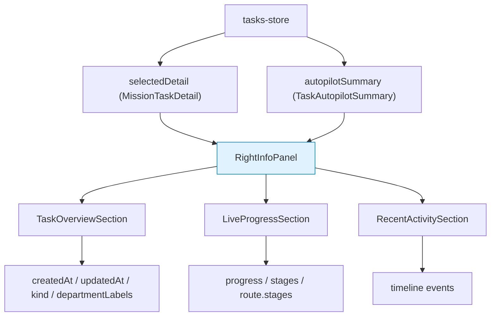

# 设计文档：右侧信息面板重排

## 概述

本设计文档描述如何将当前右侧面板从 tab 切换布局（任务 / 团队流 / Agent / 记忆报告 / 历史）改造为三段式结构化信息面板，匹配参考设计中的"任务概览 → 实时进展 → 近期动态"垂直布局。

**设计目标**：
- 用三段式垂直布局替代当前 `TasksCockpitDetail` 中的 InsightCard + DashboardMetric + Accordion 结构
- 面板宽度约束在 300–360px，独立滚动
- 消费 spec 1 的冷灰 SaaS 设计令牌
- 优先从 `autopilotSummary` 读取数据，降级到 `MissionTaskDetail` 基础字段
- 保留 `TaskDetailView` 作为深层详情的展开入口

**设计决策**：
1. **替换而非叠加**：直接替换 `TasksCockpitDetail` 的内部结构，而非在其外部再包一层。这样可以复用现有的 props 传递链路和 `OfficeTaskCockpit` 中的装配逻辑。
2. **三段式组件拆分**：将三个区域拆为独立组件（`TaskOverviewSection`、`LiveProgressSection`、`RecentActivitySection`），每个组件有独立的错误边界，便于维护和测试。
3. **SVG 环形进度**：使用纯 SVG `<circle>` 实现 Progress Ring，不引入额外依赖。stroke-dasharray / stroke-dashoffset 技术成熟且性能好。
4. **子指标派生策略**：从 `autopilotSummary.route.stages` 或 `MissionTaskDetail.stages` 派生子指标，每个 stage 的 `progress` 字段映射为一个子指标。如果 stages 为空，降级为单一的 `completedTaskCount / taskCount` 指标。
5. **时间线截断**：默认展示最近 10 条事件，通过"查看全部"按钮展开完整列表或跳转到详情页。

## 架构

### 组件层级

```
Right_Info_Panel (RightInfoPanel.tsx)
├── TaskOverviewSection
│   ├── MetaRow (创建时间)
│   ├── MetaRow (预估完成)
│   ├── MetaRow (已用时间)
│   ├── MetaRow (创建者/类型)
│   └── TagList (标签胶囊)
├── LiveProgressSection
│   ├── ProgressRing (SVG 环形进度)
│   └── SubMetricGrid (2列网格)
│       └── SubMetricItem × 2-4
├── RecentActivitySection
│   └── ActivityTimelineItem × 10
└── DetailExpandButton ("查看完整详情")
```

### 数据流



### 在 OfficeTaskCockpit 中的位置

```
┌─────────────────────────────────────────────────────────┐
│ OfficeTaskCockpit                                       │
│ ┌──────────┬──────────────────────┬──────────────────┐  │
│ │ 左侧     │ 中央内容区           │ 右侧信息面板     │  │
│ │ 任务队列 │ Scene3D 或           │ RightInfoPanel   │  │
│ │          │ TaskDetailCardsView  │ (300-360px)      │  │
│ │          │                      │ ┌──────────────┐ │  │
│ │          │                      │ │ 任务概览     │ │  │
│ │          │                      │ ├──────────────┤ │  │
│ │          │                      │ │ 实时进展     │ │  │
│ │          │                      │ ├──────────────┤ │  │
│ │          │                      │ │ 近期动态     │ │  │
│ │          │                      │ └──────────────┘ │  │
│ └──────────┴──────────────────────┴──────────────────┘  │
│ ┌──────────────────────────────────────────────────────┐ │
│ │ 底部操作区 (UnifiedLaunchComposer)                   │ │
│ └──────────────────────────────────────────────────────┘ │
└─────────────────────────────────────────────────────────┘
```

## 组件与接口

### 1. RightInfoPanel 主组件

**文件**：`client/src/components/tasks/RightInfoPanel.tsx`

#### Props

```typescript
interface RightInfoPanelProps {
  detail: MissionTaskDetail | null;
  autopilotSummary?: TaskAutopilotSummary;
  locale: string;
  onExpandDetail?: () => void;  // 点击"查看完整详情"的回调
  className?: string;
}
```

#### 结构

```tsx
<div
  className={cn(
    "flex min-h-0 flex-col overflow-y-auto",
    className
  )}
  style={{
    minWidth: '300px',
    maxWidth: '360px',
    scrollbarGutter: 'stable',
    backgroundColor: 'var(--background)',
  }}
>
  {detail ? (
    <div className="space-y-3 p-3">
      <ErrorBoundary fallback={<SectionError />}>
        <TaskOverviewSection detail={detail} autopilot={autopilotSummary} locale={locale} />
      </ErrorBoundary>
      <ErrorBoundary fallback={<SectionError />}>
        <LiveProgressSection detail={detail} autopilot={autopilotSummary} locale={locale} />
      </ErrorBoundary>
      <ErrorBoundary fallback={<SectionError />}>
        <RecentActivitySection timeline={detail.timeline} locale={locale} />
      </ErrorBoundary>
      {onExpandDetail && (
        <button onClick={onExpandDetail} className="...">
          {t(locale, "查看完整详情", "View full details")}
        </button>
      )}
    </div>
  ) : (
    <EmptyState locale={locale} />
  )}
</div>
```

### 2. TaskOverviewSection 组件

**文件**：`client/src/components/tasks/RightInfoPanel.tsx`（内部组件）

#### Props

```typescript
interface TaskOverviewSectionProps {
  detail: MissionTaskDetail;
  autopilot?: TaskAutopilotSummary;
  locale: string;
}
```

#### 数据映射

| 展示字段 | 主数据源 | 降级数据源 | 格式化 |
|----------|----------|-----------|--------|
| 创建时间 | `detail.createdAt` | — | `formatRelativeTime()` 或 `toLocaleDateString()` |
| 预估完成 | `autopilot.route.estimatedDuration` | `"—"` | 持续时间格式化（如"2h 30m"） |
| 已用时间 | `Date.now() - detail.createdAt` | — | 持续时间格式化（如"1d 4h"） |
| 创建者/类型 | `autopilot.destination.taskType` | `detail.kind` | 直接展示 |
| 标签 | `detail.departmentLabels` | `[]` | 标签胶囊列表 |

#### 渲染结构

```tsx
<section className="rounded-[var(--radius)] border border-[var(--border)] bg-[var(--card)] p-3 shadow-sm">
  <h3 className="text-[11px] font-semibold uppercase tracking-[0.14em] text-[var(--muted-foreground)]">
    {t(locale, "任务概览", "Task Overview")}
  </h3>
  <div className="mt-2 space-y-2">
    <MetaRow icon={<Clock />} label={t(locale, "创建时间", "Created")} value={...} />
    <MetaRow icon={<Target />} label={t(locale, "预估完成", "Est. Completion")} value={...} />
    <MetaRow icon={<Timer />} label={t(locale, "已用时间", "Elapsed")} value={...} />
    <MetaRow icon={<User />} label={t(locale, "创建者", "Creator")} value={...} />
  </div>
  {tags.length > 0 && (
    <div className="mt-2 flex flex-wrap gap-1">
      {tags.map(tag => (
        <span key={tag} className="rounded-full bg-[var(--secondary)] px-2 py-0.5 text-[10px] text-[var(--secondary-foreground)]">
          {tag}
        </span>
      ))}
    </div>
  )}
</section>
```

#### MetaRow 子组件

```typescript
interface MetaRowProps {
  icon: ReactNode;
  label: string;
  value: string;
}
```

```tsx
<div className="flex items-center gap-2">
  <span className="shrink-0 text-[var(--muted-foreground)]">{icon}</span>
  <span className="text-[10px] text-[var(--muted-foreground)]">{label}</span>
  <span className="ml-auto text-[11px] font-medium text-[var(--card-foreground)] font-mono tabular-nums">
    {value}
  </span>
</div>
```

### 3. LiveProgressSection 组件

#### Props

```typescript
interface LiveProgressSectionProps {
  detail: MissionTaskDetail;
  autopilot?: TaskAutopilotSummary;
  locale: string;
}
```

#### 数据映射

**整体进度**：`detail.progress`（0–100）

**子指标派生策略**：

```typescript
function deriveSubMetrics(
  detail: MissionTaskDetail,
  autopilot?: TaskAutopilotSummary,
  locale: string
): SubMetric[] {
  // 优先级 1：从 autopilot route stages 派生
  if (autopilot?.route?.stages?.length) {
    return autopilot.route.stages.slice(0, 4).map(stage => ({
      label: stage.label || stage.name || stage.id,
      value: stage.progress ?? 0,
    }));
  }

  // 优先级 2：从 detail.stages 派生
  if (detail.stages?.length) {
    return detail.stages.slice(0, 4).map(stage => ({
      label: stage.label,
      value: stage.progress,
    }));
  }

  // 优先级 3：降级为单一指标
  const total = detail.taskCount || 1;
  const completed = detail.completedTaskCount || 0;
  return [{
    label: t(locale, "任务完成", "Tasks Done"),
    value: Math.round((completed / total) * 100),
  }];
}
```

#### ProgressRing SVG 实现

```tsx
function ProgressRing({ value, size = 80, strokeWidth = 6 }: {
  value: number;
  size?: number;
  strokeWidth?: number;
}) {
  const radius = (size - strokeWidth) / 2;
  const circumference = 2 * Math.PI * radius;
  const offset = circumference - (Math.min(Math.max(value, 0), 100) / 100) * circumference;

  return (
    <svg width={size} height={size} className="rotate-[-90deg]">
      {/* 背景轨道 */}
      <circle
        cx={size / 2} cy={size / 2} r={radius}
        fill="none"
        stroke="var(--muted)"
        strokeWidth={strokeWidth}
      />
      {/* 进度弧 */}
      <circle
        cx={size / 2} cy={size / 2} r={radius}
        fill="none"
        stroke="var(--primary)"
        strokeWidth={strokeWidth}
        strokeDasharray={circumference}
        strokeDashoffset={offset}
        strokeLinecap="round"
        className="transition-[stroke-dashoffset] duration-500 ease-out"
      />
    </svg>
  );
}
```

#### 渲染结构

```tsx
<section className="rounded-[var(--radius)] border border-[var(--border)] bg-[var(--card)] p-3 shadow-sm">
  <h3 className="text-[11px] font-semibold uppercase tracking-[0.14em] text-[var(--muted-foreground)]">
    {t(locale, "实时进展", "Live Progress")}
  </h3>
  <div className="mt-3 flex items-center gap-4">
    <div className="relative">
      <ProgressRing value={detail.progress} />
      <span className="absolute inset-0 flex items-center justify-center text-[18px] font-bold font-mono tabular-nums text-[var(--card-foreground)]">
        {detail.progress}%
      </span>
    </div>
    <div className="grid flex-1 grid-cols-2 gap-2">
      {subMetrics.map(metric => (
        <SubMetricItem key={metric.label} label={metric.label} value={metric.value} />
      ))}
    </div>
  </div>
</section>
```

#### SubMetricItem 子组件

```tsx
function SubMetricItem({ label, value }: { label: string; value: number }) {
  return (
    <div className="min-w-0">
      <div className="truncate text-[10px] text-[var(--muted-foreground)]">{label}</div>
      <div className="mt-0.5 flex items-center gap-1.5">
        <div className="h-1.5 flex-1 rounded-full bg-[var(--muted)]">
          <div
            className="h-full rounded-full bg-[var(--primary)] transition-[width] duration-500"
            style={{ width: `${Math.min(Math.max(value, 0), 100)}%` }}
          />
        </div>
        <span className="shrink-0 text-[10px] font-medium font-mono tabular-nums text-[var(--card-foreground)]">
          {value}%
        </span>
      </div>
    </div>
  );
}
```

### 4. RecentActivitySection 组件

#### Props

```typescript
interface RecentActivitySectionProps {
  timeline: TaskTimelineEvent[];
  locale: string;
}
```

#### 事件颜色映射

| `event.level` | 圆点颜色 | CSS 类 |
|----------------|----------|--------|
| `"info"` | 蓝色 | `bg-blue-500` |
| `"success"` | 绿色 | `bg-[var(--primary)]` 或 `bg-green-500` |
| `"warning"` | 琥珀色 | `bg-amber-500` |
| `"error"` | 红色 | `bg-[var(--destructive)]` 或 `bg-red-500` |
| 其他 | 灰色 | `bg-[var(--muted-foreground)]` |

#### 渲染结构

```tsx
<section className="rounded-[var(--radius)] border border-[var(--border)] bg-[var(--card)] p-3 shadow-sm">
  <h3 className="text-[11px] font-semibold uppercase tracking-[0.14em] text-[var(--muted-foreground)]">
    {t(locale, "近期动态", "Recent Activity")}
  </h3>
  {sortedEvents.length > 0 ? (
    <div className="mt-2 space-y-0">
      {displayedEvents.map((event, index) => (
        <ActivityTimelineItem
          key={event.id}
          event={event}
          locale={locale}
          isLast={index === displayedEvents.length - 1}
        />
      ))}
      {timeline.length > MAX_DISPLAY_COUNT && !showAll && (
        <button onClick={() => setShowAll(true)} className="...">
          {t(locale, "查看全部", "View all")} ({timeline.length})
        </button>
      )}
    </div>
  ) : (
    <div className="mt-2 text-center text-[11px] text-[var(--muted-foreground)]">
      {t(locale, "暂无动态", "No activity yet")}
    </div>
  )}
</section>
```

#### ActivityTimelineItem 子组件

```tsx
function ActivityTimelineItem({ event, locale, isLast }: {
  event: TaskTimelineEvent;
  locale: string;
  isLast: boolean;
}) {
  return (
    <div className="flex gap-2.5 py-1.5">
      {/* 时间线轴 */}
      <div className="flex flex-col items-center">
        <div className={cn("size-2 shrink-0 rounded-full", dotColorClass(event.level))} />
        {!isLast && <div className="mt-1 w-px flex-1 bg-[var(--border)]" />}
      </div>
      {/* 内容 */}
      <div className="min-w-0 flex-1 pb-1">
        <div className="flex items-baseline justify-between gap-2">
          <span className="truncate text-[11px] font-medium text-[var(--card-foreground)]">
            {event.title}
          </span>
          <span className="shrink-0 text-[9px] font-mono tabular-nums text-[var(--muted-foreground)]">
            {formatRelativeTime(event.time, locale)}
          </span>
        </div>
        {event.description && (
          <div className="mt-0.5 line-clamp-2 text-[10px] leading-4 text-[var(--muted-foreground)]">
            {event.description}
          </div>
        )}
      </div>
    </div>
  );
}
```

### 5. 辅助函数

**文件**：`client/src/components/tasks/right-info-helpers.ts`

```typescript
/** 格式化持续时间（毫秒 → "Xd Yh" 或 "Xh Ym"） */
export function formatDuration(ms: number, locale: string): string;

/** 格式化相对时间（时间戳 → "3分钟前"） */
export function formatRelativeTime(timestamp: number, locale: string): string;

/** 从 autopilot 或 detail 派生子指标 */
export function deriveSubMetrics(
  detail: MissionTaskDetail,
  autopilot?: TaskAutopilotSummary,
  locale: string
): SubMetric[];

/** 时间线事件 level → 圆点颜色 CSS 类 */
export function dotColorClass(level: string): string;

/** 排序并截断时间线事件 */
export function prepareTimelineEvents(
  events: TaskTimelineEvent[],
  maxCount: number
): TaskTimelineEvent[];
```

### 6. 在 OfficeTaskCockpit 中的装配

当前 `OfficeTaskCockpit` 的右侧面板通过 `TasksCockpitDetail` 渲染。改造方案：

**方案**：在 `TasksCockpitDetail` 内部替换渲染结构，将现有的 InsightCard + DashboardMetric + Accordion 替换为 `RightInfoPanel` 的三段式布局。保留 `TasksCockpitDetail` 的 props 接口不变，内部委托给 `RightInfoPanel`。

```tsx
// TasksCockpitDetail.tsx 改造后
export function TasksCockpitDetail({ detail, ... }: TasksCockpitDetailProps) {
  const { locale } = useI18n();

  if (!detail) {
    return <RightInfoPanel detail={null} locale={locale} />;
  }

  return (
    <RightInfoPanel
      detail={detail}
      autopilotSummary={detail.autopilotSummary}
      locale={locale}
      onExpandDetail={() => { /* 展开完整详情的逻辑 */ }}
    />
  );
}
```

这样做的好处是：
- `OfficeTaskCockpit` 不需要修改装配逻辑
- 现有的 props 传递链路保持不变
- `TaskDetailView` 仍可通过"查看完整详情"按钮触发

## 数据模型

本次改动不涉及后端数据模型变更。所有数据均从现有 `tasks-store` 的 `MissionTaskDetail` 和 `TaskAutopilotSummary` 读取。

### 新增类型

```typescript
/** 子指标数据结构 */
interface SubMetric {
  label: string;
  value: number;  // 0-100
}

/** 时间线显示常量 */
const MAX_TIMELINE_DISPLAY = 10;
```

### i18n 扩展

需要在 `client/src/i18n/` 的中英文资源中新增：

```typescript
rightInfoPanel: {
  taskOverview: "任务概览",
  liveProgress: "实时进展",
  recentActivity: "近期动态",
  created: "创建时间",
  estCompletion: "预估完成",
  elapsed: "已用时间",
  creator: "创建者",
  unknown: "未知",
  noActivity: "暂无动态",
  viewAll: "查看全部",
  viewFullDetails: "查看完整详情",
  selectTask: "选择一个任务查看详情",
  tasksDone: "任务完成",
  sectionError: "此区域加载失败",
  retry: "重试",
}
```

## 正确性属性

### Property 1: 面板宽度约束

*对于* `RightInfoPanel` 组件的根元素，其计算后的宽度应在 300px 至 360px 范围内（含边界值）。

**验证: 需求 1.2**

### Property 2: 三段式结构完整性

*对于任意*非 null 的 `detail` 输入，`RightInfoPanel` 应渲染恰好三个区域组件（TaskOverviewSection、LiveProgressSection、RecentActivitySection），且顺序固定。

**验证: 需求 1.1**

### Property 3: 进度值范围约束

*对于* `ProgressRing` 组件接收的 `value` 参数，渲染时应将其 clamp 到 [0, 100] 范围内。即使输入为负数或大于 100，SVG 的 `stroke-dashoffset` 计算结果应保持在有效范围内。

**验证: 需求 3.2**

### Property 4: 时间线事件排序

*对于* `RecentActivitySection` 展示的事件列表，事件应按 `time` 字段降序排列（最新的在最前）。

**验证: 需求 4.2**

### Property 5: 时间线截断

*对于* `RecentActivitySection` 在默认（未展开）状态下展示的事件数量，应不超过 `MAX_TIMELINE_DISPLAY`（10）条。

**验证: 需求 4.6**

### Property 6: 圆点颜色映射完整性

*对于任意* `TaskTimelineEvent.level` 值，`dotColorClass()` 函数应返回一个非空的 CSS 类名字符串。未知的 level 值应映射到灰色默认类。

**验证: 需求 4.4**

### Property 7: 降级数据源可用性

*对于* `Autopilot_Summary` 为 null 的场景，`deriveSubMetrics()` 应仍然返回至少一个 `SubMetric` 对象（降级到 `completedTaskCount / taskCount`）。

**验证: 需求 6.1, 6.2**

### Property 8: 设计令牌消费

*对于* `RightInfoPanel` 及其子组件中使用的所有 CSS 变量引用，应仅使用 spec 1 中定义的令牌名称（`--background`、`--card`、`--card-foreground`、`--border`、`--radius`、`--primary`、`--muted`、`--muted-foreground`、`--secondary`、`--secondary-foreground`、`--destructive`、`--font-mono`）。

**验证: 需求 5.1–5.7**

## 错误处理

1. **单区域崩溃隔离**：每个区域（TaskOverviewSection、LiveProgressSection、RecentActivitySection）用 React `ErrorBoundary` 包裹。单个区域抛出异常时，显示"此区域加载失败"提示，其他区域不受影响。
2. **数据缺失降级**：所有数据映射函数对 null / undefined 输入返回合理默认值（空字符串、0、空数组），不抛出异常。
3. **时间戳异常**：`formatRelativeTime()` 和 `formatDuration()` 对无效时间戳（NaN、负数、0）返回占位文本"—"。
4. **进度值越界**：`ProgressRing` 将输入值 clamp 到 [0, 100]，`SubMetricItem` 的进度条宽度同样 clamp。

## 测试策略

### 单元测试

- `formatDuration()` 对各种毫秒值的格式化结果（0ms、59s、1h、25h、3d 等）
- `formatRelativeTime()` 对各种时间戳的相对时间格式化
- `deriveSubMetrics()` 在三种数据源场景下的返回值：autopilot stages、detail stages、降级单指标
- `dotColorClass()` 对所有已知 level 值和未知值的映射
- `prepareTimelineEvents()` 的排序和截断行为

### 组件测试

- `RightInfoPanel` 在 `detail=null` 时渲染空态
- `RightInfoPanel` 在 `detail` 非 null 时渲染三个区域
- `TaskOverviewSection` 正确展示所有元信息字段
- `TaskOverviewSection` 在数据缺失时展示占位文本
- `LiveProgressSection` 的 ProgressRing 正确渲染进度值
- `LiveProgressSection` 在无 stages 时降级为单一指标
- `RecentActivitySection` 按时间倒序展示事件
- `RecentActivitySection` 在事件为空时展示空态
- `RecentActivitySection` 默认截断为 10 条，点击"查看全部"展开
- `ActivityTimelineItem` 根据 level 渲染正确的圆点颜色

### 集成测试

- `TasksCockpitDetail` 改造后仍能正确接收和传递 props
- 在 `OfficeTaskCockpit` 中选中任务后右侧面板正确渲染三段式布局
- 运行 `pnpm run build` 验证构建成功
- 运行 `node --run check` 验证不引入新的 TypeScript 错误
