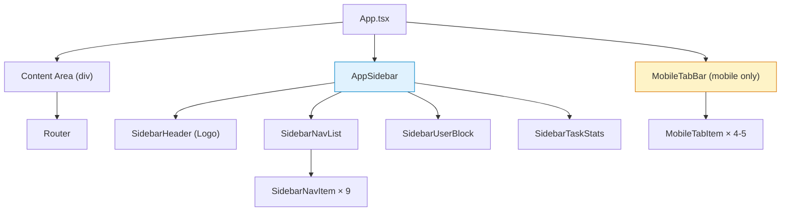

# 设计文档：左侧垂直导航栏

## 概述

本设计文档描述如何将当前底部浮动 `Toolbar`（2 个按钮）+ `MoreDrawer`（抽屉式隐藏导航）替换为固定左侧垂直导航栏，实现桌面端展开侧边栏（240px）、平板端图标侧边栏（64px）、移动端底部标签栏的三级响应式导航体系。

**设计目标**：
- 将 9 个导航项（自动驾驶、任务中心、项目空间、知识库、数据源、数据看板、智能体市场、通知中心、设置与集成）统一到左侧导航栏
- 侧边栏推挤内容区（push layout），不使用 overlay
- 与 Scene3D 视口协调，确保 3D 场景正确缩放
- 消费 spec 1 的 `--sidebar-*` 设计令牌
- 保持与现有 wouter 路由结构的兼容

**设计决策**：
1. **Push 布局而非 Overlay**：侧边栏使用 CSS `margin-left` 或 CSS Grid 推挤内容区，而非 `position: fixed` + overlay。这确保 Scene3D 的 canvas 容器宽度自然缩小，无需手动计算偏移。
2. **CSS 变量传递侧边栏宽度**：通过 `--sidebar-width` CSS 变量（240px / 64px / 0px）传递当前侧边栏宽度，Scene3D 和其他需要感知侧边栏的组件可直接消费此变量。
3. **统一数据源**：所有导航项从 `SIDEBAR_NAV_ITEMS` 数组渲染，移动端标签栏通过 `mobileVisible` 字段过滤子集。
4. **渐进式替换**：先新增 Sidebar 组件，再从 App.tsx 中移除 Toolbar 引用，最后清理 MoreDrawer 依赖。
5. **尚无路由的导航项**：项目空间、知识库、数据源、数据看板、智能体市场、通知中心暂无对应路由，渲染为禁用占位状态，点击无响应或显示"即将推出"提示。

## 架构

### 整体布局结构

```
┌──────────────────────────────────────────────────────┐
│                    App.tsx                            │
│  ┌──────────┬───────────────────────────────────┐    │
│  │          │                                   │    │
│  │ Sidebar  │         Content Area              │    │
│  │ (fixed)  │    (margin-left: var(--sw))       │    │
│  │          │                                   │    │
│  │  Logo    │    ┌─────────────────────────┐    │    │
│  │  ──────  │    │      <Router />         │    │    │
│  │  Nav     │    │  Home / Tasks / Debug   │    │    │
│  │  Items   │    │  Scene3D / Replay ...   │    │    │
│  │  ──────  │    └─────────────────────────┘    │    │
│  │  User    │                                   │    │
│  │  Stats   │                                   │    │
│  └──────────┴───────────────────────────────────┘    │
│                                                      │
│  Mobile: Sidebar hidden, MobileTabBar at bottom      │
└──────────────────────────────────────────────────────┘
```

### 组件层级



### 响应式策略

| 视口 | 断点 | 导航形态 | `--sidebar-width` | 内容区偏移 |
|------|------|----------|-------------------|-----------|
| Desktop | ≥ 1280px | 展开侧边栏 | `240px` | `margin-left: 240px` |
| Tablet | 768–1279px | 折叠图标栏 | `64px` | `margin-left: 64px` |
| Mobile | ≤ 767px | 底部标签栏 | `0px` | 无偏移，底部留白 |

## 组件与接口

### 1. 导航数据结构扩展（`navigation-config.ts`）

#### 新增类型

```typescript
export type SidebarNavigationId =
  | "autopilot"      // 自动驾驶
  | "tasks"          // 任务中心
  | "projects"       // 项目空间
  | "knowledge"      // 知识库
  | "datasource"     // 数据源
  | "dashboard"      // 数据看板
  | "marketplace"    // 智能体市场
  | "notifications"  // 通知中心
  | "settings";      // 设置与集成

export interface SidebarNavigationItem {
  id: SidebarNavigationId;
  icon: LucideIcon;
  href?: string;           // 可选路由路径，undefined 表示暂未实现
  mobileVisible: boolean;  // 是否在移动端标签栏显示
  disabled?: boolean;      // 是否禁用（暂未实现的功能）
}
```

#### 新增常量

```typescript
import {
  Navigation, ListTodo, FolderKanban, BookOpen,
  Database, BarChart3, Store, Bell, Settings,
} from "lucide-react";

export const SIDEBAR_NAV_ITEMS: SidebarNavigationItem[] = [
  { id: "autopilot",     icon: Navigation,    href: "/",      mobileVisible: true },
  { id: "tasks",         icon: ListTodo,      href: "/tasks", mobileVisible: true },
  { id: "projects",      icon: FolderKanban,                  mobileVisible: false, disabled: true },
  { id: "knowledge",     icon: BookOpen,                      mobileVisible: true,  disabled: true },
  { id: "datasource",    icon: Database,                      mobileVisible: false, disabled: true },
  { id: "dashboard",     icon: BarChart3,                     mobileVisible: false, disabled: true },
  { id: "marketplace",   icon: Store,                         mobileVisible: false, disabled: true },
  { id: "notifications", icon: Bell,                          mobileVisible: false, disabled: true },
  { id: "settings",      icon: Settings,      href: "/debug", mobileVisible: true },
];

export function getMobileTabItems(): SidebarNavigationItem[] {
  return SIDEBAR_NAV_ITEMS.filter(item => item.mobileVisible);
}
```

#### 新增活跃路由匹配

```typescript
export function getActiveSidebarId(path: string): SidebarNavigationId {
  const pathname = normalizeNavigationPath(path);
  if (pathname === "/" || pathname === "") return "autopilot";
  if (matchesPathPrefix(pathname, "/tasks")) return "tasks";
  if (matchesPathPrefix(pathname, "/debug")) return "settings";
  // 其他路径默认回退到 autopilot
  return "autopilot";
}
```

### 2. AppSidebar 组件（新建 `client/src/components/AppSidebar.tsx`）

#### Props

```typescript
interface AppSidebarProps {
  collapsed: boolean;
  onToggleCollapse: () => void;
}
```

#### 结构

```tsx
<aside
  className="fixed left-0 top-0 bottom-0 z-40 flex flex-col border-r transition-[width] duration-250 ease-in-out"
  style={{
    width: collapsed ? '64px' : '240px',
    backgroundColor: 'var(--sidebar)',
    borderColor: 'var(--sidebar-border)',
    color: 'var(--sidebar-foreground)',
  }}
  aria-label="主导航"
>
  {/* Logo / Brand */}
  <SidebarHeader collapsed={collapsed} />

  {/* Navigation Items */}
  <nav className="flex-1 overflow-y-auto py-2">
    <ul role="list">
      {SIDEBAR_NAV_ITEMS.map(item => (
        <SidebarNavItem
          key={item.id}
          item={item}
          active={item.id === activeId}
          collapsed={collapsed}
        />
      ))}
    </ul>
  </nav>

  {/* Collapse Toggle */}
  <button onClick={onToggleCollapse} aria-expanded={!collapsed}>
    <ChevronsLeft className={collapsed ? 'rotate-180' : ''} />
  </button>

  {/* User Info */}
  <SidebarUserBlock collapsed={collapsed} />

  {/* Task Stats */}
  {!collapsed && <SidebarTaskStats />}
</aside>
```

#### 令牌消费

| 用途 | CSS 变量 | 说明 |
|------|----------|------|
| 侧边栏背景 | `var(--sidebar)` | 冷白背景 |
| 文字颜色 | `var(--sidebar-foreground)` | 冷灰文字 |
| 右边框 | `var(--sidebar-border)` | 冷灰边框 |
| 活跃项背景 | `var(--sidebar-primary)` | 绿色主色 |
| 活跃项文字 | `var(--sidebar-primary-foreground)` | 白色 |
| Hover 背景 | `var(--sidebar-accent)` | 极浅冷灰 |
| Hover 文字 | `var(--sidebar-accent-foreground)` | 冷灰深色 |

### 3. SidebarNavItem 子组件

```tsx
interface SidebarNavItemProps {
  item: SidebarNavigationItem;
  active: boolean;
  collapsed: boolean;
}
```

#### 渲染逻辑

- **有 href + 非 disabled**：渲染为可点击按钮，点击调用 `setLocation(href)`
- **disabled 或无 href**：渲染为禁用状态，`opacity: 0.5`，`cursor: not-allowed`
- **active**：背景色 `var(--sidebar-primary)`，文字色 `var(--sidebar-primary-foreground)`，左侧 3px 指示条
- **collapsed**：仅显示图标居中，hover 时显示 Tooltip（使用 shadcn/ui `<Tooltip>`）

### 4. MobileTabBar 组件（新建 `client/src/components/MobileTabBar.tsx`）

```tsx
<div
  className="fixed bottom-0 left-0 right-0 z-40 border-t"
  style={{
    paddingBottom: 'env(safe-area-inset-bottom)',
    backgroundColor: 'var(--sidebar)',
    borderColor: 'var(--sidebar-border)',
  }}
>
  <div className="flex h-14 items-center justify-around">
    {getMobileTabItems().map(item => (
      <MobileTabItem key={item.id} item={item} active={...} />
    ))}
  </div>
</div>
```

### 5. App.tsx 布局变更

#### 当前结构

```tsx
function App() {
  return (
    <ThemeProvider>
      <TooltipProvider>
        <ErrorBoundary>
          <Toolbar />        {/* 底部浮动 */}
          <Router />         {/* 全屏 */}
          <ConfigPanel />
          <Toaster />
        </ErrorBoundary>
      </TooltipProvider>
    </ThemeProvider>
  );
}
```

#### 新结构

```tsx
function App() {
  const { isMobile, isTablet } = useViewportTier();
  const [sidebarCollapsed, setSidebarCollapsed] = useState(false);

  // 平板端默认折叠
  useEffect(() => {
    setSidebarCollapsed(isTablet);
  }, [isTablet]);

  const sidebarWidth = isMobile ? 0 : (sidebarCollapsed ? 64 : 240);

  return (
    <ThemeProvider>
      <TooltipProvider>
        <ErrorBoundary>
          {/* 侧边栏（桌面/平板） */}
          {!isMobile && (
            <AppSidebar
              collapsed={sidebarCollapsed}
              onToggleCollapse={() => setSidebarCollapsed(c => !c)}
            />
          )}

          {/* 内容区 */}
          <div
            style={{
              marginLeft: `${sidebarWidth}px`,
              '--sidebar-width': `${sidebarWidth}px`,
              transition: 'margin-left 250ms ease-in-out',
            } as React.CSSProperties}
          >
            <Router />
          </div>

          {/* 移动端底部标签栏 */}
          {isMobile && <MobileTabBar />}

          <ConfigPanel />
          <Toaster />
        </ErrorBoundary>
      </TooltipProvider>
    </ThemeProvider>
  );
}
```

### 6. Scene3D 视口协调

当前 `Scene3D.tsx` 可能使用 `window.innerWidth` 计算 canvas 尺寸。需要改为：

1. **方案 A（推荐）**：Scene3D 的父容器自然占满 Content Area 宽度，R3F 的 `<Canvas>` 使用 `style={{ width: '100%', height: '100%' }}` 自动适配容器。
2. **方案 B**：如果 Scene3D 需要精确像素值，通过 `ResizeObserver` 监听容器尺寸变化，或读取 CSS 变量 `--sidebar-width`。

### 7. 旧组件清理

| 操作 | 文件 | 说明 |
|------|------|------|
| 移除引用 | `App.tsx` | 移除 `import { Toolbar }` 和 `<Toolbar />` |
| 移除引用 | `App.tsx` | 移除 `import { MoreDrawer }` 相关（如果 Toolbar 内部引用） |
| 保留文件 | `Toolbar.tsx` | 暂不删除文件，仅移除 App.tsx 中的引用，后续 spec 统一清理 |
| 保留文件 | `MoreDrawer.tsx` | 同上 |
| 移除事件 | 相关组件 | 移除 `OFFICE_DESKTOP_OPEN_MORE_EVENT` 的 dispatch 和 listen |
| 保留函数 | `navigation-config.ts` | 保留 `getPrimaryNavigationId()`、`getCompatibilityRedirect()` 等旧函数以兼容 |

## 数据模型

本次改动不涉及后端数据模型变更。

### 前端状态

| 状态 | 存储位置 | 说明 |
|------|----------|------|
| `sidebarCollapsed` | `App.tsx` 的 `useState` | 侧边栏折叠状态，平板端默认 `true` |
| `activeNavId` | 从 `useLocation()` 派生 | 通过 `getActiveSidebarId(location)` 计算 |
| `--sidebar-width` | CSS 变量 | 通过 inline style 设置在 Content Area 上 |

### i18n 扩展

需要在 `client/src/i18n/` 的中英文资源中新增侧边栏导航项标签：

```typescript
sidebar: {
  autopilot: "自动驾驶",
  tasks: "任务中心",
  projects: "项目空间",
  knowledge: "知识库",
  datasource: "数据源",
  dashboard: "数据看板",
  marketplace: "智能体市场",
  notifications: "通知中心",
  settings: "设置与集成",
  collapse: "折叠侧边栏",
  expand: "展开侧边栏",
  comingSoon: "即将推出",
}
```

## 正确性属性

### Property 1: 响应式导航形态互斥

*对于任意*视口宽度，Sidebar（展开或折叠）和 MobileTabBar 不应同时渲染。当 `isMobile` 为 `true` 时仅渲染 MobileTabBar，否则仅渲染 Sidebar。

**验证: 需求 1.1, 2.1, 3.1**

### Property 2: 内容区偏移与侧边栏宽度一致

*对于任意*侧边栏状态（展开 240px / 折叠 64px / 隐藏 0px），Content Area 的 `margin-left` 值应等于当前侧边栏的实际渲染宽度。

**验证: 需求 1.5, 2.5, 3.7**

### Property 3: 活跃导航项唯一性

*对于任意*路由路径，`getActiveSidebarId()` 应返回恰好一个 `SidebarNavigationId`，且该 ID 存在于 `SIDEBAR_NAV_ITEMS` 数组中。

**验证: 需求 1.4, 3.5**

### Property 4: 移动端标签项为侧边栏子集

*对于* `getMobileTabItems()` 返回的每个导航项，该项必须存在于 `SIDEBAR_NAV_ITEMS` 中且 `mobileVisible === true`。返回数量应在 3–5 之间。

**验证: 需求 3.2, 4.4**

### Property 5: 禁用项不可导航

*对于任意* `disabled === true` 或 `href === undefined` 的 `SidebarNavigationItem`，点击该项不应触发路由变更。

**验证: 需求 4.3**

### Property 6: 旧导航组件不渲染

*在* Sidebar 组件就绪后，`App.tsx` 的渲染树中不应包含 `<Toolbar />` 或由 Toolbar 触发的 `<MoreDrawer />`。

**验证: 需求 5.1, 5.2, 5.3**

### Property 7: 无障碍语义完整

*对于* Sidebar 组件，其根元素应为 `<nav>` 或包含 `role="navigation"`，且设置了 `aria-label`。当前活跃项应设置 `aria-current="page"`。

**验证: 需求 7.1, 7.2**

## 错误处理

1. **路由不匹配**：如果当前路径无法匹配任何 `SidebarNavigationId`，`getActiveSidebarId()` 默认返回 `"autopilot"`，确保始终有一个高亮项。
2. **i18n 键缺失**：如果某个导航项的 i18n 键缺失，使用 `id` 作为 fallback 文本。
3. **Scene3D 尺寸异常**：如果 `--sidebar-width` CSS 变量未被正确设置，Scene3D 应 fallback 到 `window.innerWidth` 计算。

## 测试策略

### 单元测试

- `getActiveSidebarId()` 对各种路径的返回值正确性
- `getMobileTabItems()` 返回的项数量和 `mobileVisible` 属性
- `SIDEBAR_NAV_ITEMS` 数组的完整性（9 项、ID 唯一、图标非空）
- 折叠/展开状态切换逻辑

### 组件测试

- `AppSidebar` 在 collapsed=false 时渲染所有导航项的图标和文字
- `AppSidebar` 在 collapsed=true 时仅渲染图标
- `MobileTabBar` 渲染 `getMobileTabItems()` 返回的项
- 点击有 href 的导航项触发路由变更
- 点击 disabled 的导航项不触发路由变更
- 活跃项正确高亮

### 集成测试

- `App.tsx` 在 desktop 视口渲染 Sidebar 而非 Toolbar
- `App.tsx` 在 mobile 视口渲染 MobileTabBar 而非 Sidebar
- Content Area 的 `margin-left` 与侧边栏宽度一致
- 构建成功：`pnpm run build`

### 冒烟测试

- `Toolbar.tsx` 不再被 `App.tsx` import
- `MoreDrawer.tsx` 不再被 `App.tsx` 或 Sidebar import
- 所有现有路由（`/`、`/tasks`、`/debug`、`/replay/:id`）仍可正常访问

